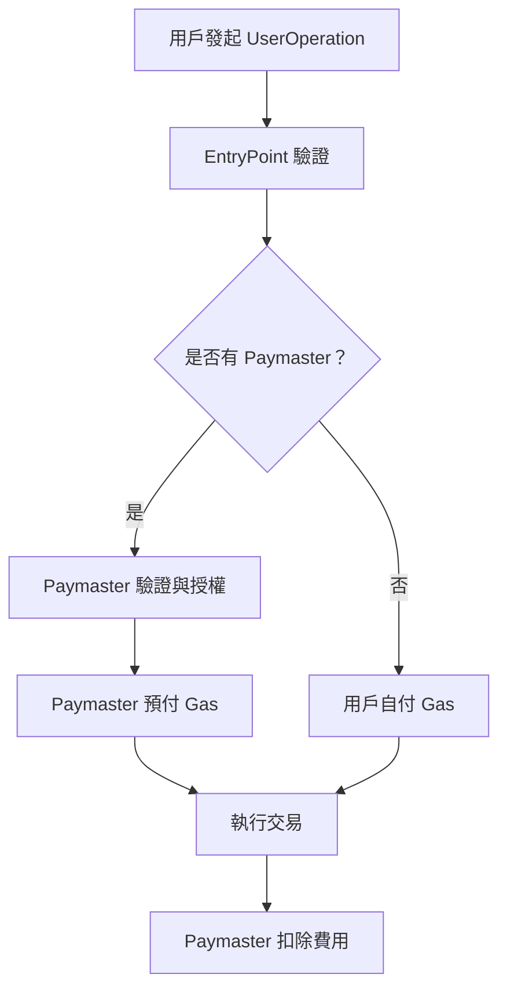

# 🚀 ERC-4337 Paymaster 實戰教學專案

## 📚 專案簡介

歡迎來到 **Account Abstraction Paymaster** 實戰教學專案！這是一個基於 Alchemy University 課程設計的完整 ERC-4337 帳戶抽象與 Paymaster 實作專案。

本專案將帶您深入了解：
- 🎯 **什麼是 Paymaster？**：代付 Gas 費用的智能合約
- 🔧 **如何實作 Paymaster**：從零開始建立自己的 Paymaster 合約
- 💡 **實際應用場景**：讓用戶無需持有 ETH 也能執行交易
- 🛠 **完整開發流程**：從開發、測試到部署的完整實戰

## 🎯 什麼是 Paymaster？

**Paymaster** 是 ERC-4337 帳戶抽象生態系統中的核心組件，它允許第三方（通常是 dApp 或服務提供商）為用戶支付交易的 Gas 費用。

### 🌟 Paymaster 的核心價值

1. **改善用戶體驗**：用戶無需持有 ETH 即可與區塊鏈互動
2. **降低進入門檻**：新用戶可以直接開始使用 dApp，無需先取得 ETH
3. **靈活的付費模式**：支援 ERC-20 代幣支付、訂閱制、免費使用等多種模式
4. **商業模式創新**：dApp 可以承擔用戶的 Gas 費用來吸引更多用戶

### 🔄 Paymaster 工作流程



## 📁 專案結構詳解

```
95-au-account-abstraction-paymaster/
├── contracts/
│   ├── Account.sol              # 智能合約錢包實作
│   ├── AccountFactory.sol       # 帳戶工廠合約
│   ├── Paymaster.sol           # 核心 Paymaster 合約 🔥
│   ├── VerifyingPaymaster.sol  # 進階驗證型 Paymaster
│   └── interfaces/
│       ├── IAccount.sol        # 帳戶介面
│       └── IPaymaster.sol      # Paymaster 介面
├── test/
│   ├── Account.test.ts         # 帳戶合約測試
│   ├── Paymaster.test.ts       # Paymaster 測試 🔥
│   └── integration.test.ts     # 整合測試
├── scripts/
│   ├── deploy.ts              # 部署腳本
│   ├── create-account.ts      # 創建帳戶腳本
│   └── paymaster-demo.ts      # Paymaster 示範腳本
├── ignition/
│   └── modules/
│       ├── Account.ts         # 帳戶部署模組
│       └── Paymaster.ts       # Paymaster 部署模組 🔥
├── utils/
│   ├── userOp.ts             # UserOperation 工具
│   └── paymaster-utils.ts    # Paymaster 工具函數
├── hardhat.config.ts         # Hardhat 配置
├── package.json              # 專案依賴
└── README.md                 # 本文件
```

## 🛠 技術棧與依賴

### 核心技術
- **Solidity**: ^0.8.19 - 智能合約開發語言
- **Hardhat**: ^2.22.19 - 開發框架
- **TypeScript**: ^5.8.3 - 型別安全的開發體驗
- **Ethers.js**: ^6.13.5 - 區塊鏈互動庫

### ERC-4337 相關
- **@account-abstraction/contracts**: ^0.6.0 - 官方 AA 合約庫
- **@openzeppelin/contracts**: ^4.9.0 - 安全的合約基礎庫

### 測試與開發工具
- **Chai**: ^4.3.7 - 測試斷言庫
- **Mocha**: ^10.2.0 - 測試框架

## 🚀 快速開始

### 1. 環境準備

```bash
# 複製專案
git clone <repository-url>
cd 95-au-account-abstraction-paymaster

# 安裝依賴
npm install
# 或
yarn install
```

### 2. 環境變數配置

創建 `.env` 文件：

```env
# RPC URLs
OPTIMISM_SEPOLIA_RPC_URL=https://sepolia.optimism.io
POLYGON_MUMBAI_RPC_URL=https://rpc-mumbai.maticvigil.com

# 私鑰（測試網專用，切勿使用主網私鑰）
PRIVATE_KEY=your_test_private_key_here

# Etherscan API Keys（用於合約驗證）
OPTIMISTIC_ETHERSCAN_API_KEY=your_optimistic_etherscan_api_key
POLYGONSCAN_API_KEY=your_polygonscan_api_key

# EntryPoint 合約地址（ERC-4337 標準）
ENTRY_POINT_ADDRESS=0x5FF137D4b0FDCD49DcA30c7CF57E578a026d2789
```

### 3. 編譯與測試

```bash
# 編譯合約
npx hardhat compile

# 運行測試套件
npx hardhat test

# 執行 Paymaster 專用測試
npx hardhat test test/Paymaster.test.ts

# 檢視 Gas 報告
REPORT_GAS=true npx hardhat test
```

## 💡 Paymaster 合約深度解析

### 🔥 基礎 Paymaster 實作

我們的 `Paymaster.sol` 實現了最基本的 Paymaster 功能：

```solidity
// SPDX-License-Identifier: MIT
pragma solidity ^0.8.19;

import "@account-abstraction/contracts/core/BasePaymaster.sol";
import "@account-abstraction/contracts/interfaces/IEntryPoint.sol";

contract Paymaster is BasePaymaster {
    constructor(IEntryPoint _entryPoint) BasePaymaster(_entryPoint) {}
    
    function _validatePaymasterUserOp(
        UserOperation calldata userOp,
        bytes32 userOpHash,
        uint256 maxCost
    ) internal view override returns (bytes memory context, uint256 validationData) {
        // 基礎驗證邏輯
        // 在生產環境中，這裡需要實作具體的授權邏輯
        return ("", 0);
    }
}
```

### 🎯 進階 VerifyingPaymaster

`VerifyingPaymaster.sol` 提供更安全的簽名驗證機制：

```solidity
contract VerifyingPaymaster is BasePaymaster {
    address public verifyingSigner;
    
    constructor(IEntryPoint _entryPoint, address _verifyingSigner) 
        BasePaymaster(_entryPoint) {
        verifyingSigner = _verifyingSigner;
    }
    
    function _validatePaymasterUserOp(
        UserOperation calldata userOp,
        bytes32 userOpHash,
        uint256 maxCost
    ) internal view override returns (bytes memory context, uint256 validationData) {
        // 驗證簽名邏輯
        bytes32 hash = keccak256(abi.encodePacked(userOpHash, maxCost));
        bytes memory signature = userOp.paymasterAndData[20:];
        
        if (verifyingSigner != hash.recover(signature)) {
            return ("", 1); // 驗證失败
        }
        
        return ("", 0); // 驗證成功
    }
}
```

## 🧪 實戰範例與測試

### 範例 1：基礎 Paymaster 使用

```typescript
// scripts/paymaster-demo.ts
import { ethers } from "hardhat";

async function main() {
    // 部署 Paymaster
    const Paymaster = await ethers.getContractFactory("Paymaster");
    const paymaster = await Paymaster.deploy(ENTRY_POINT_ADDRESS);
    await paymaster.waitForDeployment();
    
    // 向 Paymaster 存入資金
    await paymaster.deposit({ value: ethers.parseEther("1.0") });
    
    console.log("Paymaster 部署完成:", await paymaster.getAddress());
    console.log("Paymaster 餘額:", await paymaster.getDeposit());
}
```

### 範例 2：創建 UserOperation 與 Paymaster 互動

```typescript
// utils/userOp.ts
export async function createUserOpWithPaymaster(
    account: string,
    callData: string,
    paymasterAddress: string
): Promise<UserOperation> {
    return {
        sender: account,
        nonce: await getNonce(account),
        initCode: "0x",
        callData: callData,
        callGasLimit: 100000,
        verificationGasLimit: 100000,
        preVerificationGas: 21000,
        maxFeePerGas: await getGasPrice(),
        maxPriorityFeePerGas: await getPriorityFee(),
        paymasterAndData: paymasterAddress, // 🔥 指定 Paymaster
        signature: "0x"
    };
}
```

## 🏗 部署指南

### 1. 本地測試網部署

```bash
# 啟動本地 Hardhat 網路
npx hardhat node

# 在新終端執行部署
npx hardhat run scripts/deploy.ts --network localhost
```

### 2. 測試網部署

```bash
# 部署到 Optimism Sepolia
npx hardhat run scripts/deploy.ts --network optimismSepolia

# 驗證合約
npx hardhat verify --network optimismSepolia <CONTRACT_ADDRESS>
```

### 3. 使用 Ignition 部署（推薦）

```bash
# 部署 Paymaster 模組
npx hardhat ignition deploy ./ignition/modules/Paymaster.ts --network optimismSepolia
```

## 📋 常用指令速查

```bash
# 開發相關
npx hardhat compile                    # 編譯合約
npx hardhat test                       # 運行測試
npx hardhat test --grep "Paymaster"    # 運行特定測試
npx hardhat clean                      # 清理編譯產物

# 部署相關
npx hardhat node                       # 啟動本地網路
npx hardhat run scripts/deploy.ts      # 執行部署腳本
npx hardhat console --network localhost # 進入互動式控制台

# 驗證相關
npx hardhat verify <address> --network <network> # 驗證合約

# Gas 分析
REPORT_GAS=true npx hardhat test       # 生成 Gas 報告
```

## 🎯 實際應用場景

### 1. 🎮 遊戲 dApp 免費體驗
```
用戶可以立即開始遊戲，無需購買 ETH
遊戲公司承擔 Gas 費用，提升用戶體驗
```

### 2. 💰 DeFi 協議優惠方案
```
新用戶前 10 筆交易免 Gas 費
使用平台代幣支付 Gas 費用
VIP 用戶享受 Gas 費減免
```

### 3. 🛍 電商平台無摩擦支付
```
用戶使用信用卡購買商品
後台自動執行區塊鏈交易
完全隱藏區塊鏈複雜性
```

## 🔐 安全考量與最佳實踐

### ⚠️ 安全風險
1. **DOS 攻擊**：惡意用戶可能耗盡 Paymaster 資金
2. **前運行攻擊**：簽名可能被重放使用
3. **Gas 價格操縱**：攻擊者可能操縱 Gas 價格

### 🛡 安全措施
1. **實作速率限制**：限制每個地址的使用頻率
2. **簽名驗證**：使用 nonce 和時間戳防止重放
3. **資金管理**：設定每日支出上限
4. **白名單機制**：只允許特定合約或用戶使用

```solidity
// 安全的 Paymaster 範例
contract SecurePaymaster is BasePaymaster {
    mapping(address => uint256) public dailySpent;
    mapping(address => uint256) public lastUsed;
    uint256 public constant DAILY_LIMIT = 0.1 ether;
    uint256 public constant COOLDOWN = 300; // 5 分鐘冷卻
    
    function _validatePaymasterUserOp(
        UserOperation calldata userOp,
        bytes32 userOpHash,
        uint256 maxCost
    ) internal override returns (bytes memory context, uint256 validationData) {
        // 檢查日限額
        require(dailySpent[userOp.sender] + maxCost <= DAILY_LIMIT, "Daily limit exceeded");
        
        // 檢查冷卻時間
        require(block.timestamp >= lastUsed[userOp.sender] + COOLDOWN, "Cooldown not met");
        
        return ("", 0);
    }
}
```

## 📖 學習資源與進階教材

### 🎓 官方文檔
- [ERC-4337 規範完整文檔](https://eips.ethereum.org/EIPS/eip-4337)
- [Account Abstraction 官方指南](https://docs.alchemy.com/docs/account-abstraction)
- [Ethereum Foundation AA 資源](https://ethereum.org/developers/docs/accounts/)

### 🎬 影片教學
- [Alchemy University AA 課程](https://www.youtube.com/watch?v=2LGpEobxIBA&t=916s&ab_channel=Alchemy)
- [Build and Deploy a Paymaster in Solidity](https://www.youtube.com/watch?v=2LGpEobxIBA&t=916s&ab_channel=Alchemy)

### 🛠 開發工具
- [Hardhat 完整指南](https://hardhat.org/docs)
- [OpenZeppelin Contracts 安全庫](https://docs.openzeppelin.com/contracts)
- [Ethers.js 開發文檔](https://docs.ethers.org/)

### 🔗 相關專案
- [StackUp Bundler](https://github.com/stackup-wallet/stackup-bundler)
- [Biconomy SDK](https://docs.biconomy.io/)
- [ZeroDev Kernel](https://docs.zerodev.app/)

## 🤝 貢獻與社群

### 貢獻指南
1. 🍴 Fork 本專案到您的 GitHub
2. 🌿 創建功能分支 (`git checkout -b feature/amazing-paymaster`)
3. 📝 提交您的修改 (`git commit -m 'Add amazing paymaster feature'`)
4. 🚀 推送到分支 (`git push origin feature/amazing-paymaster`)
5. 🔄 創建 Pull Request

### 🐛 問題回報
遇到問題？請到 [Issues](../../issues) 頁面：
1. 檢查是否已有類似問題
2. 創建新 Issue，描述問題詳情
3. 提供重現步驟和錯誤訊息
4. 貼上相關程式碼片段

## 📜 授權條款

本專案採用 [MIT License](LICENSE) 開源授權。

## ⚠️ 重要聲明

- 🧪 **僅供學習用途**：本專案為教學示範，請勿直接用於生產環境
- 🔒 **安全第一**：部署前請進行完整的安全審計
- 💸 **測試網使用**：建議先在測試網充分測試後再考慮主網部署
- 📊 **Gas 最佳化**：生產環境需要進一步最佳化合約以降低 Gas 消耗

---

## 🎉 開始您的 Paymaster 之旅！

現在您已經掌握了 Paymaster 的核心概念和實作方法，是時候開始動手實踐了！

1. 🚀 **立即開始**：執行 `npm install && npx hardhat test`
2. 🔧 **動手修改**：嘗試修改 Paymaster 邏輯，添加您的創新想法
3. 🌟 **分享經驗**：在社群中分享您的學習心得和專案成果

記住，**帳戶抽象和 Paymaster 是 Web3 用戶體驗革命的核心技術**，掌握這些技能將讓您在去中心化應用開發中擁有巨大優勢！

**祝您學習愉快，創造無限可能！** 🚀✨
