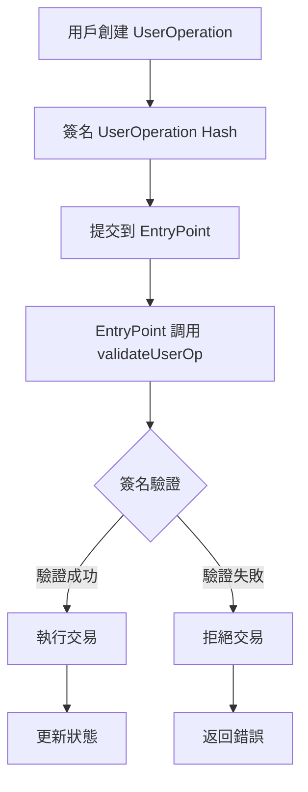

# 🔐 ERC-4337 UserOperation 驗證實戰教學專案

## 📚 專案簡介

歡迎來到 **Account Abstraction UserOperation 驗證** 實戰教學專案！這是一個基於 Alchemy University 課程設計的完整 ERC-4337 帳戶抽象與 UserOperation 驗證實作專案。

本專案將帶您深入了解：
- 🎯 **什麼是 UserOperation 驗證？**：帳戶抽象中的核心安全機制
- 🔧 **如何實作簽名驗證**：從零開始建立安全的帳戶驗證系統
- 💡 **驗證流程深度解析**：理解 EntryPoint 如何驗證用戶操作
- 🛠 **完整開發實戰**：從開發、測試到執行的完整流程

## 🎯 什麼是 UserOperation 驗證？

**UserOperation 驗證** 是 ERC-4337 帳戶抽象中的核心安全機制，它確保只有合法的用戶才能執行智能合約錢包的操作。

### 🌟 UserOperation 驗證的核心價值

1. **安全保障**：防止未授權的交易執行
2. **靈活認證**：支援多種簽名算法和驗證邏輯
3. **Gas 最佳化**：在驗證階段就能拒絕無效操作
4. **合約錢包基礎**：是智能合約錢包正常運作的基石

### 🔄 UserOperation 驗證流程



## 📁 專案結構詳解

```
106-au-account-abstraction-validating-a-user-operation/
├── contracts/
│   ├── Account.sol              # 核心帳戶合約 🔥
│   ├── SimpleEntryPoint.sol     # 簡化版 EntryPoint
│   └── Paymaster.sol           # 費用代付合約
├── scripts/
│   ├── execute.ts              # UserOperation 執行腳本 🔥
│   ├── sig.ts                  # 簽名示範腳本
│   ├── test-entrypoint.ts      # EntryPoint 測試腳本
│   ├── deployAF.ts            # AccountFactory 部署
│   └── deployEP.ts            # EntryPoint 部署
├── test/
│   └── test.ts                # 基礎測試腳本
├── ignition/
│   └── modules/               # 部署模組
├── hardhat.config.ts          # Hardhat 配置
├── package.json               # 專案依賴
└── README.md                  # 本文件
```

## 🛠 技術棧與依賴

### 核心技術
- **Solidity**: ^0.8.12 - 智能合約開發語言
- **Hardhat**: ^2.22.19 - 開發框架
- **TypeScript**: ^5.8.3 - 型別安全的開發體驗
- **Ethers.js**: ^6.13.5 - 區塊鏈互動庫

### ERC-4337 相關
- **@account-abstraction/contracts**: ^0.6.0 - 官方 AA 合約庫
- **@openzeppelin/contracts**: ^4.2.0 - 安全的合約基礎庫（包含 ECDSA）

### 開發工具
- **@nomicfoundation/hardhat-toolbox**: ^5.0.0 - Hardhat 工具套件

## 🚀 快速開始

### 1. 環境準備

```bash
# 複製專案
git clone <repository-url>
cd 106-au-account-abstraction-validating-a-user-operation

# 安裝依賴
npm install
# 或
yarn install
```

### 2. 環境變數配置

創建 `.env` 文件：

```env
# RPC URLs
SEPOLIA_RPC_URL=https://eth-sepolia.g.alchemy.com/v2/YOUR_API_KEY
GOERLI_RPC_URL=https://eth-goerli.g.alchemy.com/v2/YOUR_API_KEY

# 私鑰（測試網專用，切勿使用主網私鑰）
PRIVATE_KEY=your_test_private_key_here

# Etherscan API Key（用於合約驗證）
ETHERSCAN_API_KEY=your_etherscan_api_key

# EntryPoint 合約地址（ERC-4337 標準）
ENTRY_POINT_ADDRESS=0x5FF137D4b0FDCD49DcA30c7CF57E578a026d2789
```

### 3. 編譯與測試

```bash
# 編譯合約
npx hardhat compile

# 啟動本地網路
npx hardhat node

# 運行測試（在新終端）
npx hardhat run test/test.ts --network localhost

# 部署合約
npx hardhat run scripts/deployEP.ts --network localhost
npx hardhat run scripts/deployAF.ts --network localhost
```

## 💡 UserOperation 驗證機制深度解析

### 🔥 Account 合約中的驗證邏輯

我們的 `Account.sol` 實現了 IAccount 介面的 `validateUserOp` 函數：

```solidity
// SPDX-License-Identifier: UNLICENSED
pragma solidity ^0.8.12;

import "@account-abstraction/contracts/interfaces/IAccount.sol";
import "@openzeppelin/contracts/utils/cryptography/ECDSA.sol";

contract Account is IAccount {
    address public owner;

    constructor(address _owner) {
        owner = _owner;
    }

    // 🔥 核心驗證函數
    function validateUserOp(
        UserOperation calldata userOp, 
        bytes32 userOpHash, 
        uint256
    ) external view returns (uint256 validationData) {
        // 使用 ECDSA 恢復簽名者地址
        address recovered = ECDSA.recover(
            ECDSA.toEthSignedMessageHash(userOpHash), 
            userOp.signature
        );
        
        // 驗證簽名者是否為帳戶擁有者
        return owner == recovered ? 0 : 1;
    }
}
```

### 🎯 驗證流程詳解

#### 1. **UserOperation Hash 生成**
```typescript
// EntryPoint 會生成 UserOperation 的唯一雜湊值
const userOpHash = await entryPoint.getUserOpHash(userOp);
```

#### 2. **用戶簽名**
```typescript
// 用戶使用私鑰對 userOpHash 進行簽名
userOp.signature = await signer.signMessage(ethers.getBytes(userOpHash));
```

#### 3. **合約驗證**
```solidity
// 合約驗證簽名的有效性
address recovered = ECDSA.recover(
    ECDSA.toEthSignedMessageHash(userOpHash), 
    userOp.signature
);
return owner == recovered ? 0 : 1;
```

### 🔧 EntryPoint 與帳戶互動

```solidity
// SimpleEntryPoint.sol - 簡化版實現
contract SimpleEntryPoint {
    function handleOps(UserOperation[] calldata ops, address payable beneficiary) external {
        for (uint256 i = 0; i < ops.length; i++) {
            UserOperation calldata op = ops[i];
            
            // 🔥 這裡會調用帳戶的 validateUserOp 函數
            // 在真實的 EntryPoint 中會有完整的驗證邏輯
            
            // 增加 nonce 防止重放攻擊
            nonceSequenceNumber[op.sender][0]++;
            
            // 執行交易
            if (op.callData.length > 0) {
                (bool success,) = op.sender.call(op.callData);
                require(success, "call failed");
            }
        }
    }
}
```

## 🧪 實戰範例與執行

### 範例 1：創建並執行 UserOperation

```typescript
// scripts/execute.ts
async function main() {
    const entryPoint = await ethers.getContractAt("EntryPoint", EP_ADDRESS);
    const [signer] = await ethers.getSigners();
    
    // 🔥 創建 UserOperation
    const userOp = {
        sender: accountAddress,
        nonce: await entryPoint.getNonce(sender, 0),
        initCode: "0x", // 已存在的帳戶不需要 initCode
        callData: Account.interface.encodeFunctionData("increment", []),
        callGasLimit: 400_000,
        verificationGasLimit: 600_000,
        preVerificationGas: 100_000,
        maxFeePerGas: ethers.parseUnits("10", "gwei"),
        maxPriorityFeePerGas: ethers.parseUnits("5", "gwei"),
        paymasterAndData: "0x", // 不使用 Paymaster
        signature: "0x", // 稍後填入
    };

    // 🔥 生成 UserOperation Hash
    const userOpHash = await entryPoint.getUserOpHash(userOp);
    
    // 🔥 簽名
    userOp.signature = await signer.signMessage(ethers.getBytes(userOpHash));
    
    // 🔥 執行 UserOperation
    const tx = await entryPoint.handleOps([userOp], signer);
    await tx.wait();
}
```

### 範例 2：帳戶工廠與部署

```solidity
// Account.sol 中的工廠合約
contract AccountFactory {
    function createAccount(address _owner) external returns (address) {
        return address(new Account(_owner));
    }
}
```

```typescript
// 使用工廠創建新帳戶
const AccountFactory = await ethers.getContractFactory("AccountFactory");
const initCode = FACTORY_ADDRESS + AccountFactory.interface
    .encodeFunctionData("createAccount", [ownerAddress])
    .slice(2);

// 在 UserOperation 中使用 initCode
const userOp = {
    // ...
    initCode: initCode, // 🔥 用於創建新帳戶
    // ...
};
```

## 🏗 部署與執行指南

### 1. 本地開發環境

```bash
# 終端 1：啟動本地網路
npx hardhat node

# 終端 2：部署合約
npx hardhat run scripts/deployEP.ts --network localhost
npx hardhat run scripts/deployAF.ts --network localhost

# 執行 UserOperation
npx hardhat run scripts/execute.ts --network localhost

# 測試帳戶狀態
npx hardhat run test/test.ts --network localhost
```

### 2. 測試網部署

```bash
# 部署到 Sepolia 測試網
npx hardhat run scripts/deployEP.ts --network sepolia
npx hardhat run scripts/deployAF.ts --network sepolia

# 執行測試
npx hardhat run scripts/execute.ts --network sepolia
```

## 📋 常用指令速查

```bash
# 開發相關
npx hardhat compile                           # 編譯合約
npx hardhat node                             # 啟動本地網路
npx hardhat console --network localhost      # 互動式控制台

# 執行腳本
npx hardhat run scripts/execute.ts --network localhost    # 執行 UserOperation
npx hardhat run scripts/sig.ts --network localhost        # 簽名示範
npx hardhat run test/test.ts --network localhost          # 測試帳戶狀態

# 部署相關
npx hardhat run scripts/deployEP.ts --network localhost   # 部署 EntryPoint
npx hardhat run scripts/deployAF.ts --network localhost   # 部署 AccountFactory

# 清理與重置
npx hardhat clean                            # 清理編譯產物
```

## 🔐 安全考量與最佳實踐

### ⚠️ 常見安全風險

1. **簽名重放攻擊**
   ```solidity
   // ❌ 錯誤：沒有檢查 nonce
   function validateUserOp(...) external view returns (uint256) {
       address recovered = ECDSA.recover(userOpHash, userOp.signature);
       return owner == recovered ? 0 : 1;
   }
   ```

2. **無效的簽名格式**
   ```solidity
   // ✅ 正確：使用標準的以太坊簽名格式
   address recovered = ECDSA.recover(
       ECDSA.toEthSignedMessageHash(userOpHash), 
       userOp.signature
   );
   ```

### 🛡 安全最佳實踐

1. **Nonce 管理**：EntryPoint 自動管理 nonce 防止重放攻擊
2. **簽名驗證**：使用 OpenZeppelin 的 ECDSA 庫進行安全的簽名恢復
3. **Gas 限制**：設定合理的 gas 限制防止 DoS 攻擊
4. **多重簽名**：可以擴展為支援多重簽名的驗證邏輯

```solidity
// 進階：多重簽名帳戶範例
contract MultiSigAccount is IAccount {
    address[] public owners;
    uint256 public threshold;
    
    function validateUserOp(
        UserOperation calldata userOp,
        bytes32 userOpHash,
        uint256
    ) external view override returns (uint256 validationData) {
        bytes[] memory signatures = abi.decode(userOp.signature, (bytes[]));
        require(signatures.length >= threshold, "Insufficient signatures");
        
        uint256 validSignatures = 0;
        for (uint256 i = 0; i < signatures.length; i++) {
            address recovered = ECDSA.recover(
                ECDSA.toEthSignedMessageHash(userOpHash),
                signatures[i]
            );
            
            if (isOwner(recovered)) {
                validSignatures++;
            }
        }
        
        return validSignatures >= threshold ? 0 : 1;
    }
}
```

## 🎯 實際應用場景

### 1. 🔐 企業級錢包
```
多重簽名驗證
角色權限管理
交易限額控制
時間鎖定機制
```

### 2. 🎮 遊戲帳戶系統
```
遊戲內簽名驗證
防作弊機制
資產安全保護
批量交易執行
```

### 3. 🏦 DeFi 協議整合
```
自動化交易策略
風險控制機制
合規性檢查
資金安全保障
```

## 📖 學習資源與進階教材

### 🎓 官方文檔
- [ERC-4337 規範完整文檔](https://eips.ethereum.org/EIPS/eip-4337)
- [Account Abstraction 官方指南](https://docs.alchemy.com/docs/account-abstraction)
- [IAccount 介面文檔](https://github.com/eth-infinitism/account-abstraction)

### 🎬 影片教學
- [Alchemy University AA 課程](https://www.youtube.com/watch?v=2LGpEobxIBA&t=916s&ab_channel=Alchemy)
- [UserOperation 驗證深度解析](https://www.youtube.com/watch?v=2LGpEobxIBA&t=916s&ab_channel=Alchemy)

### 🛠 開發工具
- [Hardhat 完整指南](https://hardhat.org/docs)
- [OpenZeppelin ECDSA 庫](https://docs.openzeppelin.com/contracts/4.x/api/utils#ECDSA)
- [Ethers.js 簽名指南](https://docs.ethers.org/v6/api/crypto/)

### 🔗 相關專案
- [Account Abstraction SDK](https://github.com/eth-infinitism/account-abstraction)
- [Safe Contracts](https://github.com/safe-global/safe-contracts)
- [Argent Wallet](https://github.com/argentlabs/argent-contracts)

## 🤝 貢獻與社群

### 貢獻指南
1. 🍴 Fork 本專案到您的 GitHub
2. 🌿 創建功能分支 (`git checkout -b feature/enhanced-validation`)
3. 📝 提交您的修改 (`git commit -m 'Add enhanced validation feature'`)
4. 🚀 推送到分支 (`git push origin feature/enhanced-validation`)
5. 🔄 創建 Pull Request

### 🐛 問題回報
遇到問題？請到 [Issues](../../issues) 頁面：
1. 檢查是否已有類似問題
2. 創建新 Issue，描述問題詳情
3. 提供重現步驟和錯誤訊息
4. 貼上相關程式碼片段

## 📜 授權條款

本專案採用 [MIT License](LICENSE) 開源授權。

## ⚠️ 重要聲明

- 🧪 **僅供學習用途**：本專案為教學示範，請勿直接用於生產環境
- 🔒 **安全第一**：部署前請進行完整的安全審計
- 💸 **測試網使用**：建議先在測試網充分測試後再考慮主網部署
- 📊 **Gas 最佳化**：生產環境需要進一步最佳化合約以降低驗證成本

---

## 🎉 開始您的 UserOperation 驗證之旅！

現在您已經掌握了 UserOperation 驗證的核心概念和實作方法，是時候開始動手實踐了！

1. 🚀 **立即開始**：執行 `npm install && npx hardhat compile`
2. 🔧 **動手實驗**：嘗試修改驗證邏輯，添加您的創新想法
3. 🌟 **分享經驗**：在社群中分享您的學習心得和專案成果

記住，**UserOperation 驗證是帳戶抽象安全性的核心基石**，掌握這些技能將讓您在智能合約錢包開發中擁有堅實的基礎！

**祝您學習愉快，構建安全可靠的去中心化應用！** 🔐✨
