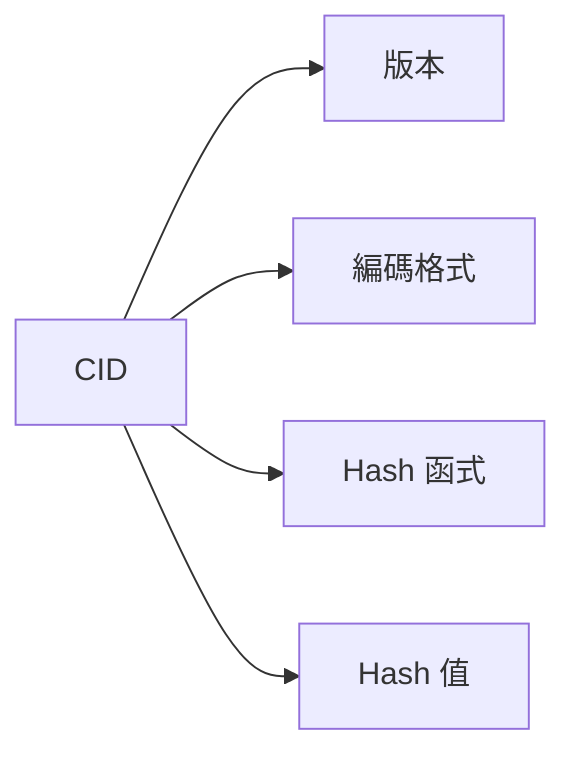
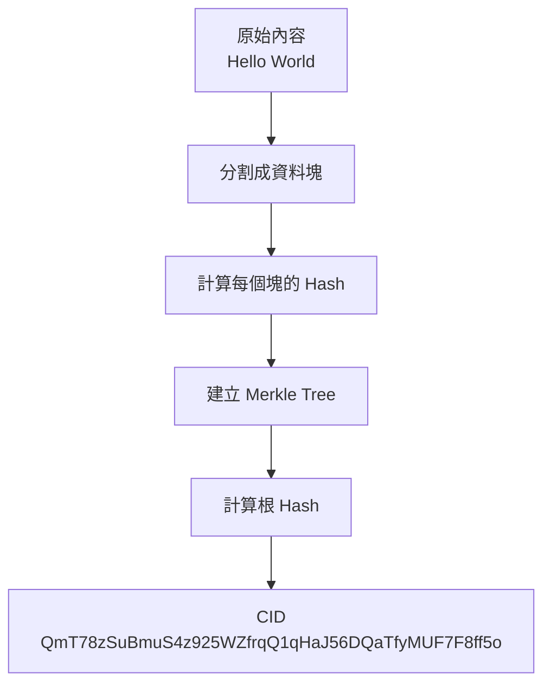
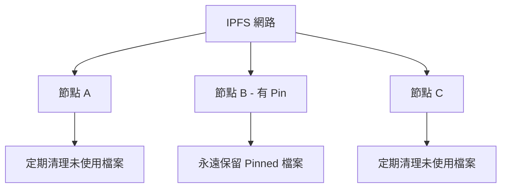
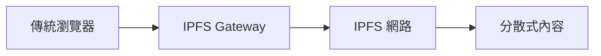
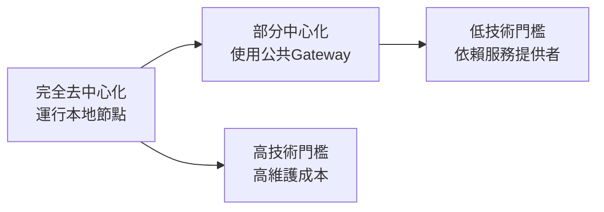
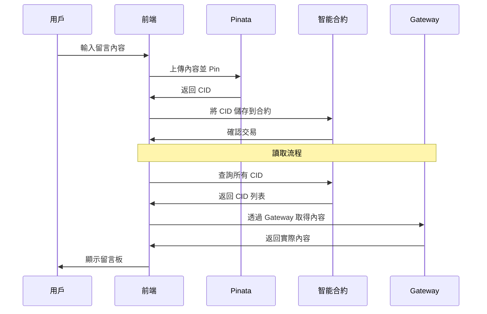
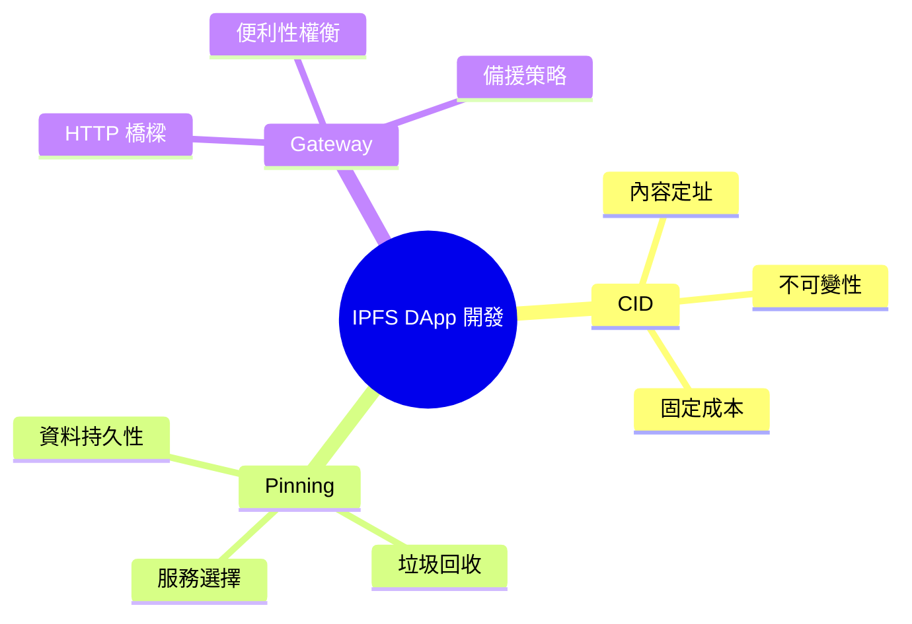

# 第三課：關鍵概念深度解析

## 課程目標
- 深度理解 CID (Content Identifier) 的生成原理與特性
- 掌握 Pinning 機制及其在資料持久性中的作用
- 了解 IPFS Gateway 的功能與使用場景

## 1. CID (Content Identifier) - IPFS 的核心

### 1.1 什麼是 CID？

CID (Content Identifier) 是 IPFS 中每個內容的唯一識別符，它不僅僅是一個 Hash，而是一個自描述的、自驗證的標識符。

### 1.2 CID 的結構解析

一個典型的 CID 看起來像這樣：
```
QmYwAPJzv5CZsnA625s3Xf2nemtYgPpHdWEz79ojWnPbdG
```

讓我們分解它的結構：



**CID v0 (舊格式)：**
- 以 "Qm" 開頭
- 使用 SHA-256 Hash
- Base58 編碼
- 46 個字元長度

**CID v1 (新格式)：**
```
bafybeigdyrzt5sfp7udm7hu76uh7y26nf3efuylqabf3oclgtqy55fbzdi
```
- 更靈活的結構
- 支援多種 Hash 函式
- 支援多種編碼格式

### 1.3 CID 的生成過程



**詳細步驟：**

1. **內容分塊**：
   ```
   原始檔案 → 256KB 的資料塊
   ```

2. **計算 Hash**：
   ```
   每個塊 → SHA-256 → Hash 值
   ```

3. **建立 Merkle Tree**：
   ```
   塊 Hash → 組合成樹狀結構 → 根 Hash
   ```

4. **包裝成 CID**：
   ```
   根 Hash + 元資料 → CID
   ```

### 1.4 為什麼 CID 是不可變的？

**Hash 函式的性質：**
- **確定性**：相同輸入總是產生相同輸出
- **雪崩效應**：微小改變導致完全不同的輸出

**實際範例：**
```javascript
// 原始內容
const content1 = "Hello World"
const cid1 = "QmT78zSuBmuS4z925WZfrqQ1qHaJ56DQaTfyMUF7F8ff5o"

// 僅改變一個字元
const content2 = "Hello world"  // W 改成小寫 w
const cid2 = "QmWfVY9y3xjsixTgbd9AorQxH7VtMpzfx2HaWtsoUYecaX"
```

這個特性確保：
1. **內容完整性**：任何篡改都會被發現
2. **版本控制**：不同版本有不同的 CID
3. **去重**：相同內容共享相同的 CID

### 1.5 CID 與區塊鏈的完美契合

**為什麼 IPFS CID 特別適合區塊鏈？**

1. **固定長度**：所有 CID 都是 46 個字元，儲存成本可預測
2. **內容定址**：Hash 保證內容的真實性
3. **不可變性**：符合區塊鏈的不可變特性

**在智能合約中的使用：**
```solidity
contract IPFSStorage {
    // 儲存 CID 的成本是固定的，約 20,000 Gas
    mapping(uint256 => string) public contentHashes;
    
    function storeContent(string memory _cid) public {
        // 只儲存 46 個字元的 CID，而不是完整內容
        contentHashes[block.timestamp] = _cid;
    }
}
```

## 2. Pinning - 確保資料持久性

### 2.1 IPFS 的資料消失問題

IPFS 預設行為：
- 節點會自動清理不常用的資料
- 垃圾回收機制會刪除未被 "pin" 的檔案
- 如果沒有節點儲存某個檔案，它就會從網路中消失

### 2.2 什麼是 Pinning？



**Pinning 的作用：**
- 告訴 IPFS 節點：「這個檔案很重要，不要刪除它」
- 確保檔案在至少一個節點上持續存在
- 提供資料的持久性保證

### 2.3 Pinning 的類型

**1. 直接 Pin (Direct Pin)：**
```bash
ipfs pin add QmYwAPJzv5CZsnA625s3Xf2nemtYgPpHdWEz79ojWnPbdG
```
- 只 pin 指定的 CID
- 不包含子節點

**2. 遞迴 Pin (Recursive Pin)：**
```bash
ipfs pin add -r QmYwAPJzv5CZsnA625s3Xf2nemtYgPpHdWEz79ojWnPbdG
```
- Pin 整個檔案或目錄樹
- 包含所有子節點
- 最常用的方式

**3. 間接 Pin (Indirect Pin)：**
- 當父節點被遞迴 pin 時，子節點自動成為間接 pin

### 2.4 本地 vs 遠端 Pinning

**本地 Pinning：**
```bash
# 在你的本地節點 pin 檔案
ipfs pin add QmYwAPJzv5CZsnA625s3Xf2nemtYgPpHdWEz79ojWnPbdG
```

**遠端 Pinning (Pinning Services)：**
```bash
# 使用 Pinata 等服務
curl -X POST "https://api.pinata.cloud/pinning/pinByHash" \
  -H "pinata_api_key: YOUR_API_KEY" \
  -H "pinata_secret_api_key: YOUR_SECRET" \
  -d '{"hashToPin": "QmYwAPJzv5CZsnA625s3Xf2nemtYgPpHdWEz79ojWnPbdG"}'
```

### 2.5 Pinning 策略

**對於 DApp 開發者：**

1. **重要資料**：永遠 pin
   - 應用程式核心資料
   - 用戶生成的內容
   - 配置檔案

2. **暫存資料**：可以不 pin
   - 暫存快取
   - 可重新生成的資料

3. **備援策略**：
   - 在多個節點 pin 重要資料
   - 使用多個 Pinning 服務
   - 定期檢查 pin 狀態

### 2.6 Pinning 的成本考量

**本地 Pinning：**
- 成本：硬碟空間 + 電費
- 優點：完全控制
- 缺點：需要維護節點

**Pinning 服務：**
- 成本：按儲存量付費
- 優點：簡單可靠
- 缺點：需要月費

**主要 Pinning 服務比較：**

| 服務 | 免費額度 | 付費價格 | 特色 |
|------|----------|----------|------|
| Pinata | 1 GB | $1/GB/月 | 最流行，API 友好 |
| Infura | 5 GB | $0.08/GB/月 | 以太坊生態 |
| Web3.Storage | 1 TB | 免費 | Protocol Labs 支援 |

## 3. IPFS Gateway - 橋接 Web2 與 Web3

### 3.1 什麼是 IPFS Gateway？

Gateway 是一個 HTTP 介面，讓傳統的網頁瀏覽器能夠存取 IPFS 內容。



### 3.2 Gateway 的使用方式

**格式：**
```
https://gateway.domain.com/ipfs/CID
```

**實際範例：**
```
https://ipfs.io/ipfs/QmYwAPJzv5CZsnA625s3Xf2nemtYgPpHdWEz79ojWnPbdG
https://gateway.pinata.cloud/ipfs/QmYwAPJzv5CZsnA625s3Xf2nemtYgPpHdWEz79ojWnPbdG
https://cloudflare-ipfs.com/ipfs/QmYwAPJzv5CZsnA625s3Xf2nemtYgPpHdWEz79ojWnPbdG
```

### 3.3 Gateway 的類型

**1. 公共 Gateway：**
- 免費使用
- 可能有速度限制
- 適合開發和測試

**2. 專用 Gateway：**
- 付費服務
- 更好的效能
- 自訂網域
- 適合生產環境

**3. 本地 Gateway：**
```
http://localhost:8080/ipfs/QmYwAPJzv5CZsnA625s3Xf2nemtYgPpHdWEz79ojWnPbdG
```
- 當你運行本地 IPFS 節點時可用
- 最快的存取速度
- 完全隱私

### 3.4 主要公共 Gateway

| Gateway | URL | 提供者 | 特色 |
|---------|-----|--------|------|
| IPFS.io | ipfs.io | Protocol Labs | 官方 gateway |
| Pinata | gateway.pinata.cloud | Pinata | 商業服務 |
| Cloudflare | cloudflare-ipfs.com | Cloudflare | CDN 加速 |
| Infura | ipfs.infura.io | Infura | 企業級 |

### 3.5 Gateway 在 DApp 中的使用

**前端程式碼範例：**
```javascript
// 從智能合約取得 CID
const cid = "QmYwAPJzv5CZsnA625s3Xf2nemtYgPpHdWEz79ojWnPbdG"

// 透過 Gateway 取得內容
const gatewayUrl = `https://gateway.pinata.cloud/ipfs/${cid}`

// 在 React 中使用
function IPFSContent({ cid }) {
  const [content, setContent] = useState('')
  
  useEffect(() => {
    fetch(`https://gateway.pinata.cloud/ipfs/${cid}`)
      .then(response => response.text())
      .then(setContent)
  }, [cid])
  
  return <div>{content}</div>
}
```

### 3.6 Gateway 的去中心化權衡

**便利性 vs 去中心化：**



**實際建議：**
1. **開發階段**：使用公共 Gateway，快速原型
2. **生產階段**：考慮專用 Gateway 或本地節點
3. **備援策略**：支援多個 Gateway，提高可靠性

## 4. 三個概念的整合應用

### 4.1 完整的 DApp 資料流



### 4.2 關鍵決策點

**CID 管理：**
- 在合約中儲存 CID
- 在前端解析 CID 為實際內容

**Pinning 策略：**
- 使用 Pinning 服務確保資料持久性
- 考慮多重備份

**Gateway 選擇：**
- 開發時使用公共 Gateway
- 生產時考慮專用服務

### 4.3 最佳實踐

1. **錯誤處理**：
   ```javascript
   async function fetchFromIPFS(cid) {
     const gateways = [
       'https://gateway.pinata.cloud',
       'https://ipfs.io',
       'https://cloudflare-ipfs.com'
     ]
     
     for (const gateway of gateways) {
       try {
         const response = await fetch(`${gateway}/ipfs/${cid}`)
         if (response.ok) return await response.text()
       } catch (error) {
         console.log(`Gateway ${gateway} failed`)
       }
     }
     throw new Error('All gateways failed')
   }
   ```

2. **快取策略**：
   ```javascript
   // CID 是不可變的，可以永久快取
   const cache = new Map()
   
   function getCachedContent(cid) {
     if (cache.has(cid)) {
       return cache.get(cid)
     }
     
     const content = fetchFromIPFS(cid)
     cache.set(cid, content)
     return content
   }
   ```

## 5. 課程小結

### 5.1 三大核心概念總結

| 概念 | 核心功能 | DApp 中的作用 |
|------|----------|---------------|
| **CID** | 內容的唯一識別符 | 在智能合約中儲存資料索引 |
| **Pinning** | 確保資料持久性 | 防止重要資料消失 |
| **Gateway** | 提供 HTTP 存取 | 讓瀏覽器能夠讀取 IPFS 內容 |

### 5.2 知識框架



### 5.3 為模組二做準備

在下一個模組中，我們將親手實踐這些概念：
- 安裝並使用 IPFS Desktop
- 註冊並使用 Pinata 服務
- 實際上傳檔案並取得 CID
- 透過不同 Gateway 存取內容

## 練習題

1. 解釋為什麼相同的檔案在不同時間上傳到 IPFS 會得到相同的 CID？
2. 如果你不 pin 一個檔案，它多久會從 IPFS 網路中消失？
3. 比較使用本地 Gateway 和公共 Gateway 的優缺點。
4. 設計一個備援策略來確保你的 DApp 資料永遠可以存取。

---

**模組一總結**：我們已經建立了 IPFS 的理論基礎，理解了為什麼它是解決區塊鏈儲存問題的最佳方案。接下來我們將進入實作階段！
