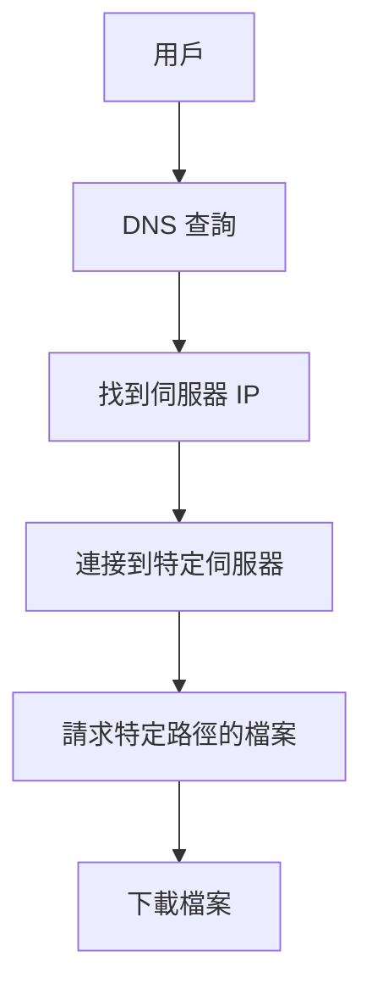
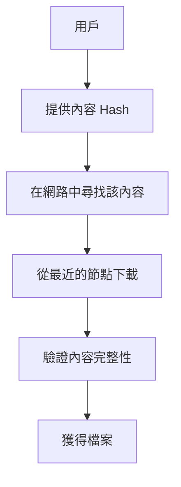
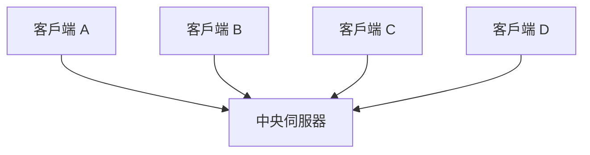
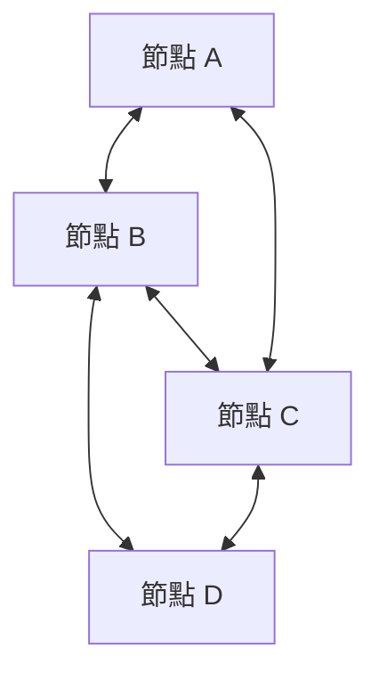
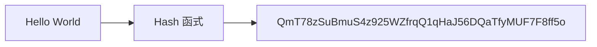
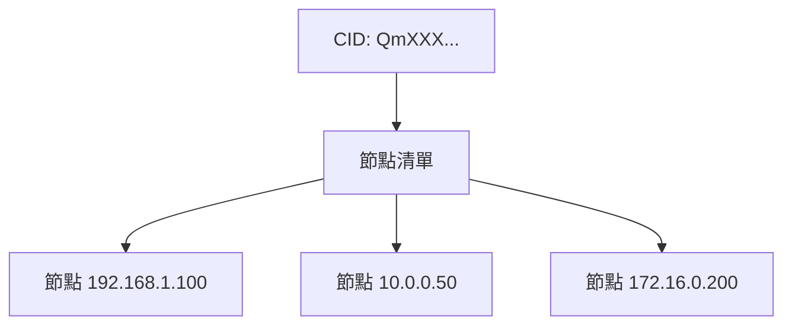
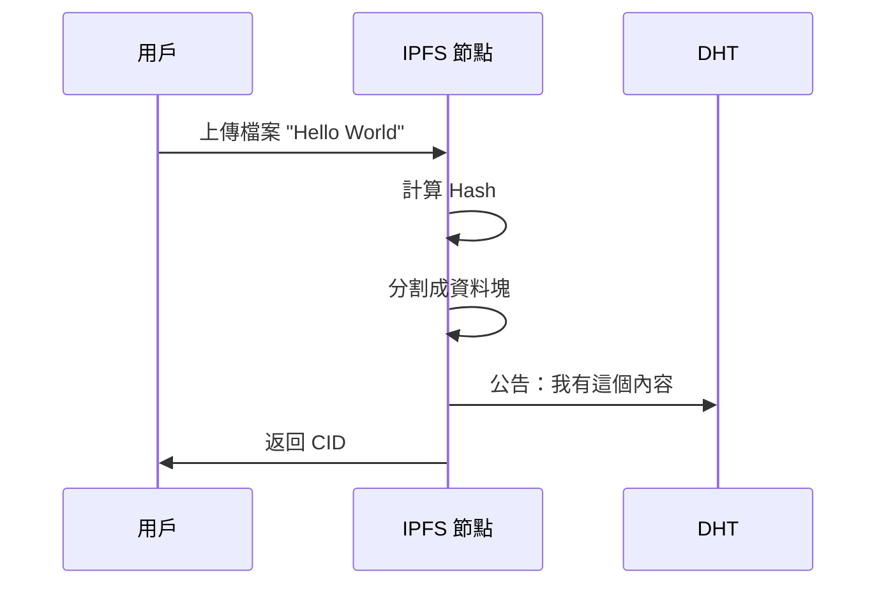
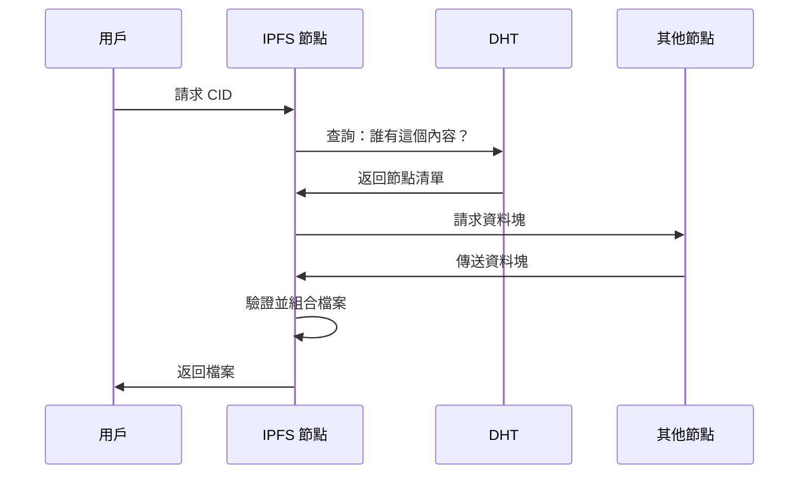
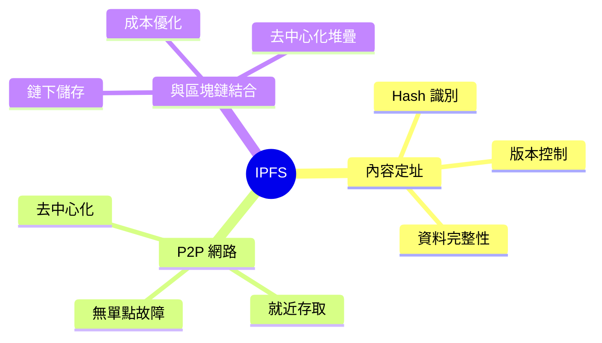

# 第二課：IPFS 介紹 - 為新一代網路而生的檔案系統

## 課程目標
- 理解 IPFS 的基本概念和設計理念
- 了解 IPFS 與傳統 HTTP 的根本區別
- 掌握點對點 (P2P) 和內容定址 (Content Addressing) 的核心思想

## 1. 什麼是 IPFS？

### 1.1 IPFS 全名與願景

**IPFS (InterPlanetary File System)** - 星際檔案系統

這個名字聽起來很科幻，但它反映了 IPFS 的雄心壯志：建立一個能夠跨越地球，甚至未來能夠跨越星球的全球性檔案系統。

### 1.2 IPFS 的核心使命

IPFS 旨在創建一個：
- **去中心化**的網際網路
- **更快速**的網頁瀏覽體驗
- **更安全**的資料儲存
- **更持久**的網路內容

### 1.3 IPFS 的簡單定義

> IPFS 是一個分散式系統，用於儲存和存取檔案、網站、應用程式和資料。

## 2. HTTP vs IPFS：兩種不同的網路哲學

### 2.1 HTTP 的運作方式（位置定址）



**HTTP 範例：**
```
https://example.com/images/cat.jpg
      ↑               ↑
   伺服器位置      檔案位置
```

**HTTP 的問題：**
1. **單點故障**：伺服器掛了，內容就無法存取
2. **效率低下**：需要從遠端伺服器下載，即使附近有相同檔案
3. **中心化控制**：內容可能被刪除或修改
4. **頻寬浪費**：相同檔案被重複下載

### 2.2 IPFS 的運作方式（內容定址）



**IPFS 範例：**
```
ipfs://QmYwAPJzv5CZsnA625s3Xf2nemtYgPpHdWEz79ojWnPbdG
           ↑
      內容的唯一標識符 (CID)
```

**IPFS 的優勢：**
1. **無單點故障**：內容分散在多個節點
2. **就近存取**：從最近的節點下載
3. **內容不可變**：Hash 確保內容完整性
4. **去重優化**：相同內容只需要一份

## 3. 核心概念一：點對點 (P2P) 網路

### 3.1 什麼是 P2P？

在 P2P 網路中，每個參與者既是客戶端也是伺服器。這與傳統的客戶端-伺服器模式形成對比。

### 3.2 P2P vs 客戶端-伺服器

**傳統模式（客戶端-伺服器）：**


**P2P 模式：**


### 3.3 P2P 的實際應用範例

您可能已經熟悉的 P2P 應用：
- **BitTorrent**：檔案分享
- **Bitcoin**：數位貨幣
- **Skype**（早期版本）：語音通話

### 3.4 IPFS 中的 P2P

在 IPFS 中：
- 每個節點都儲存一些內容
- 節點互相連接形成網路
- 當您需要檔案時，網路會找到擁有該檔案的節點
- 您可以同時從多個節點下載，提高速度

## 4. 核心概念二：內容定址 (Content Addressing)

### 4.1 什麼是內容定址？

內容定址是指使用內容本身來產生該內容的位址（識別符），而不是使用其存放位置。

### 4.2 位置定址 vs 內容定址

**位置定址（HTTP）：**
```
"貓咪圖片在 example.com 伺服器的 /images/cat.jpg 路徑"
```

**內容定址（IPFS）：**
```
"我要 Hash 為 QmYwAPJzv5CZsnA625s3Xf2nemtYgPpHdWEz79ojWnPbdG 的內容"
```

### 4.3 Hash 的工作原理



**重要特性：**
1. **確定性**：相同輸入總是產生相同輸出
2. **唯一性**：不同內容（幾乎）不可能產生相同 Hash
3. **不可逆**：無法從 Hash 推導出原始內容
4. **雪崩效應**：微小改變會導致完全不同的 Hash

### 4.4 內容定址的優勢

1. **資料完整性**：下載後可以驗證內容是否正確
2. **自然去重**：相同內容的 Hash 相同，自動去重
3. **版本控制**：內容改變會產生新的 Hash
4. **快取友好**：可以永久快取，因為內容不會改變

## 5. IPFS 的網路架構

### 5.1 分散式雜湊表 (DHT)

IPFS 使用分散式雜湊表來記錄哪些節點擁有哪些內容：



### 5.2 內容路由

當您請求一個檔案時：
1. IPFS 查詢 DHT 找到擁有該檔案的節點
2. 連接到這些節點
3. 下載檔案
4. 驗證檔案的 Hash 是否正確

### 5.3 Bitswap 協議

IPFS 使用 Bitswap 協議來交換資料塊：
- 節點之間可以交易資料塊
- 類似 BitTorrent 的概念
- 提供激勵機制鼓勵分享

## 6. IPFS 的實際運作流程

### 6.1 上傳檔案到 IPFS



### 6.2 從 IPFS 下載檔案



## 7. IPFS 的應用場景

### 7.1 Web3 和區塊鏈

- **NFT 元資料儲存**：OpenSea 等平台廣泛使用
- **DApp 資料儲存**：如我們即將建立的留言板
- **智能合約檔案儲存**：原始碼和文件

### 7.2 內容分發

- **網站託管**：去中心化的靜態網站
- **軟體分發**：防止單點故障
- **學術論文**：永久保存研究成果

### 7.3 資料備份和歸檔

- **個人檔案備份**
- **企業資料歸檔**
- **歷史資料保存**

## 8. IPFS 的生態系統

### 8.1 相關項目

- **Filecoin**：IPFS 的激勵層，提供儲存挖礦
- **IPLD**：星際連結資料，擴展 IPFS 的資料結構
- **libp2p**：IPFS 使用的 P2P 網路函式庫

### 8.2 主要實現

- **go-ipfs**：官方 Go 語言實現
- **js-ipfs**：JavaScript 實現
- **rust-ipfs**：Rust 實現

## 9. 課程小結

### 9.1 關鍵學習點

1. **IPFS 是內容定址的分散式檔案系統**
2. **P2P 架構消除單點故障**
3. **Hash 確保資料完整性和唯一性**
4. **適合與區塊鏈技術結合使用**

### 9.2 思維框架



### 9.3 為下一課做準備

在下一課中，我們將深入探討 IPFS 的三個關鍵技術點：CID、Pinning 和 Gateway，這些是 DApp 開發中最直接相關的概念。

## 練習題

1. 解釋為什麼相同的檔案在 IPFS 中總是有相同的 CID？
2. 如果有一個檔案在全球有 1000 個副本，在 HTTP 和 IPFS 中分別如何處理？
3. 思考：為什麼 IPFS 特別適合與區塊鏈技術結合？

---

**下一課預告**：我們將深入了解 CID、Pinning 和 Gateway 這三個 IPFS 的關鍵概念，為實際開發做好準備。
