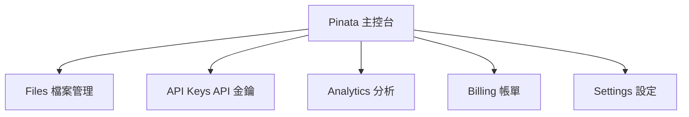
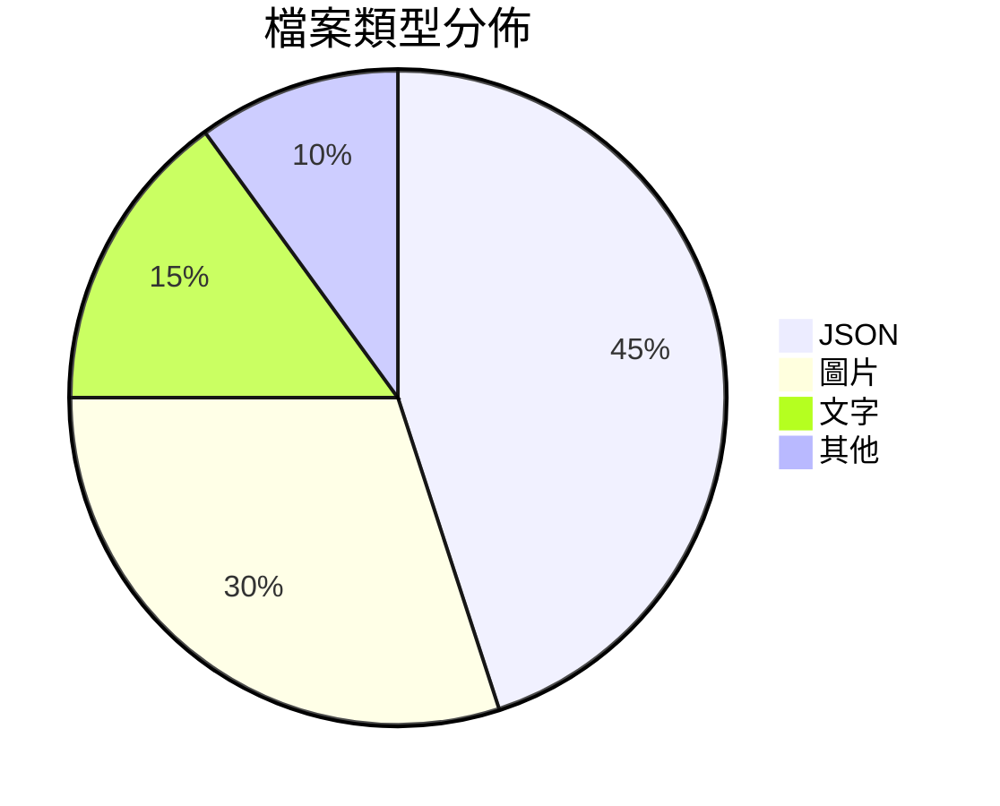

# 第三課：【實作】掌握 Pinata - 你的 DApp 儲存後盾

## 課程目標
- 註冊並設定 Pinata 帳號
- 掌握 Pinata Web 介面的操作
- 理解 Pinata 的分析儀表板
- 為後續的 API 整合做好準備

## 1. Pinata 註冊與設定

### 1.1 帳號註冊

**註冊步驟：**
1. 前往 Pinata 官網：https://www.pinata.cloud/
2. 點擊 "Sign Up" 按鈕
3. 選擇註冊方式：
   - Email 註冊
   - GitHub 帳號登入（推薦）
   - Google 帳號登入

**建議使用 GitHub 註冊的原因：**
- 快速驗證開發者身份
- 與程式碼管理工具整合
- 更好的專業信譽

### 1.2 選擇方案

**免費方案 (Starter)：**
```
✅ 1 GB 儲存空間
✅ 無限制檔案數量
✅ 基本 API 存取
✅ 社群支援
```

**付費方案比較：**

| 方案 | 儲存空間 | 月費 | Gateway 頻寬 | 適用對象 |
|------|----------|------|--------------|----------|
| **Starter** | 1 GB | 免費 | 100 GB | 學習和原型 |
| **Picnic** | 無限制 | $20/月 | 1 TB | 個人專案 |
| **Team** | 無限制 | $100/月 | 10 TB | 團隊開發 |

**初學者建議：**
- 先使用免費方案學習
- 1 GB 足夠完成本課程的所有練習
- 熟悉後再根據需求升級

### 1.3 帳號驗證

**電子郵件驗證：**
1. 檢查註冊時使用的電子郵件
2. 點擊驗證連結
3. 完成電話號碼驗證（可選但建議）

**設定個人資料：**
- 完善公司/專案資訊
- 設定頭像和簡介
- 這些資訊有助於獲得更好的支援

## 2. Pinata 主控台導覽

### 2.1 主要功能區域



### 2.2 Files 頁面詳解

**檔案列表界面：**
```
📋 檔案列表
┌─────────────────────────────────────────────────────┐
│ 🔍 Search Files                    [Upload] [Folder] │
├─────────────────────────────────────────────────────┤
│ □ 檔案名稱         │ 大小   │ 上傳時間  │ Pinned │ ... │
│ □ message.txt      │ 25 B   │ 2 分鐘前  │   ✅   │ ⋮ │
│ □ config.json      │ 156 B  │ 1 小時前  │   ✅   │ ⋮ │
│ □ image.png        │ 2.3 MB │ 昨天     │   ✅   │ ⋮ │
└─────────────────────────────────────────────────────┘
```

**重要欄位說明：**
- **檔案名稱**：你上傳時設定的名稱
- **CID**：點擊檔案名稱可查看完整 CID
- **大小**：檔案的實際大小
- **上傳時間**：檔案被 pin 的時間
- **Pin 狀態**：所有 Pinata 上的檔案都會自動被 pin

### 2.3 檔案操作選單

點擊每行末尾的 "⋮" 選單可進行：

**檢視操作：**
- **View on IPFS**：透過 Pinata Gateway 檢視
- **Copy CID**：複製檔案的 CID
- **Copy Gateway URL**：複製完整的 Gateway URL

**管理操作：**
- **Download**：下載檔案到本地
- **Rename**：修改檔案顯示名稱
- **Delete**：從 Pinata 刪除（unpin）

**分享操作：**
- **Get shareable link**：產生分享連結
- **Generate API response**：查看 API 回應格式

## 3. 實作練習：Web 介面上傳

### 3.1 準備測試檔案

讓我們創建幾個不同類型的測試檔案：

**1. 建立 dapp-config.json：**
```json
{
  "appName": "我的去中心化留言板",
  "version": "1.0.0",
  "description": "基於 IPFS 和智能合約的留言板應用",
  "features": [
    "去中心化儲存",
    "不可篡改記錄",
    "Web3 整合"
  ],
  "settings": {
    "maxMessageLength": 1000,
    "allowAnonymous": true,
    "moderationEnabled": false
  },
  "ipfs": {
    "pinningService": "Pinata",
    "gateway": "https://gateway.pinata.cloud"
  }
}
```

**2. 建立 sample-message.txt：**
```text
標題：歡迎來到去中心化留言板！

內容：
這是我們留言板應用的第一則訊息。透過 IPFS 和區塊鏈技術，
這則訊息將永遠保存在去中心化網路中，任何人都無法刪除或修改它。

作者：DApp 開發者
時間：2024-12-19
標籤：#IPFS #區塊鏈 #去中心化

---
這則訊息展示了我們即將建立的留言板 DApp 的基本功能。
```

**3. 準備一張圖片：**
- 找一張小於 1MB 的圖片（如應用 logo）
- 或使用線上工具產生一張測試圖片

### 3.2 上傳單個檔案

**步驟一：點擊 Upload**
1. 在 Files 頁面點擊右上角的 "Upload" 按鈕
2. 選擇 "File" 選項

**步驟二：選擇檔案**
1. 點擊 "Browse Files" 或直接拖拽檔案
2. 選擇 `dapp-config.json`
3. 檔案會立即顯示在上傳區域

**步驟三：設定上傳選項**
```
📋 上傳設定
┌─────────────────────────────────────┐
│ File Name: dapp-config.json         │
│ Metadata (選填):                    │
│ ┌─────────────────────────────────┐ │
│ │ {                               │ │
│ │   "project": "IPFS Course",    │ │
│ │   "type": "configuration"      │ │
│ │ }                               │ │
│ └─────────────────────────────────┘ │
│                                     │
│ [Upload to IPFS] 按鈕              │
└─────────────────────────────────────┘
```

**元資料 (Metadata) 建議：**
```json
{
  "project": "IPFS-Course",
  "type": "config",
  "description": "DApp configuration file",
  "uploadedBy": "student"
}
```

**步驟四：確認上傳**
1. 點擊 "Upload to IPFS" 按鈕
2. 等待上傳完成
3. 系統會顯示成功訊息和 CID

### 3.3 上傳多個檔案

**一次選擇多個檔案：**
1. 點擊 "Upload" → "File"
2. 在檔案選擇對話框中：
   - Windows：按住 Ctrl 鍵選擇多個檔案
   - macOS：按住 Cmd 鍵選擇多個檔案
3. 所有選中的檔案會顯示在上傳列表中
4. 點擊 "Upload to IPFS" 一次性上傳

**拖拽上傳：**
1. 直接將多個檔案拖拽到上傳區域
2. 系統會自動識別所有檔案
3. 確認後批量上傳

### 3.4 上傳資料夾

**建立測試資料夾結構：**
```
my-dapp-assets/
├── config/
│   ├── app-config.json
│   └── theme-config.json
├── messages/
│   ├── welcome.txt
│   └── sample-posts.json
└── images/
    ├── logo.png
    └── background.jpg
```

**上傳資料夾步驟：**
1. 點擊 "Upload" → "Folder"
2. 選擇整個 `my-dapp-assets` 資料夾
3. Pinata 會保持原有的資料夾結構
4. 每個檔案和資料夾都會得到獨立的 CID

**重要提醒：**
- 資料夾上傳會建立 IPFS 目錄結構
- 可以透過 `/ipfs/CID/folder/file.txt` 存取特定檔案
- 整個資料夾有一個根 CID

## 4. 檔案管理功能

### 4.1 搜尋與篩選

**搜尋功能：**
```
🔍 搜尋框支援：
- 檔案名稱搜尋
- CID 搜尋
- 元資料搜尋
```

**實際範例：**
- 搜尋 "config" 找到所有配置檔案
- 搜尋 "QmYwAP..." 找到特定 CID 的檔案
- 搜尋 "project:IPFS-Course" 找到特定專案的檔案

**篩選選項：**
- **檔案類型**：依副檔名篩選
- **上傳時間**：今天、本週、本月等
- **檔案大小**：小於 1MB、1-10MB 等

### 4.2 標籤和元資料管理

**為檔案添加標籤：**
1. 點擊檔案的 "⋮" 選單
2. 選擇 "Edit metadata"
3. 添加或修改元資料：

```json
{
  "project": "IPFS-Course",
  "type": "configuration",
  "environment": "development",
  "tags": ["config", "dapp", "ipfs"],
  "description": "Main configuration file for the DApp"
}
```

**元資料的好處：**
- 更好的檔案組織
- 方便搜尋和篩選
- 專案管理
- 團隊協作時的檔案識別

### 4.3 批量操作

**選擇多個檔案：**
1. 使用檔案列表左側的核取方塊
2. 可以選擇單個或多個檔案
3. 選中後會出現批量操作選單

**批量操作選項：**
- **Delete selected**：批量刪除
- **Download selected**：批量下載
- **Update metadata**：批量更新元資料

## 5. Pinata Gateway 使用

### 5.1 理解 Pinata Gateway

**Pinata Gateway URL 格式：**
```
https://gateway.pinata.cloud/ipfs/[CID]
```

**與公共 Gateway 的差異：**

| 特性 | Pinata Gateway | 公共 Gateway |
|------|----------------|--------------|
| **速度** | 較快，CDN 加速 | 變動較大 |
| **可靠性** | 高可用性保證 | 依服務提供者而定 |
| **頻寬限制** | 根據方案不同 | 可能有限制 |
| **自訂網域** | 付費方案支援 | 不支援 |

### 5.2 Gateway 功能測試

**測試不同的存取方式：**

1. **透過 Pinata Gateway：**
   ```
   https://gateway.pinata.cloud/ipfs/QmYourCIDHere
   ```

2. **透過 IPFS.io：**
   ```
   https://ipfs.io/ipfs/QmYourCIDHere
   ```

3. **透過 Cloudflare：**
   ```
   https://cloudflare-ipfs.com/ipfs/QmYourCIDHere
   ```

**比較測試步驟：**
1. 上傳一個測試檔案到 Pinata
2. 複製檔案的 CID
3. 用上述三種 Gateway 分別存取
4. 記錄載入時間和成功率

### 5.3 Gateway 進階功能

**檔案類型處理：**
- **文字檔案**：直接在瀏覽器顯示
- **JSON 檔案**：格式化顯示
- **圖片檔案**：直接顯示圖片
- **其他檔案**：提供下載

**目錄瀏覽：**
```
https://gateway.pinata.cloud/ipfs/QmDirectoryCID/
```
會顯示目錄列表，可以點擊進入子目錄或檔案

**URL 參數：**
```
# 指定檔案名稱（影響下載時的檔案名）
https://gateway.pinata.cloud/ipfs/QmCID?filename=myfile.txt

# 強制下載
https://gateway.pinata.cloud/ipfs/QmCID?download=true
```

## 6. API Keys 管理

### 6.1 產生 API Keys

**建立新的 API Key：**
1. 前往 "API Keys" 頁面
2. 點擊 "New Key" 按鈕
3. 設定 Key 的詳細資訊：

```
📋 API Key 設定
┌─────────────────────────────────────┐
│ Key Name: IPFS-Course-Development   │
│                                     │
│ Permissions:                        │
│ ☑ pinFileToIPFS                    │
│ ☑ pinJSONToIPFS                    │
│ ☑ pinHashToIPFS                    │
│ ☑ unpin                            │
│ ☑ userPinnedDataTotal              │
│                                     │
│ Max Uses: 1000 (選填)              │
│                                     │
│ [Generate API Key] 按鈕            │
└─────────────────────────────────────┘
```

**建議的權限設定：**
- **開發階段**：選擇所有權限
- **生產階段**：只選擇必要的權限
- **臨時測試**：設定使用次數限制

### 6.2 API Key 安全管理

**API Key 組成：**
```
API Key: 7d4f8a9e2c1b3f5d8e7a9c2b4f6d8e1a
API Secret: a1b2c3d4e5f6789012345678901234567890
JWT Token: eyJhbGciOiJIUzI1NiIsInR5cCI6IkpXVCJ9...
```

**安全最佳實踐：**

1. **立即儲存**：產生後立即複製並安全儲存
2. **環境變數**：永遠不要將 API Key 寫在程式碼中
3. **權限最小化**：只給予必要的權限
4. **定期輪換**：定期更新 API Key
5. **監控使用**：定期檢查 API Key 的使用狀況

**環境變數設定範例：**
```bash
# .env 檔案（永遠不要提交到 git）
PINATA_API_KEY=7d4f8a9e2c1b3f5d8e7a9c2b4f6d8e1a
PINATA_SECRET_API_KEY=a1b2c3d4e5f6789012345678901234567890
PINATA_JWT=eyJhbGciOiJIUzI1NiIsInR5cCI6IkpXVCJ9...
```

### 6.3 API Key 測試

**使用 curl 測試：**
```bash
# 測試 API 連接
curl -X GET "https://api.pinata.cloud/data/testAuthentication" \
  -H "pinata_api_key: YOUR_API_KEY" \
  -H "pinata_secret_api_key: YOUR_SECRET"

# 成功回應：
# {"message":"Congratulations! You are communicating with the Pinata API!"}
```

**使用 Postman 測試：**
1. 建立新的 GET 請求
2. URL: `https://api.pinata.cloud/data/testAuthentication`
3. Headers 中添加：
   - `pinata_api_key`: 你的 API Key
   - `pinata_secret_api_key`: 你的 Secret

## 7. Analytics 儀表板

### 7.1 主要指標

**儲存統計：**
```
📊 儲存使用情況
┌─────────────────────────────────────┐
│ Total Files: 157                    │
│ Total Size: 245.8 MB               │
│ Bandwidth Used: 1.2 GB             │
│ API Calls: 3,456                   │
└─────────────────────────────────────┘
```

**時間趨勢：**
- 每日上傳量
- 檔案數量成長
- 頻寬使用趨勢
- API 調用頻率

### 7.2 使用分析

**檔案類型分佈：**


**存取模式分析：**
- 最常存取的檔案
- Gateway 流量分佈
- 尖峰使用時段

### 7.3 成本管理

**方案使用監控：**
- 當前方案限制
- 使用量百分比
- 預估月底使用量
- 升級建議

**成本優化建議：**
1. **定期清理**：刪除不需要的檔案
2. **壓縮檔案**：上傳前壓縮大型檔案
3. **批量上傳**：減少 API 調用次數

## 8. 實作作業

### 8.1 基礎作業

1. **檔案上傳練習**
   - 上傳至少 5 個不同類型的檔案
   - 為每個檔案添加適當的元資料
   - 記錄所有檔案的 CID

2. **Gateway 測試**
   - 透過 3 個不同的 Gateway 存取你的檔案
   - 記錄存取速度和可靠性
   - 比較使用體驗

3. **搜尋和管理**
   - 使用搜尋功能找到特定檔案
   - 練習批量操作
   - 修改檔案的元資料

### 8.2 進階作業

1. **專案組織**
   建立一個完整的專案結構：
   ```
   my-dapp-project/
   ├── contracts/
   │   └── contract-abi.json
   ├── frontend/
   │   ├── config.json
   │   └── styles.css
   ├── assets/
   │   ├── logo.png
   │   └── favicon.ico
   └── docs/
       ├── README.md
       └── api-docs.json
   ```

2. **API Key 設定**
   - 產生專用的 API Key
   - 設定適當的權限
   - 在本地環境中設定環境變數

3. **分析和監控**
   - 定期檢查 Analytics 數據
   - 記錄使用趨勢
   - 制定檔案管理策略

### 8.3 整合準備

**為下一模組做準備：**
1. 確保你有可用的 Pinata API Key
2. 熟悉 Pinata 的檔案管理介面
3. 理解 CID 和 Gateway URL 的使用方式
4. 準備好用於智能合約整合的測試檔案

## 9. 課程小結

### 9.1 學習成果檢查

通過本課程，你應該已經掌握：

✅ **Pinata 帳號和設定**
- 成功註冊並驗證帳號
- 理解不同方案的差異
- 熟悉主控台介面

✅ **檔案管理操作**
- 單檔案和批量上傳
- 資料夾結構上傳
- 搜尋、篩選和組織檔案

✅ **API Key 管理**
- 產生和設定 API Key
- 理解安全最佳實踐
- 測試 API 連接

✅ **分析和監控**
- 閱讀使用統計數據
- 理解成本結構
- 制定管理策略

### 9.2 IPFS Desktop vs Pinata 比較

| 方面 | IPFS Desktop | Pinata |
|------|--------------|--------|
| **學習價值** | 高，理解底層原理 | 中，專注於應用 |
| **操作複雜度** | 高，需要技術知識 | 低，用戶友好 |
| **可靠性** | 中，依賴本地設備 | 高，企業級基礎設施 |
| **成本** | 免費但需要維護 | 有月費但省時間 |
| **適用場景** | 學習和實驗 | 商業開發 |

### 9.3 最佳實踐總結

1. **檔案組織**
   - 使用有意義的檔案名稱
   - 添加詳細的元資料
   - 建立清晰的專案結構

2. **安全管理**
   - 妥善保管 API Key
   - 使用環境變數
   - 定期檢查權限設定

3. **成本控制**
   - 監控使用量
   - 及時清理不需要的檔案
   - 選擇合適的方案

### 9.4 下一步準備

現在你已經掌握了 IPFS 的兩種主要使用方式：
- IPFS Desktop：理解了去中心化儲存的原理
- Pinata：掌握了商業級的 IPFS 服務

在下一個模組中，我們將開始整合這些技術到實際的 DApp 開發中，建立我們的去中心化留言板應用。

## 練習題

1. 比較使用 IPFS Desktop 和 Pinata 上傳相同檔案的體驗差異。
2. 設計一個檔案管理策略，確保你的 DApp 檔案能夠長期可用。
3. 計算你的專案在不同使用量下使用 Pinata 的月費成本。
4. 解釋為什麼 Pinata 特別適合商業 DApp 開發。

---

**模組二總結**：我們已經完成了 IPFS 的理論學習和實際操作，現在你具備了將 IPFS 整合到 DApp 中的所有必要知識。接下來我們將開始建立真正的去中心化應用！
