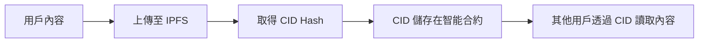

# 第一課：重新思考鏈上儲存的限制

## 課程目標
- 理解 Solidity 中 `string` 與 `bytes` 的 Gas 成本
- 認識將使用者生成內容（UGC）直接上鏈的問題
- 建立「鏈下儲存」的開發思維

## 1. 鏈上儲存的現實困境

### 1.1 Gas 成本分析

在以太坊上，每個儲存操作都需要消耗 Gas。讓我們來看看實際的成本：

```solidity
// 範例合約：直接儲存文字的留言板
contract SimpleMessageBoard {
    struct Message {
        address sender;
        string content;  // 這裡直接儲存文字內容
        uint256 timestamp;
    }
    
    Message[] public messages;
    
    function postMessage(string memory _content) public {
        messages.push(Message({
            sender: msg.sender,
            content: _content,
            timestamp: block.timestamp
        }));
    }
}
```

**Gas 成本計算：**
- 每個字元（byte）的儲存成本約為 **20,000 Gas**
- 一篇 1000 字的文章（約 3000 bytes）需要：**60,000,000 Gas**
- 以 20 Gwei 的 Gas Price 計算：**1.2 ETH**（約台幣 $60,000）

### 1.2 實際範例比較

讓我們用具體數字來感受這個差異：

| 內容類型 | 大小 | Gas 成本 | ETH 成本 (20 Gwei) | 台幣成本 |
|---------|------|----------|-------------------|----------|
| 短推文 (140字) | 420 bytes | 8,400,000 | 0.168 ETH | ~$8,400 |
| 部落格文章 | 3,000 bytes | 60,000,000 | 1.2 ETH | ~$60,000 |
| 高解析度圖片 | 2 MB | 40,000,000,000 | 800 ETH | ~$40,000,000 |

### 1.3 為什麼這樣的成本是不合理的？

1. **用戶體驗問題**：沒有人願意為發一篇文章支付數萬元
2. **可擴展性問題**：區塊鏈會因為大量資料而變得臃腫
3. **經濟模型問題**：高昂的成本會阻礙創新和採用

## 2. 傳統 Web2 vs Web3 的儲存思維

### 2.1 Web2 的儲存模式
```
用戶上傳內容 → 中心化伺服器 → 資料庫儲存
優點：便宜、快速
缺點：中心化、可能被審查、伺服器可能關閉
```

### 2.2 原始 Web3 思維（錯誤方向）
```
用戶上傳內容 → 直接上鏈儲存
優點：去中心化、不可篡改
缺點：極度昂貴、不可行
```

### 2.3 現代 Web3 思維（正確方向）
```
用戶上傳內容 → IPFS 儲存 → 鏈上儲存 IPFS Hash
優點：去中心化、便宜、不可篡改的索引
缺點：需要額外的技術整合
```

## 3. 鏈下儲存 (Off-Chain Storage) 的概念

### 3.1 什麼是鏈下儲存？

鏈下儲存是指將實際資料儲存在區塊鏈之外，但在區塊鏈上儲存資料的「指紋」或「地址」，以確保資料的完整性和可驗證性。

### 3.2 常見的鏈下儲存解決方案

1. **IPFS (InterPlanetary File System)**
   - 去中心化的檔案系統
   - 使用內容定址 (Content Addressing)
   - 本課程的重點

2. **Arweave**
   - 永久儲存區塊鏈
   - 一次付費，永久儲存

3. **Sia Network**
   - 分散式雲端儲存

4. **Swarm**
   - 以太坊生態系的儲存解決方案

### 3.3 鏈下儲存的運作原理



## 4. 實際範例：對比分析

### 4.1 鏈上儲存版本
```solidity
contract OnChainMessageBoard {
    struct Message {
        address sender;
        string content;  // 直接儲存內容 - 昂貴！
        uint256 timestamp;
    }
    
    Message[] public messages;
    
    function postMessage(string memory _content) public {
        // 這個操作對於長文字會非常昂貴
        messages.push(Message({
            sender: msg.sender,
            content: _content,
            timestamp: block.timestamp
        }));
    }
}
```

### 4.2 鏈下儲存版本
```solidity
contract OffChainMessageBoard {
    struct Message {
        address sender;
        string ipfsHash;  // 只儲存 IPFS Hash - 便宜！
        uint256 timestamp;
    }
    
    Message[] public messages;
    
    function postMessage(string memory _ipfsHash) public {
        // 只儲存 46 個字元的 Hash，成本固定且低廉
        messages.push(Message({
            sender: msg.sender,
            ipfsHash: _ipfsHash,
            timestamp: block.timestamp
        }));
    }
}
```

### 4.3 成本對比

| 版本 | 儲存內容 | Gas 成本 | 1000字文章成本 |
|------|----------|----------|---------------|
| 鏈上儲存 | 完整文字內容 | ~60,000,000 Gas | ~$60,000 |
| 鏈下儲存 | IPFS Hash (46字元) | ~920,000 Gas | ~$46 |

**成本降低了 99.98%！**

## 5. 課程小結

### 5.1 關鍵學習點
1. **直接鏈上儲存大型內容在經濟上不可行**
2. **鏈下儲存 + 鏈上索引是現代 DApp 的標準做法**
3. **IPFS 是目前最流行的去中心化儲存解決方案**

### 5.2 思維轉換
- ❌ 舊思維：「所有東西都要上鏈才算去中心化」
- ✅ 新思維：「重要的是資料的完整性和可驗證性，而不是儲存位置」

### 5.3 為下一課做準備
在下一課中，我們將深入了解 IPFS 的工作原理，並理解為什麼它是解決這個問題的最佳方案。

## 練習題

1. 計算在當前 Gas Price 下，儲存一篇 5000 字文章的成本
2. 思考：除了成本考量，直接鏈上儲存大型內容還有哪些問題？
3. 研究：查找一個知名 DApp，了解它是如何處理大型資料儲存的

---

**下一課預告**：我們將探索 IPFS 的革命性設計理念，了解它如何成為新一代網路的基礎設施。
