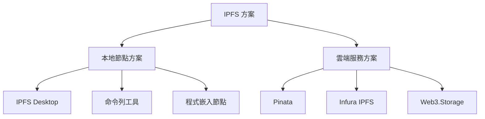
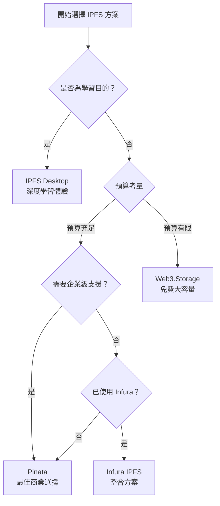
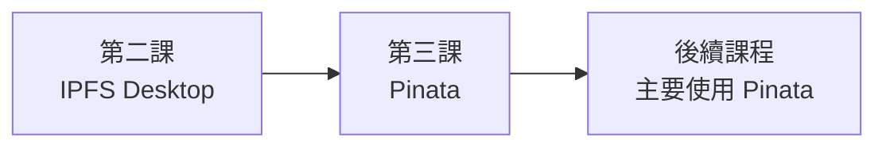

# 第一課：選擇你的 IPFS 方案

## 課程目標
- 了解不同 IPFS 方案的優缺點
- 學會根據專案需求選擇合適的 IPFS 工具
- 為後續實作課程做好技術選型準備

## 1. IPFS 方案總覽

在開發 DApp 時，我們有多種方式來與 IPFS 互動。選擇合適的方案是專案成功的關鍵。

### 1.1 主要方案分類

### 1.2 選擇標準

在選擇 IPFS 方案時，需要考慮以下因素：

| 考量因素 | 重要性 | 說明 |
|----------|--------|------|
| **開發難度** | ⭐⭐⭐⭐⭐ | 學習曲線和實作複雜度 |
| **維護成本** | ⭐⭐⭐⭐ | 長期營運的人力和技術成本 |
| **效能表現** | ⭐⭐⭐ | 上傳/下載速度和可靠性 |
| **成本控制** | ⭐⭐⭐⭐ | 儲存和頻寬的費用 |
| **去中心化程度** | ⭐⭐ | 對去中心化理念的符合程度 |

## 2. 方案一：本地節點（IPFS Desktop）

### 2.1 什麼是 IPFS Desktop？

IPFS Desktop 是 Protocol Labs 開發的官方桌面應用程式，提供了完整的 IPFS 節點功能和圖形化介面。

### 2.2 IPFS Desktop 的特色

**視覺化介面：**
- 直觀的檔案管理
- 網路狀態監控
- 節點資訊儀表板

**完整的 IPFS 功能：**
- 檔案上傳與分享
- Pin 管理
- 節點設定
- Peer 連接管理

### 2.3 IPFS Desktop 的優勢

✅ **完全去中心化**
- 直接參與 IPFS 網路
- 不依賴第三方服務
- 完全控制你的資料

✅ **學習價值高**
- 深度理解 IPFS 運作原理
- 直接觀察 P2P 網路行為
- 完整的功能體驗

✅ **免費使用**
- 無月費或使用限制
- 只需要提供儲存空間

✅ **隱私保護**
- 資料不經過第三方
- 完全的資料主權

### 2.4 IPFS Desktop 的劣勢

❌ **技術門檻較高**
- 需要理解網路配置
- 防火牆和 NAT 設定
- 故障排除需要技術知識

❌ **維護負擔**
- 需要保持電腦運行
- 定期更新軟體
- 監控磁碟空間

❌ **網路依賴**
- 需要穩定的網路連線
- 上傳速度受限於住家網路
- 可能的連線問題

❌ **可靠性考量**
- 單點故障風險
- 硬體損壞可能導致資料遺失

### 2.5 適用場景

**最適合：**
- 學習和實驗 IPFS
- 個人專案或小型應用
- 對去中心化有強烈需求
- 技術團隊有維護能力

**不適合：**
- 商業級應用
- 需要高可用性的服務
- 團隊缺乏技術經驗
- 快速開發需求

## 3. 方案二：Pinning 服務（以 Pinata 為例）

### 3.1 什麼是 Pinata？

Pinata 是目前最受歡迎的 IPFS Pinning 服務，提供簡單易用的 API 和可靠的基礎設施。

### 3.2 Pinata 的核心功能

**檔案管理：**
- Web UI 上傳
- API 自動化上傳
- 檔案組織和標籤
- 批量操作

**Pinning 服務：**
- 自動 Pin 上傳的檔案
- 多節點備份
- 高可用性保證

**分析工具：**
- 儲存使用統計
- 流量分析
- 費用追蹤

### 3.3 Pinata 的優勢

✅ **極低的技術門檻**
- 簡單的 Web 介面
- RESTful API 設計
- 豐富的文件和範例

✅ **企業級可靠性**
- 99.9% 的可用性保證
- 多地區備份
- 24/7 監控

✅ **快速開發**
- 註冊即可使用
- 無需設定基礎設施
- 豐富的 SDK 支援

✅ **可擴展性**
- 彈性的價格方案
- 支援大型檔案
- CDN 加速存取

### 3.4 Pinata 的劣勢

❌ **月費成本**
- 超過免費額度需要付費
- 長期成本可能較高

❌ **中心化依賴**
- 依賴 Pinata 的服務
- 服務中斷會影響應用
- 需要信任第三方

❌ **API 限制**
- 請求頻率限制
- 檔案大小限制
- 功能受服務提供者限制

### 3.5 Pinata 價格結構

| 方案 | 儲存空間 | 月費 | 適用對象 |
|------|----------|------|----------|
| **免費** | 1 GB | $0 | 學習和小型專案 |
| **Picnic** | 無限制 | $20/月 | 個人開發者 |
| **Team** | 無限制 | $100/月 | 小型團隊 |
| **Enterprise** | 無限制 | 客製化 | 企業客戶 |

### 3.6 適用場景

**最適合：**
- 商業級 DApp 開發
- 快速原型開發
- 團隊協作專案
- 需要高可用性的應用

**不適合：**
- 預算極度有限的專案
- 對去中心化有嚴格要求
- 大量資料儲存需求

## 4. 其他重要的 Pinning 服務

### 4.1 Infura IPFS

**特色：**
- 與 Infura 以太坊服務整合
- 企業級基礎設施
- 支援專用 Gateway

**價格：**
- 5 GB 免費額度
- $0.08/GB/月

**適合：**
- 已使用 Infura 以太坊服務的團隊
- 需要整合的區塊鏈解決方案

### 4.2 Web3.Storage

**特色：**
- Protocol Labs 官方服務
- 免費 1 TB 儲存
- 專注於 NFT 和 Web3

**優勢：**
- 大量免費額度
- 官方支援
- 與 Filecoin 整合

**適合：**
- NFT 專案
- 大量資料儲存需求
- 實驗性專案

### 4.3 4EVERLAND

**特色：**
- 去中心化雲端平台
- 支援 IPFS 和 Arweave
- 提供 CDN 服務

**適合：**
- 需要多鏈支援
- 全球 CDN 需求

## 5. 方案比較與選擇指南

### 5.1 詳細比較表

| 特性 | IPFS Desktop | Pinata | Infura IPFS | Web3.Storage |
|------|--------------|--------|-------------|--------------|
| **學習曲線** | 高 | 低 | 低 | 低 |
| **設定複雜度** | 高 | 極低 | 低 | 低 |
| **月費成本** | 免費 | $20起 | $0.08/GB | 免費 |
| **可靠性** | 中等 | 高 | 高 | 高 |
| **去中心化** | 完全 | 部分 | 部分 | 部分 |
| **API 品質** | N/A | 優秀 | 良好 | 良好 |
| **文件完整度** | 高 | 優秀 | 良好 | 中等 |
| **社群支援** | 高 | 高 | 中等 | 中等 |

### 5.2 選擇決策樹

### 5.3 混合策略建議

很多成功的專案會採用混合策略：

**開發階段：**
1. **學習階段**：使用 IPFS Desktop 理解原理
2. **開發階段**：使用 Pinata 快速原型
3. **測試階段**：多個服務交叉驗證

**生產階段：**
1. **主要服務**：選擇一個可靠的 Pinning 服務
2. **備援服務**：設定第二個 Pinning 服務
3. **監控機制**：定期檢查資料可用性

## 6. 本課程的選擇策略

### 6.1 我們的學習路徑

基於教學效果和實用性，本課程將採用以下策略：

### 6.2 選擇理由

**為什麼先學 IPFS Desktop？**
- 理解 IPFS 的底層運作
- 獲得完整的 P2P 體驗
- 建立對去中心化的深度認知

**為什麼主要使用 Pinata？**
- 最適合 DApp 開發的商業方案
- 優秀的開發者體驗
- 豐富的文件和社群支援
- 容易整合到 Scaffold-eth-2

### 6.3 學習建議

1. **第二課**：親手體驗 IPFS Desktop，理解原理
2. **第三課**：掌握 Pinata，為實際開發做準備
3. **後續課程**：在 DApp 中整合 Pinata API

## 7. 課程小結

### 7.1 關鍵決策因素

選擇 IPFS 方案時，請考慮：

| 因素 | IPFS Desktop | Pinning 服務 |
|------|--------------|--------------|
| **專案階段** | 學習、實驗 | 開發、生產 |
| **技術能力** | 高 | 中低 |
| **預算考量** | 免費但需設備 | 有月費但省時間 |
| **可靠性需求** | 中等 | 高 |
| **去中心化需求** | 高 | 中等 |

### 7.2 實際建議

**對於個人學習者：**
- 從 IPFS Desktop 開始
- 理解原理後轉向 Pinning 服務

**對於專業開發者：**
- 直接選擇合適的 Pinning 服務
- 建立備援和監控策略

**對於企業專案：**
- 評估多個 Pinning 服務
- 考慮混合部署策略

### 7.3 為下一課做準備

在下一課中，我們將：
1. 安裝並設定 IPFS Desktop
2. 上傳第一個檔案到 IPFS
3. 理解本地節點的運作方式
4. 為後續的 Pinata 整合奠定基礎

## 練習題

1. 比較在以下情況下，你會選擇哪種 IPFS 方案，並說明理由：
   - 個人部落格
   - NFT 市場
   - 企業文件管理系統

2. 計算一個每月有 1000 個用戶，每個用戶平均上傳 10MB 內容的應用，使用不同方案的年度成本。

3. 設計一個備援策略，確保你的重要資料在任何情況下都能存取。

---

**下一課預告**：我們將親手安裝 IPFS Desktop，上傳第一個檔案，並體驗完全去中心化的檔案分享！
