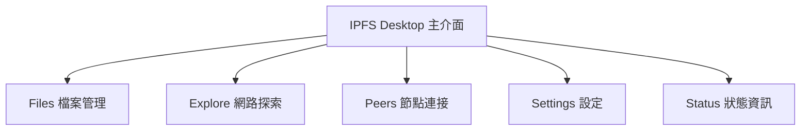
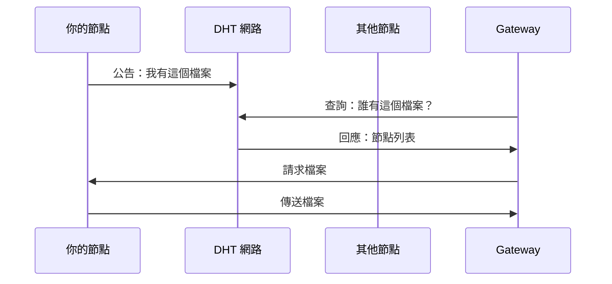

# 第二課：【實作】使用 IPFS Desktop 上傳與讀取

## 課程目標
- 安裝並設定 IPFS Desktop
- 實際操作檔案上傳並取得 CID
- 透過不同方式存取 IPFS 內容
- 獲得 IPFS 操作的直觀體感

## 1. 安裝 IPFS Desktop

### 1.1 系統需求

**支援的作業系統：**
- Windows 10 或更新版本
- macOS 10.14 或更新版本
- Linux (Ubuntu 18.04+ 或其他主流發行版)

**硬體需求：**
- 至少 2GB RAM
- 至少 1GB 可用硬碟空間
- 穩定的網路連線

### 1.2 下載與安裝

**步驟一：下載**
1. 前往官方網站：https://github.com/ipfs/ipfs-desktop/releases
2. 選擇適合你作業系統的版本
3. 下載最新的穩定版本

**各平台檔案格式：**
- **Windows**: `IPFS-Desktop-Setup-X.X.X.exe`
- **macOS**: `IPFS-Desktop-X.X.X.dmg`
- **Linux**: `IPFS-Desktop-X.X.X.AppImage`

**步驟二：安裝**

**Windows：**
```bash
# 雙擊 .exe 檔案，跟隨安裝精靈
# 安裝完成後會自動啟動
```

**macOS：**
```bash
# 雙擊 .dmg 檔案
# 將 IPFS Desktop 拖拽到 Applications 資料夾
# 從 Applications 資料夾啟動
```

**Linux：**
```bash
# 給予執行權限
chmod +x IPFS-Desktop-X.X.X.AppImage

# 執行應用程式
./IPFS-Desktop-X.X.X.AppImage
```

### 1.3 首次啟動設定

**初始化畫面：**
當您第一次啟動 IPFS Desktop 時，會看到歡迎畫面和初始化設定。

**重要設定選項：**
1. **存放位置**：選擇 IPFS 資料存放的資料夾
2. **網路設定**：通常使用預設值即可
3. **開機自動啟動**：建議開啟以維持節點運行

## 2. IPFS Desktop 介面導覽

### 2.1 主要功能區域



### 2.2 Files（檔案管理）

**功能介紹：**
- 瀏覽你的 IPFS 檔案
- 上傳新檔案
- 管理檔案和資料夾
- Pin/Unpin 檔案

**界面元素：**
- **Import 按鈕**：上傳檔案或資料夾
- **檔案列表**：顯示所有已上傳的檔案
- **Pin 狀態指示器**：顯示檔案是否被 pin
- **分享按鈕**：取得檔案的 IPFS 連結

### 2.3 Status（狀態資訊）

**重要指標：**
```
Peer ID: QmYourPeerIdHere...
Connected Peers: 45
Repository Size: 125.6 MB
```

- **Peer ID**：你的節點在 IPFS 網路中的唯一識別符
- **Connected Peers**：當前連接的其他節點數量
- **Repository Size**：本地儲存的資料總大小

## 3. 實作練習：上傳第一個檔案

### 3.1 準備測試檔案

讓我們創建一個簡單的測試檔案：

**建立 message.txt：**
```text
Hello IPFS World!

這是我上傳到 IPFS 的第一個檔案。
時間：2024年12月19日
內容：測試訊息

IPFS 是一個了不起的去中心化檔案系統！
```

**建立 message.json：**
```json
{
  "title": "我的第一則 IPFS 訊息",
  "content": "Hello IPFS World!",
  "author": "IPFS 學習者",
  "timestamp": "2024-12-19T10:00:00Z",
  "tags": ["IPFS", "學習", "去中心化"],
  "metadata": {
    "version": "1.0",
    "encoding": "UTF-8"
  }
}
```

### 3.2 上傳檔案步驟

**步驟一：開啟 Files 頁面**
1. 在 IPFS Desktop 中點擊 "Files" 標籤
2. 確認你在根目錄（/）

**步驟二：上傳檔案**
1. 點擊 "Import" 按鈕
2. 選擇 "File" 選項
3. 瀏覽並選擇你剛創建的 `message.txt`
4. 點擊 "Open" 確認上傳

**步驟三：查看結果**
上傳完成後，你會看到：
```
📄 message.txt
   📍 Pinned
   🔗 QmHash...
   📊 25 bytes
```

### 3.3 取得 CID

**方法一：透過 IPFS Desktop**
1. 在檔案列表中找到你的檔案
2. 點擊檔案旁的 "..." 選單
3. 選擇 "Copy Hash" 或 "Share"
4. CID 會被複製到剪貼簿

**方法二：透過右鍵選單**
1. 在檔案上右鍵點擊
2. 選擇 "Copy CID"

**典型的 CID 格式：**
```
QmYwAPJzv5CZsnA625s3Xf2nemtYgPpHdWEz79ojWnPbdG
```

## 4. 存取 IPFS 內容的不同方式

### 4.1 方法一：本地 Gateway

**本地 Gateway URL：**
```
http://localhost:8080/ipfs/[YOUR_CID]
```

**實際範例：**
```
http://localhost:8080/ipfs/QmYwAPJzv5CZsnA625s3Xf2nemtYgPpHdWEz79ojWnPbdG
```

**操作步驟：**
1. 複製你的檔案 CID
2. 在瀏覽器中輸入上述 URL 格式
3. 將 `[YOUR_CID]` 替換為實際的 CID
4. 按 Enter 訪問

**優點：**
- 最快的存取速度
- 完全隱私（不經過外部服務）
- 無頻寬限制

### 4.2 方法二：公共 Gateway

**主要公共 Gateway：**

1. **IPFS.io (官方)**
   ```
   https://ipfs.io/ipfs/[YOUR_CID]
   ```

2. **Cloudflare**
   ```
   https://cloudflare-ipfs.com/ipfs/[YOUR_CID]
   ```

3. **Pinata Gateway**
   ```
   https://gateway.pinata.cloud/ipfs/[YOUR_CID]
   ```

**測試練習：**
1. 使用你的 CID 嘗試所有 Gateway
2. 比較載入速度
3. 觀察是否都能正確顯示內容

### 4.3 方法三：透過 IPFS Desktop 預覽

**直接預覽：**
1. 在 Files 頁面點擊檔案名稱
2. IPFS Desktop 會開啟內建預覽器
3. 對於文字檔案會直接顯示內容

**外部應用程式開啟：**
1. 右鍵點擊檔案
2. 選擇 "Open with system application"
3. 使用預設程式開啟

## 5. 進階操作：使用命令列

### 5.1 開啟命令列介面

IPFS Desktop 內建了命令列工具的存取：

**Windows：**
```cmd
# IPFS Desktop 會自動設定 PATH
# 開啟 Command Prompt 或 PowerShell
ipfs version
```

**macOS/Linux：**
```bash
# 檢查 IPFS 是否可用
ipfs version

# 如果不可用，可能需要手動設定 PATH
export PATH=$PATH:/Applications/IPFS\ Desktop.app/Contents/Resources/app/node_modules/go-ipfs/bin
```

### 5.2 常用命令練習

**檢查節點狀態：**
```bash
# 查看節點資訊
ipfs id

# 查看連接的節點
ipfs swarm peers | head -10

# 查看儲存庫統計
ipfs repo stat
```

**檔案操作：**
```bash
# 上傳檔案
ipfs add message.txt

# 查看檔案內容
ipfs cat QmYourCIDHere

# 下載檔案
ipfs get QmYourCIDHere

# 列出目錄內容
ipfs ls QmYourCIDHere
```

**Pin 管理：**
```bash
# 查看所有 pinned 檔案
ipfs pin ls

# Pin 一個檔案
ipfs pin add QmYourCIDHere

# Unpin 一個檔案
ipfs pin rm QmYourCIDHere
```

### 5.3 實作練習：命令列上傳

**創建新的測試檔案：**
```bash
# 創建一個新檔案
echo "透過命令列上傳到 IPFS" > cli-test.txt

# 上傳到 IPFS
ipfs add cli-test.txt

# 輸出範例：
# added QmNewCIDHere cli-test.txt
```

**驗證上傳結果：**
```bash
# 透過命令列讀取
ipfs cat QmNewCIDHere

# 透過本地 Gateway 驗證
curl http://localhost:8080/ipfs/QmNewCIDHere
```

## 6. 理解 IPFS 網路行為

### 6.1 觀察節點連接

**檢查連接狀態：**
```bash
# 查看當前連接的節點數
ipfs swarm peers | wc -l

# 查看詳細的節點資訊
ipfs swarm peers --verbose
```

**連接過程理解：**
1. 你的節點會自動尋找其他 IPFS 節點
2. 透過 DHT 發現內容提供者
3. 建立 P2P 連接來交換資料

### 6.2 觀察檔案傳播

**模擬檔案請求：**
1. 清除瀏覽器快取
2. 透過不同的公共 Gateway 存取你的檔案
3. 觀察載入時間的差異

**理解傳播過程：**


### 6.3 Pin 和垃圾回收

**理解 Pinning：**
```bash
# 查看 Pin 狀態
ipfs pin ls --type recursive

# 手動垃圾回收（小心使用！）
ipfs repo gc
```

**重要概念：**
- Pin 的檔案不會被垃圾回收
- 未 Pin 的檔案可能會被自動清理
- IPFS Desktop 預設會 Pin 你上傳的檔案

## 7. 疑難排解

### 7.1 常見問題與解決方案

**問題一：無法連接到其他節點**
```bash
# 檢查網路連接
ipfs swarm peers

# 如果連接數為 0，嘗試重啟節點
ipfs shutdown
# 重新啟動 IPFS Desktop
```

**問題二：Gateway 無法存取**
```bash
# 檢查本地 Gateway 是否運行
curl http://localhost:8080/ipfs/QmUNLLsPACCz1vLxQVkXqqLX5R1X345qqfHbsf67hvA3Nn

# 檢查 API 端口
ipfs config Addresses.API
```

**問題三：檔案上傳失敗**
- 檢查硬碟空間是否足夠
- 確認檔案權限
- 嘗試重新啟動 IPFS Desktop

### 7.2 效能優化

**調整設定：**
```bash
# 查看當前設定
ipfs config show

# 調整連接限制
ipfs config Swarm.ConnMgr.HighWater 100
ipfs config Swarm.ConnMgr.LowWater 50
```

**網路優化：**
- 確保防火牆允許 IPFS 連接
- 檢查路由器的 UPnP 設定
- 考慮手動設定端口轉發

## 8. 實作作業

### 8.1 基礎作業

1. **上傳多種檔案類型**
   - 文字檔案 (.txt)
   - JSON 檔案 (.json)
   - 圖片檔案 (.jpg 或 .png)
   - 記錄每個檔案的 CID

2. **測試不同 Gateway**
   - 透過至少 3 個不同的 Gateway 存取你的檔案
   - 比較載入速度
   - 記錄任何差異

3. **命令列練習**
   - 使用 `ipfs add` 上傳檔案
   - 使用 `ipfs cat` 讀取檔案
   - 使用 `ipfs pin ls` 查看 Pin 狀態

### 8.2 進階作業

1. **建立檔案結構**
   ```
   my-ipfs-project/
   ├── README.md
   ├── data/
   │   ├── config.json
   │   └── messages.txt
   └── images/
       └── logo.png
   ```
   上傳整個資料夾並記錄目錄的 CID

2. **分享實驗**
   - 將你的檔案 CID 分享給朋友
   - 請朋友透過 Gateway 存取
   - 驗證去中心化分享的效果

3. **Pin 管理實驗**
   - 上傳一個測試檔案
   - Unpin 該檔案
   - 等待一段時間後檢查檔案是否仍然可存取

## 9. 課程小結

### 9.1 學習成果

通過本課程，你已經：

✅ **掌握 IPFS Desktop 的基本操作**
- 安裝和設定
- 檔案上傳和管理
- 介面導覽

✅ **理解 CID 的實際應用**
- 如何取得檔案的 CID
- 如何使用 CID 存取內容
- CID 的不變性驗證

✅ **體驗去中心化檔案分享**
- P2P 網路的實際運作
- 多種存取方式的比較
- 網路效應的觀察

### 9.2 關鍵概念回顧

| 概念 | 實際體驗 | 重要性 |
|------|----------|--------|
| **內容定址** | 每個檔案都有唯一的 CID | 理解 IPFS 的基礎 |
| **去中心化** | 檔案可透過多個 Gateway 存取 | 無單點故障 |
| **Pinning** | 確保檔案不被垃圾回收 | 資料持久性 |
| **P2P 網路** | 觀察節點連接和資料傳播 | 網路架構理解 |

### 9.3 為下一課做準備

在下一課中，我們將：
- 註冊並設定 Pinata 帳號
- 學習如何使用 Pinata 的 Web 介面
- 比較 Pinata 與 IPFS Desktop 的差異
- 為後續的 API 整合做準備

透過本課程的實際操作，你已經建立了對 IPFS 運作的直觀理解，這將為接下來的 DApp 開發奠定堅實的基礎。

## 練習題

1. 解釋為什麼相同的檔案在不同時間上傳會得到相同的 CID？
2. 如果你關閉 IPFS Desktop，其他人還能存取你上傳的檔案嗎？為什麼？
3. 比較本地 Gateway 和公共 Gateway 的優缺點。
4. 設計一個實驗來驗證 IPFS 的去中心化特性。

---

**下一課預告**：我們將探索 Pinata 這個專業的 IPFS Pinning 服務，並學習如何將其整合到我們的開發工作流程中。
