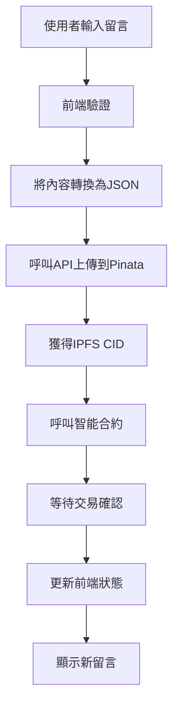
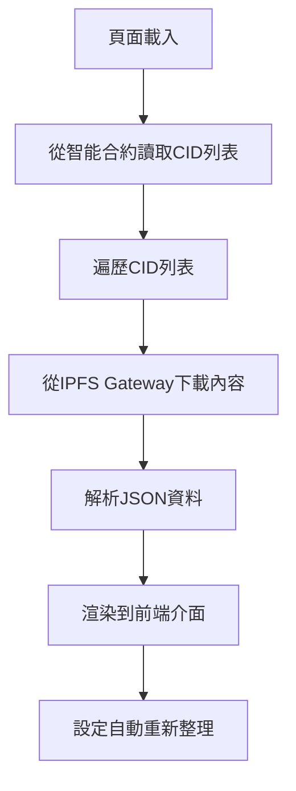

# 第一課：前端架構與環境變數設定

## 🎯 學習目標

完成本課後，您將能夠：
- 設計清晰的前端互動流程架構
- 安全地配置 Pinata API 金鑰和環境變數
- 理解 Next.js 環境變數的使用原則
- 建立前端與後端的資料流規劃

## 📋 課程大綱

1. [前端架構設計](#前端架構設計)
2. [資料流程規劃](#資料流程規劃)
3. [環境變數安全配置](#環境變數安全配置)
4. [Pinata API 金鑰管理](#pinata-api-金鑰管理)
5. [開發環境設定驗證](#開發環境設定驗證)

---

## 前端架構設計

### 🏗️ **整體架構概覽**

我們的 DApp 前端架構將遵循以下設計原則：

```
🌐 使用者介面 (UI)
├── 💬 留言輸入元件
├── 📝 留言列表元件  
├── 👤 使用者資訊元件
└── 🔄 載入狀態元件

⚡ 狀態管理 (State)
├── 🗂️ 留言資料狀態
├── 👤 使用者連接狀態
├── ⏳ 載入狀態管理
└── ❌ 錯誤狀態處理

🔧 核心功能層 (Services)
├── 📤 IPFS 上傳服務
├── 📥 IPFS 讀取服務
├── ⛓️ 智能合約互動
└── 🔐 錢包連接管理

🗄️ 資料層 (Data)
├── 🌐 IPFS 儲存
├── ⛓️ 區塊鏈狀態
└── 💾 本地快取
```

### 🏗️ **詳細互動流程**

#### **發布留言流程**


#### **讀取留言流程**


### 🏗️ **元件結構規劃**

```
📁 components/
├── 🎨 UI Components
│   ├── MessageInput.tsx      # 留言輸入框
│   ├── MessageList.tsx       # 留言列表
│   ├── MessageCard.tsx       # 單則留言卡片
│   ├── UserProfile.tsx       # 使用者資訊
│   └── LoadingSpinner.tsx    # 載入動畫
├── 🔧 Functional Components  
│   ├── IpfsUploader.tsx      # IPFS 上傳邏輯
│   ├── ContractInteraction.tsx # 合約互動
│   └── WalletConnection.tsx  # 錢包連接
└── 🎯 Layout Components
    ├── Header.tsx            # 頁面標題
    ├── Navigation.tsx        # 導航列
    └── Footer.tsx            # 頁面底部
```

---

## 資料流程規劃

### 📊 **資料結構設計**

#### **前端留言資料結構**
```typescript
interface MessageData {
  // 鏈上資料
  messageId: number;
  sender: string;
  timestamp: number;
  ipfsCid: string;
  
  // IPFS 內容
  content?: {
    text: string;
    author?: string;
    title?: string;
    tags?: string[];
    createdAt: string;
  };
  
  // 前端狀態
  isLoading?: boolean;
  hasError?: boolean;
  errorMessage?: string;
}
```

#### **IPFS 儲存格式**
```typescript
interface IPFSContent {
  text: string;           // 留言內容
  author?: string;        // 作者名稱（可選）
  title?: string;         // 留言標題（可選）
  tags?: string[];        // 標籤（可選）
  createdAt: string;      // 建立時間
  version: "1.0";         // 格式版本
}
```

### 📊 **狀態管理策略**

```typescript
// 全域狀態結構
interface AppState {
  // 使用者狀態
  user: {
    address: string | null;
    isConnected: boolean;
    isConnecting: boolean;
  };
  
  // 留言狀態
  messages: {
    data: MessageData[];
    isLoading: boolean;
    hasError: boolean;
    lastUpdated: number;
  };
  
  // UI 狀態
  ui: {
    isPosting: boolean;
    postError: string | null;
    selectedMessage: number | null;
  };
}
```

### 📊 **錯誤處理策略**

```typescript
enum ErrorType {
  NETWORK_ERROR = "NETWORK_ERROR",
  IPFS_ERROR = "IPFS_ERROR",
  CONTRACT_ERROR = "CONTRACT_ERROR",
  VALIDATION_ERROR = "VALIDATION_ERROR",
}

interface AppError {
  type: ErrorType;
  message: string;
  timestamp: number;
  isRetryable: boolean;
}
```

---

## 環境變數安全配置

### 🔒 **Next.js 環境變數規則**

#### **安全原則**
1. **公開變數**：以 `NEXT_PUBLIC_` 開頭，會暴露到瀏覽器
2. **私人變數**：不以 `NEXT_PUBLIC_` 開頭，僅在伺服器端可用
3. **API 密鑰**：永遠不要在前端暴露 API Secret

#### **正確與錯誤的範例**

```bash
# ❌ 錯誤：API Secret 暴露到前端
NEXT_PUBLIC_PINATA_API_SECRET=your-secret-here

# ✅ 正確：API Secret 僅在伺服器端
PINATA_API_SECRET=your-secret-here

# ✅ 正確：公開資訊可以暴露到前端
NEXT_PUBLIC_PINATA_GATEWAY_URL=https://gateway.pinata.cloud
```

### 🔒 **建立環境變數檔案**

在專案根目錄 `packages/nextjs/` 下建立 `.env.local` 檔案：

```bash
# 進入前端目錄
cd packages/nextjs

# 建立環境變數檔案
touch .env.local
```

### 🔒 **環境變數檔案內容**

編輯 `.env.local` 檔案：

```bash
# ===========================================
# Pinata IPFS 服務配置
# ===========================================

# API 金鑰（伺服器端使用，不會暴露到前端）
PINATA_API_KEY=你的_PINATA_API_金鑰
PINATA_API_SECRET=你的_PINATA_API_密鑰

# 公開配置（前端可以使用）
NEXT_PUBLIC_PINATA_GATEWAY_URL=https://gateway.pinata.cloud

# ===========================================
# 應用配置
# ===========================================

# 應用基本資訊
NEXT_PUBLIC_APP_NAME=我的留言板
NEXT_PUBLIC_APP_VERSION=1.0.0

# 開發模式配置
NEXT_PUBLIC_DEBUG_MODE=true

# ===========================================
# 區塊鏈配置（可選）
# ===========================================

# 如果使用測試網，可以配置 RPC URL
NEXT_PUBLIC_ALCHEMY_API_KEY=你的_ALCHEMY_API_金鑰（如果使用）
```

### 🔒 **安全檢查清單**

在提交程式碼前，確認：

- [ ] `.env.local` 已加入 `.gitignore`
- [ ] 沒有在程式碼中硬編碼任何密鑰
- [ ] 所有 API Secret 都沒有 `NEXT_PUBLIC_` 前綴
- [ ] 測試環境變數是否正確載入

---

## Pinata API 金鑰管理

### 🔑 **取得 Pinata API 金鑰**

如果您在模組二中還沒有取得 API 金鑰，請按照以下步驟：

#### **步驟一：登入 Pinata**
1. 前往 [Pinata Cloud](https://pinata.cloud/)
2. 使用您的帳號登入

#### **步驟二：建立 API 金鑰**
1. 點擊右上角的頭像，選擇 "API Keys"
2. 點擊 "New Key" 按鈕
3. 配置權限：
   ```
   Pinning Services: ✅ pinFileToIPFS
   Pinning Services: ✅ pinJSONToIPFS  
   Pinning Services: ✅ unpin (可選)
   Data: ✅ pinList (可選)
   ```
4. 設定金鑰名稱：`MessageBoard-DApp`
5. 點擊 "Create Key"

#### **步驟三：安全保存**
⚠️ **重要**：API Secret 只會顯示一次，請立即複製並保存！

```bash
# 示例（不要使用這些值）
API Key: a1b2c3d4e5f6
API Secret: 1a2b3c4d5e6f7g8h9i0j1k2l3m4n5o6p7q8r9s0t
```

### 🔑 **金鑰權限說明**

| 權限 | 說明 | 是否必要 |
|------|------|----------|
| `pinFileToIPFS` | 上傳檔案到 IPFS | ✅ 必要 |
| `pinJSONToIPFS` | 上傳 JSON 物件到 IPFS | ✅ 必要 |
| `unpin` | 取消釘選檔案 | ⚠️ 可選 |
| `pinList` | 查看已釘選檔案列表 | ⚠️ 可選 |

### 🔑 **測試 API 金鑰**

建立一個簡單的測試腳本來驗證 API 金鑰：

```javascript
// packages/nextjs/scripts/test-pinata.js
const axios = require('axios');
require('dotenv').config({ path: '.env.local' });

async function testPinataConnection() {
  const url = 'https://api.pinata.cloud/data/testAuthentication';
  
  try {
    const response = await axios.get(url, {
      headers: {
        'pinata_api_key': process.env.PINATA_API_KEY,
        'pinata_secret_api_key': process.env.PINATA_API_SECRET,
      },
    });
    
    console.log('✅ Pinata API 連接成功!');
    console.log('回應:', response.data);
  } catch (error) {
    console.error('❌ Pinata API 連接失敗:', error.response?.data || error.message);
  }
}

testPinataConnection();
```

執行測試：

```bash
# 安裝 axios（如果還沒安裝）
npm install axios dotenv

# 執行測試
node scripts/test-pinata.js
```

---

## 開發環境設定驗證

### ✅ **環境檢查腳本**

建立一個全面的環境檢查腳本：

```typescript
// packages/nextjs/utils/environmentCheck.ts
export interface EnvironmentStatus {
  isValid: boolean;
  issues: string[];
  warnings: string[];
}

export function checkEnvironment(): EnvironmentStatus {
  const issues: string[] = [];
  const warnings: string[] = [];

  // 檢查必要的環境變數
  const requiredVars = [
    'PINATA_API_KEY',
    'PINATA_API_SECRET',
  ];

  const optionalVars = [
    'NEXT_PUBLIC_PINATA_GATEWAY_URL',
    'NEXT_PUBLIC_APP_NAME',
  ];

  // 檢查必要變數
  requiredVars.forEach(varName => {
    if (!process.env[varName]) {
      issues.push(`缺少必要環境變數: ${varName}`);
    }
  });

  // 檢查可選變數
  optionalVars.forEach(varName => {
    if (!process.env[varName]) {
      warnings.push(`建議設定環境變數: ${varName}`);
    }
  });

  // 檢查 API 金鑰格式
  if (process.env.PINATA_API_KEY && process.env.PINATA_API_KEY.length < 10) {
    issues.push('PINATA_API_KEY 格式可能有誤');
  }

  if (process.env.PINATA_API_SECRET && process.env.PINATA_API_SECRET.length < 20) {
    issues.push('PINATA_API_SECRET 格式可能有誤');
  }

  // 檢查公開變數洩露
  if (process.env.NEXT_PUBLIC_PINATA_API_SECRET) {
    issues.push('❌ 嚴重安全問題：API Secret 設定為公開變數！');
  }

  return {
    isValid: issues.length === 0,
    issues,
    warnings,
  };
}

// 在開發模式下自動檢查
if (process.env.NODE_ENV === 'development' && process.env.NEXT_PUBLIC_DEBUG_MODE === 'true') {
  const status = checkEnvironment();
  
  if (!status.isValid) {
    console.error('🚨 環境設定有問題：');
    status.issues.forEach(issue => console.error(`  - ${issue}`));
  }
  
  if (status.warnings.length > 0) {
    console.warn('⚠️ 環境設定建議：');
    status.warnings.forEach(warning => console.warn(`  - ${warning}`));
  }
  
  if (status.isValid && status.warnings.length === 0) {
    console.log('✅ 環境設定完全正確！');
  }
}
```

### ✅ **前端環境變數使用**

建立一個集中的設定檔：

```typescript
// packages/nextjs/config/app.ts
interface AppConfig {
  pinata: {
    gatewayUrl: string;
    apiUrl: string;
  };
  app: {
    name: string;
    version: string;
    debugMode: boolean;
  };
}

const config: AppConfig = {
  pinata: {
    gatewayUrl: process.env.NEXT_PUBLIC_PINATA_GATEWAY_URL || 'https://gateway.pinata.cloud',
    apiUrl: 'https://api.pinata.cloud',
  },
  app: {
    name: process.env.NEXT_PUBLIC_APP_NAME || '去中心化留言板',
    version: process.env.NEXT_PUBLIC_APP_VERSION || '1.0.0',
    debugMode: process.env.NEXT_PUBLIC_DEBUG_MODE === 'true',
  },
};

export default config;
```

### ✅ **安全驗證清單**

完成環境設定後，檢查以下項目：

#### **檔案安全性**
- [ ] `.env.local` 檔案存在且包含所有必要變數
- [ ] `.env.local` 已加入 `.gitignore`
- [ ] 沒有在任何程式碼中硬編碼 API 密鑰

#### **變數設定正確性**
- [ ] `PINATA_API_KEY` 設定正確（無 `NEXT_PUBLIC_` 前綴）
- [ ] `PINATA_API_SECRET` 設定正確（無 `NEXT_PUBLIC_` 前綴）
- [ ] 公開變數正確使用 `NEXT_PUBLIC_` 前綴

#### **功能測試**
- [ ] Pinata API 連接測試通過
- [ ] 環境檢查腳本執行無錯誤
- [ ] 前端可以正確讀取公開環境變數

---

## 📝 本課總結

### **已完成的設定**

1. ✅ **架構規劃**：清晰的前端架構和資料流設計
2. ✅ **環境變數**：安全的 API 金鑰管理
3. ✅ **安全配置**：遵循最佳實踐的安全設定
4. ✅ **驗證機制**：完整的環境檢查工具

### **關鍵學習點**

1. **安全第一**：API 密鑰絕不能暴露到前端
2. **架構清晰**：良好的前端架構便於開發和維護
3. **環境管理**：正確使用環境變數提高安全性
4. **驗證重要**：自動化檢查避免配置錯誤

### **下一課預告**

在下一課中，我們將建立訊息上傳至 Pinata 的 API Route，實現從前端到 IPFS 的安全上傳通道！

---

## 🔗 延伸閱讀

- [Next.js 環境變數指南](https://nextjs.org/docs/basic-features/environment-variables)
- [Pinata API 文件](https://docs.pinata.cloud/reference/getting-started)
- [React 狀態管理最佳實踐](https://react.dev/learn/managing-state)

**下一課：** [第二課：【實作】建立訊息上傳至 Pinata 的 API Route](第二課-建立訊息上傳至Pinata的API-Route.md)
