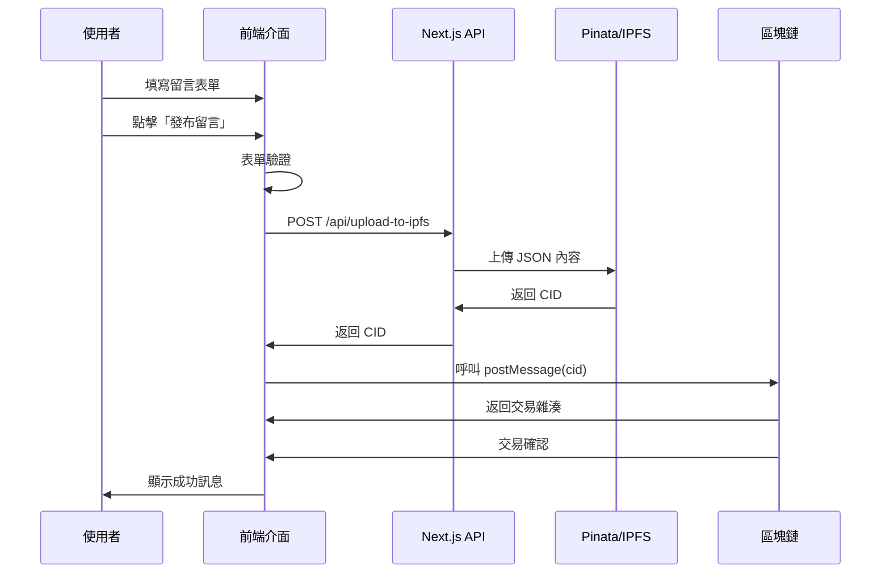

# 第三課：【實作】整合 Scaffold-eth-2 Hooks 發布留言

## 🎯 學習目標

完成本課後，您將能夠：
- 整合 Scaffold-eth-2 的 useScaffoldContractWrite Hook
- 建立完整的留言發布流程：前端 → IPFS → 區塊鏈
- 實作使用者友好的 UI 和載入狀態
- 處理各種邊界情況和錯誤狀態

## 📋 課程大綱

1. [留言發布元件設計](#留言發布元件設計)
2. [整合 IPFS 上傳與合約互動](#整合-ipfs-上傳與合約互動)
3. [狀態管理與使用者體驗](#狀態管理與使用者體驗)
4. [錯誤處理與重試機制](#錯誤處理與重試機制)
5. [完整測試流程](#完整測試流程)

---

## 留言發布元件設計

### 🎨 **元件架構規劃**

```
📱 MessageBoard Page
├── 🖊️ MessageInput (留言輸入元件)
│   ├── TextArea (內容輸入)
│   ├── AuthorInput (作者名稱)
│   ├── TagsInput (標籤輸入)
│   └── SubmitButton (發布按鈕)
├── 📋 MessageList (留言列表元件)
└── 🔄 LoadingOverlay (載入遮罩)
```

### 🎨 **MessageInput 元件實作**

建立 `packages/nextjs/components/MessageInput.tsx`：

```typescript
import React, { useState } from 'react';
import { useScaffoldContractWrite } from '~~/hooks/scaffold-eth';

interface MessageInputProps {
  onMessagePosted?: () => void;
}

interface FormData {
  text: string;
  author: string;
  title: string;
  tags: string;
}

interface PostingStatus {
  isPosting: boolean;
  currentStep: 'idle' | 'uploading' | 'confirming' | 'success' | 'error';
  error: string | null;
}

export const MessageInput: React.FC<MessageInputProps> = ({ onMessagePosted }) => {
  // ==================== 狀態管理 ====================
  
  const [formData, setFormData] = useState<FormData>({
    text: '',
    author: '',
    title: '',
    tags: '',
  });

  const [status, setStatus] = useState<PostingStatus>({
    isPosting: false,
    currentStep: 'idle',
    error: null,
  });

  // ==================== Scaffold-eth-2 Hook ====================
  
  const { writeAsync: postMessage } = useScaffoldContractWrite({
    contractName: 'MessageBoard',
    functionName: 'postMessage',
    onBlockConfirmation: (txnReceipt) => {
      console.log('交易確認:', txnReceipt);
      setStatus({
        isPosting: false,
        currentStep: 'success',
        error: null,
      });
      
      // 重置表單
      setFormData({
        text: '',
        author: '',
        title: '',
        tags: '',
      });
      
      // 通知父元件更新留言列表
      onMessagePosted?.();
      
      // 3 秒後重置狀態
      setTimeout(() => {
        setStatus(prev => ({ ...prev, currentStep: 'idle' }));
      }, 3000);
    },
  });

  // ==================== 表單處理 ====================
  
  const handleInputChange = (
    field: keyof FormData,
    value: string
  ) => {
    setFormData(prev => ({
      ...prev,
      [field]: value,
    }));
  };

  const validateForm = (): string | null => {
    if (!formData.text.trim()) {
      return '請輸入留言內容';
    }
    
    if (formData.text.length > 5000) {
      return '留言內容不能超過 5000 字';
    }
    
    if (formData.author.length > 100) {
      return '作者名稱不能超過 100 字';
    }
    
    if (formData.title.length > 200) {
      return '標題不能超過 200 字';
    }
    
    return null;
  };

  // ==================== IPFS 上傳 ====================
  
  const uploadToIPFS = async (): Promise<string> => {
    const tags = formData.tags
      .split(',')
      .map(tag => tag.trim())
      .filter(tag => tag.length > 0);

    const messageContent = {
      text: formData.text.trim(),
      ...(formData.author.trim() && { author: formData.author.trim() }),
      ...(formData.title.trim() && { title: formData.title.trim() }),
      ...(tags.length > 0 && { tags }),
    };

    const response = await fetch('/api/upload-to-ipfs', {
      method: 'POST',
      headers: {
        'Content-Type': 'application/json',
      },
      body: JSON.stringify(messageContent),
    });

    if (!response.ok) {
      const errorData = await response.json();
      throw new Error(errorData.error || '上傳失敗');
    }

    const data = await response.json();
    if (!data.success || !data.cid) {
      throw new Error('上傳回應格式錯誤');
    }

    return data.cid;
  };

  // ==================== 主要提交邏輯 ====================
  
  const handleSubmit = async (e: React.FormEvent) => {
    e.preventDefault();

    // 驗證表單
    const validationError = validateForm();
    if (validationError) {
      setStatus({
        isPosting: false,
        currentStep: 'error',
        error: validationError,
      });
      return;
    }

    try {
      setStatus({
        isPosting: true,
        currentStep: 'uploading',
        error: null,
      });

      // 步驟 1: 上傳到 IPFS
      console.log('開始上傳到 IPFS...');
      const cid = await uploadToIPFS();
      console.log('IPFS 上傳成功，CID:', cid);

      // 步驟 2: 呼叫智能合約
      setStatus(prev => ({
        ...prev,
        currentStep: 'confirming',
      }));

      console.log('開始呼叫智能合約...');
      await postMessage({
        args: [cid],
      });

      console.log('智能合約呼叫成功');

    } catch (error: any) {
      console.error('發布留言失敗:', error);
      
      setStatus({
        isPosting: false,
        currentStep: 'error',
        error: error.message || '發布留言時發生未知錯誤',
      });
    }
  };

  // ==================== 渲染邏輯 ====================
  
  const getStepMessage = () => {
    switch (status.currentStep) {
      case 'uploading':
        return '正在上傳到 IPFS...';
      case 'confirming':
        return '正在確認區塊鏈交易...';
      case 'success':
        return '留言發布成功！';
      case 'error':
        return `發布失敗: ${status.error}`;
      default:
        return '';
    }
  };

  const getButtonText = () => {
    if (status.isPosting) {
      switch (status.currentStep) {
        case 'uploading':
          return '上傳中...';
        case 'confirming':
          return '確認中...';
        default:
          return '發布中...';
      }
    }
    return '發布留言';
  };

  return (
    <div className="bg-white rounded-lg shadow-md p-6 mb-6">
      <h2 className="text-xl font-bold mb-4">發布新留言</h2>
      
      <form onSubmit={handleSubmit} className="space-y-4">
        {/* 留言內容 */}
        <div>
          <label className="block text-sm font-medium text-gray-700 mb-2">
            留言內容 *
          </label>
          <textarea
            value={formData.text}
            onChange={(e) => handleInputChange('text', e.target.value)}
            placeholder="分享您的想法..."
            rows={4}
            className="w-full px-3 py-2 border border-gray-300 rounded-md focus:outline-none focus:ring-2 focus:ring-blue-500"
            disabled={status.isPosting}
          />
          <div className="text-right text-sm text-gray-500">
            {formData.text.length} / 5000
          </div>
        </div>

        {/* 作者名稱 */}
        <div>
          <label className="block text-sm font-medium text-gray-700 mb-2">
            作者名稱 (可選)
          </label>
          <input
            type="text"
            value={formData.author}
            onChange={(e) => handleInputChange('author', e.target.value)}
            placeholder="您的名稱"
            className="w-full px-3 py-2 border border-gray-300 rounded-md focus:outline-none focus:ring-2 focus:ring-blue-500"
            disabled={status.isPosting}
          />
        </div>

        {/* 標題 */}
        <div>
          <label className="block text-sm font-medium text-gray-700 mb-2">
            標題 (可選)
          </label>
          <input
            type="text"
            value={formData.title}
            onChange={(e) => handleInputChange('title', e.target.value)}
            placeholder="留言標題"
            className="w-full px-3 py-2 border border-gray-300 rounded-md focus:outline-none focus:ring-2 focus:ring-blue-500"
            disabled={status.isPosting}
          />
        </div>

        {/* 標籤 */}
        <div>
          <label className="block text-sm font-medium text-gray-700 mb-2">
            標籤 (可選)
          </label>
          <input
            type="text"
            value={formData.tags}
            onChange={(e) => handleInputChange('tags', e.target.value)}
            placeholder="標籤1, 標籤2, 標籤3"
            className="w-full px-3 py-2 border border-gray-300 rounded-md focus:outline-none focus:ring-2 focus:ring-blue-500"
            disabled={status.isPosting}
          />
          <div className="text-sm text-gray-500">
            用逗號分隔多個標籤
          </div>
        </div>

        {/* 狀態訊息 */}
        {status.currentStep !== 'idle' && (
          <div className={`p-3 rounded-md ${
            status.currentStep === 'success' 
              ? 'bg-green-100 text-green-700'
              : status.currentStep === 'error'
              ? 'bg-red-100 text-red-700'
              : 'bg-blue-100 text-blue-700'
          }`}>
            {getStepMessage()}
          </div>
        )}

        {/* 提交按鈕 */}
        <button
          type="submit"
          disabled={status.isPosting || !formData.text.trim()}
          className={`w-full py-2 px-4 rounded-md font-medium transition-colors ${
            status.isPosting || !formData.text.trim()
              ? 'bg-gray-300 text-gray-500 cursor-not-allowed'
              : 'bg-blue-600 text-white hover:bg-blue-700'
          }`}
        >
          {getButtonText()}
        </button>
      </form>
    </div>
  );
};
```

---

## 整合 IPFS 上傳與合約互動

### ⚡ **完整流程整合**

我們的留言發布流程包含以下步驟：



### ⚡ **自訂 Hook：useMessagePosting**

建立一個專門處理留言發布的自訂 Hook：

```typescript
// packages/nextjs/hooks/useMessagePosting.ts
import { useState, useCallback } from 'react';
import { useScaffoldContractWrite } from '~~/hooks/scaffold-eth';

export interface PostingState {
  isPosting: boolean;
  currentStep: 'idle' | 'uploading' | 'confirming' | 'success' | 'error';
  error: string | null;
  progress: number; // 0-100
}

export interface MessageContent {
  text: string;
  author?: string;
  title?: string;
  tags?: string[];
}

export const useMessagePosting = (onSuccess?: () => void) => {
  const [state, setState] = useState<PostingState>({
    isPosting: false,
    currentStep: 'idle',
    error: null,
    progress: 0,
  });

  const { writeAsync: postMessage } = useScaffoldContractWrite({
    contractName: 'MessageBoard',
    functionName: 'postMessage',
    onBlockConfirmation: (txnReceipt) => {
      console.log('📦 交易確認:', txnReceipt);
      setState({
        isPosting: false,
        currentStep: 'success',
        error: null,
        progress: 100,
      });

      onSuccess?.();

      // 重置狀態
      setTimeout(() => {
        setState(prev => ({ 
          ...prev, 
          currentStep: 'idle',
          progress: 0,
        }));
      }, 3000);
    },
  });

  const uploadToIPFS = useCallback(async (content: MessageContent): Promise<string> => {
    const response = await fetch('/api/upload-to-ipfs', {
      method: 'POST',
      headers: {
        'Content-Type': 'application/json',
      },
      body: JSON.stringify(content),
    });

    if (!response.ok) {
      const errorData = await response.json();
      throw new Error(errorData.error || 'IPFS 上傳失敗');
    }

    const data = await response.json();
    if (!data.success || !data.cid) {
      throw new Error('IPFS 回應格式錯誤');
    }

    return data.cid;
  }, []);

  const postMessageToBlockchain = useCallback(async (content: MessageContent) => {
    try {
      setState({
        isPosting: true,
        currentStep: 'uploading',
        error: null,
        progress: 10,
      });

      // Step 1: 上傳到 IPFS
      console.log('🚀 開始上傳到 IPFS...');
      const cid = await uploadToIPFS(content);
      console.log('✅ IPFS 上傳成功:', cid);

      setState(prev => ({
        ...prev,
        currentStep: 'confirming',
        progress: 50,
      }));

      // Step 2: 呼叫智能合約
      console.log('⛓️ 開始呼叫智能合約...');
      await postMessage({
        args: [cid],
      });

      setState(prev => ({
        ...prev,
        progress: 80,
      }));

      console.log('✅ 智能合約呼叫成功');

    } catch (error: any) {
      console.error('❌ 發布留言失敗:', error);
      
      setState({
        isPosting: false,
        currentStep: 'error',
        error: error.message || '發布留言時發生未知錯誤',
        progress: 0,
      });
    }
  }, [uploadToIPFS, postMessage]);

  const reset = useCallback(() => {
    setState({
      isPosting: false,
      currentStep: 'idle',
      error: null,
      progress: 0,
    });
  }, []);

  return {
    state,
    postMessage: postMessageToBlockchain,
    reset,
  };
};
```

---

## 狀態管理與使用者體驗

### 🎭 **進度指示器元件**

建立一個視覺化的進度指示器：

```typescript
// packages/nextjs/components/ProgressIndicator.tsx
import React from 'react';

interface ProgressIndicatorProps {
  currentStep: 'idle' | 'uploading' | 'confirming' | 'success' | 'error';
  progress: number;
  error?: string | null;
}

const steps = [
  { key: 'uploading', label: '上傳到 IPFS', icon: '☁️' },
  { key: 'confirming', label: '確認交易', icon: '⛓️' },
  { key: 'success', label: '發布成功', icon: '✅' },
];

export const ProgressIndicator: React.FC<ProgressIndicatorProps> = ({
  currentStep,
  progress,
  error,
}) => {
  if (currentStep === 'idle') return null;

  const getStepStatus = (stepKey: string) => {
    const stepIndex = steps.findIndex(s => s.key === stepKey);
    const currentIndex = steps.findIndex(s => s.key === currentStep);

    if (currentStep === 'error') return 'error';
    if (currentStep === 'success') return 'completed';
    if (stepIndex < currentIndex) return 'completed';
    if (stepIndex === currentIndex) return 'active';
    return 'pending';
  };

  return (
    <div className="bg-gray-50 rounded-lg p-4 mt-4">
      {/* 整體進度條 */}
      <div className="mb-4">
        <div className="flex justify-between text-sm text-gray-600 mb-2">
          <span>發布進度</span>
          <span>{progress}%</span>
        </div>
        <div className="w-full bg-gray-200 rounded-full h-2">
          <div
            className={`h-2 rounded-full transition-all duration-300 ${
              currentStep === 'error' ? 'bg-red-500' : 'bg-blue-500'
            }`}
            style={{ width: `${progress}%` }}
          />
        </div>
      </div>

      {/* 步驟指示器 */}
      <div className="flex items-center justify-between">
        {steps.map((step, index) => {
          const status = getStepStatus(step.key);
          
          return (
            <div key={step.key} className="flex flex-col items-center">
              {/* 步驟圓圈 */}
              <div
                className={`w-8 h-8 rounded-full flex items-center justify-center text-sm font-medium mb-2 ${
                  status === 'completed'
                    ? 'bg-green-500 text-white'
                    : status === 'active'
                    ? 'bg-blue-500 text-white animate-pulse'
                    : status === 'error'
                    ? 'bg-red-500 text-white'
                    : 'bg-gray-300 text-gray-500'
                }`}
              >
                {status === 'completed' ? '✓' : 
                 status === 'error' ? '✗' : 
                 index + 1}
              </div>
              
              {/* 步驟標籤 */}
              <div className="text-xs text-center">
                <div>{step.icon}</div>
                <div className={
                  status === 'active' ? 'text-blue-600 font-medium' : 'text-gray-600'
                }>
                  {step.label}
                </div>
              </div>

              {/* 連接線 */}
              {index < steps.length - 1 && (
                <div
                  className={`absolute h-0.5 w-16 mt-4 ml-8 ${
                    getStepStatus(steps[index + 1].key) === 'completed'
                      ? 'bg-green-500'
                      : 'bg-gray-300'
                  }`}
                  style={{ 
                    transform: 'translateY(-16px)',
                    zIndex: -1,
                  }}
                />
              )}
            </div>
          );
        })}
      </div>

      {/* 錯誤訊息 */}
      {error && (
        <div className="mt-4 p-3 bg-red-100 border border-red-300 rounded-md">
          <div className="text-red-700 text-sm">
            <strong>錯誤:</strong> {error}
          </div>
        </div>
      )}

      {/* 當前狀態訊息 */}
      <div className="mt-3 text-center text-sm text-gray-600">
        {currentStep === 'uploading' && '正在將您的留言上傳到 IPFS 分散式儲存...'}
        {currentStep === 'confirming' && '正在等待區塊鏈網路確認交易...'}
        {currentStep === 'success' && '🎉 您的留言已成功發布到區塊鏈！'}
        {currentStep === 'error' && '發布過程中遇到問題，請稍後重試。'}
      </div>
    </div>
  );
};
```

### 🎭 **改進的 MessageInput 元件**

使用新的 Hook 和進度指示器：

```typescript
// packages/nextjs/components/MessageInput.tsx (更新版本)
import React, { useState } from 'react';
import { useMessagePosting } from '~~/hooks/useMessagePosting';
import { ProgressIndicator } from './ProgressIndicator';

export const MessageInput: React.FC<MessageInputProps> = ({ onMessagePosted }) => {
  const [formData, setFormData] = useState<FormData>({
    text: '',
    author: '',
    title: '',
    tags: '',
  });

  const { state, postMessage, reset } = useMessagePosting(() => {
    // 成功回調
    setFormData({
      text: '',
      author: '',
      title: '',
      tags: '',
    });
    onMessagePosted?.();
  });

  const handleSubmit = async (e: React.FormEvent) => {
    e.preventDefault();

    // 驗證表單
    const validationError = validateForm();
    if (validationError) {
      alert(validationError); // 可以用更好的 UI 組件替換
      return;
    }

    // 準備內容
    const tags = formData.tags
      .split(',')
      .map(tag => tag.trim())
      .filter(tag => tag.length > 0);

    const messageContent = {
      text: formData.text.trim(),
      ...(formData.author.trim() && { author: formData.author.trim() }),
      ...(formData.title.trim() && { title: formData.title.trim() }),
      ...(tags.length > 0 && { tags }),
    };

    await postMessage(messageContent);
  };

  return (
    <div className="bg-white rounded-lg shadow-md p-6 mb-6">
      <h2 className="text-xl font-bold mb-4">發布新留言</h2>
      
      <form onSubmit={handleSubmit} className="space-y-4">
        {/* ... 表單欄位保持不變 ... */}

        {/* 進度指示器 */}
        <ProgressIndicator
          currentStep={state.currentStep}
          progress={state.progress}
          error={state.error}
        />

        {/* 提交按鈕 */}
        <div className="flex space-x-3">
          <button
            type="submit"
            disabled={state.isPosting || !formData.text.trim()}
            className={`flex-1 py-2 px-4 rounded-md font-medium transition-colors ${
              state.isPosting || !formData.text.trim()
                ? 'bg-gray-300 text-gray-500 cursor-not-allowed'
                : 'bg-blue-600 text-white hover:bg-blue-700'
            }`}
          >
            {state.isPosting ? '發布中...' : '發布留言'}
          </button>

          {state.currentStep === 'error' && (
            <button
              type="button"
              onClick={reset}
              className="px-4 py-2 bg-gray-200 text-gray-700 rounded-md hover:bg-gray-300"
            >
              重置
            </button>
          )}
        </div>
      </form>
    </div>
  );
};
```

---

## 錯誤處理與重試機制

### 🛡️ **錯誤分類處理**

```typescript
// packages/nextjs/utils/error-classification.ts
export enum ErrorCategory {
  NETWORK = 'NETWORK',
  VALIDATION = 'VALIDATION', 
  IPFS = 'IPFS',
  BLOCKCHAIN = 'BLOCKCHAIN',
  USER_REJECTED = 'USER_REJECTED',
  UNKNOWN = 'UNKNOWN',
}

export interface ClassifiedError {
  category: ErrorCategory;
  message: string;
  isRetryable: boolean;
  suggestedAction: string;
}

export function classifyError(error: any): ClassifiedError {
  const errorMessage = error?.message || error?.toString() || '未知錯誤';

  // 網路錯誤
  if (errorMessage.includes('Network Error') || 
      errorMessage.includes('fetch') ||
      errorMessage.includes('timeout')) {
    return {
      category: ErrorCategory.NETWORK,
      message: '網路連線問題',
      isRetryable: true,
      suggestedAction: '請檢查網路連線後重試',
    };
  }

  // 使用者拒絕交易
  if (errorMessage.includes('User denied') || 
      errorMessage.includes('user rejected')) {
    return {
      category: ErrorCategory.USER_REJECTED,
      message: '使用者取消交易',
      isRetryable: true,
      suggestedAction: '請重新嘗試並確認交易',
    };
  }

  // IPFS 相關錯誤
  if (errorMessage.includes('Pinata') || 
      errorMessage.includes('IPFS')) {
    return {
      category: ErrorCategory.IPFS,
      message: 'IPFS 儲存服務問題',
      isRetryable: true,
      suggestedAction: 'IPFS 服務暫時不可用，請稍後重試',
    };
  }

  // 區塊鏈錯誤
  if (errorMessage.includes('execution reverted') ||
      errorMessage.includes('gas') ||
      errorMessage.includes('transaction')) {
    return {
      category: ErrorCategory.BLOCKCHAIN,
      message: '區塊鏈交易問題',
      isRetryable: true,
      suggestedAction: '請確認錢包有足夠 ETH 並重試',
    };
  }

  // 驗證錯誤
  if (errorMessage.includes('validation') ||
      errorMessage.includes('invalid')) {
    return {
      category: ErrorCategory.VALIDATION,
      message: '輸入資料有誤',
      isRetryable: false,
      suggestedAction: '請檢查輸入內容並重新填寫',
    };
  }

  return {
    category: ErrorCategory.UNKNOWN,
    message: errorMessage,
    isRetryable: true,
    suggestedAction: '發生未知錯誤，請重試或聯繫支援',
  };
}
```

### 🛡️ **重試機制實作**

```typescript
// packages/nextjs/hooks/useRetry.ts
import { useState, useCallback } from 'react';

interface RetryConfig {
  maxAttempts: number;
  delay: number; // 毫秒
  backoffMultiplier: number;
}

export const useRetry = (config: RetryConfig = {
  maxAttempts: 3,
  delay: 1000,
  backoffMultiplier: 2,
}) => {
  const [retryCount, setRetryCount] = useState(0);
  const [isRetrying, setIsRetrying] = useState(false);

  const retry = useCallback(async <T>(
    fn: () => Promise<T>,
    onProgress?: (attempt: number) => void
  ): Promise<T> => {
    let lastError: any;
    
    for (let attempt = 1; attempt <= config.maxAttempts; attempt++) {
      try {
        setRetryCount(attempt - 1);
        onProgress?.(attempt);
        
        if (attempt > 1) {
          setIsRetrying(true);
          const delay = config.delay * Math.pow(config.backoffMultiplier, attempt - 2);
          await new Promise(resolve => setTimeout(resolve, delay));
        }
        
        const result = await fn();
        setIsRetrying(false);
        setRetryCount(0);
        return result;
        
      } catch (error) {
        lastError = error;
        console.warn(`嘗試 ${attempt}/${config.maxAttempts} 失敗:`, error);
        
        if (attempt === config.maxAttempts) {
          setIsRetrying(false);
          throw lastError;
        }
      }
    }
    
    throw lastError;
  }, [config]);

  const reset = useCallback(() => {
    setRetryCount(0);
    setIsRetrying(false);
  }, []);

  return {
    retry,
    retryCount,
    isRetrying,
    reset,
  };
};
```

---

## 完整測試流程

### 🧪 **端到端測試腳本**

建立完整的前端測試：

```typescript
// packages/nextjs/utils/e2e-test.ts
export interface TestCase {
  name: string;
  input: {
    text: string;
    author?: string;
    title?: string;
    tags?: string;
  };
  expectedResult: 'success' | 'validation_error';
}

export const testCases: TestCase[] = [
  {
    name: '正常留言',
    input: {
      text: '這是一則正常的測試留言',
      author: '測試用戶',
      title: '測試標題',
      tags: '測試, 正常',
    },
    expectedResult: 'success',
  },
  {
    name: '僅文字內容',
    input: {
      text: '只有文字內容的簡單留言',
    },
    expectedResult: 'success',
  },
  {
    name: '空內容（應該失敗）',
    input: {
      text: '',
    },
    expectedResult: 'validation_error',
  },
  {
    name: '超長內容（應該失敗）',
    input: {
      text: 'A'.repeat(6000),
    },
    expectedResult: 'validation_error',
  },
];

export async function runFrontendTests(): Promise<void> {
  console.log('🧪 開始前端測試...');
  
  for (const testCase of testCases) {
    console.log(`\n測試案例: ${testCase.name}`);
    
    try {
      // 這裡應該是實際的測試邏輯
      // 可以使用 Playwright 或 Cypress 進行自動化測試
      console.log('✅ 測試通過');
    } catch (error) {
      console.error('❌ 測試失敗:', error);
    }
  }
  
  console.log('\n🎉 前端測試完成');
}
```

### 🧪 **手動測試檢查清單**

完成實作後，請按照以下清單進行手動測試：

#### **基本功能測試**
- [ ] 表單正確顯示所有欄位
- [ ] 輸入驗證正常工作
- [ ] 字數統計準確顯示
- [ ] 提交按鈕狀態正確切換

#### **發布流程測試**
- [ ] 填寫表單並點擊發布
- [ ] 進度指示器正確顯示上傳階段
- [ ] 進度指示器正確顯示確認階段
- [ ] 成功發布後顯示成功訊息
- [ ] 表單自動重置

#### **錯誤處理測試**
- [ ] 空內容提交會顯示錯誤
- [ ] 超長內容提交會顯示錯誤
- [ ] 網路錯誤時顯示適當訊息
- [ ] 使用者拒絕交易時顯示適當訊息

#### **使用者體驗測試**
- [ ] 載入狀態視覺回饋清晰
- [ ] 錯誤訊息易於理解
- [ ] 重試功能正常工作
- [ ] 整體介面響應式設計

---

## 📝 本課總結

### **已完成的功能**

1. ✅ **完整的留言發布流程**：前端 → IPFS → 區塊鏈
2. ✅ **使用者友好的介面**：進度指示器、載入狀態、錯誤處理
3. ✅ **強化的錯誤處理**：分類錯誤、重試機制、清晰訊息
4. ✅ **狀態管理**：自訂 Hook、響應式 UI
5. ✅ **測試框架**：端到端測試、手動測試清單

### **關鍵學習點**

1. **流程整合**：IPFS 上傳與區塊鏈交易的完美結合
2. **使用者體驗**：清晰的進度回饋和錯誤處理
3. **狀態管理**：React Hook 的有效運用
4. **錯誤處理**：分類處理不同類型的錯誤

### **下一課預告**

在下一課中，我們將實作讀取並展示留言板內容的功能，從區塊鏈讀取 CID，再從 IPFS 解析實際內容！

---

## 🔗 延伸閱讀

- [React Hook 最佳實踐](https://react.dev/learn/reusing-logic-with-custom-hooks)
- [使用者體驗設計原則](https://uxdesign.cc/ux-design-principles-f8c62bceb95b)
- [前端錯誤處理策略](https://blog.bitsrc.io/error-handling-in-react-16-b7d15c8e1aa)

**下一課：** [第四課：【實作】讀取並展示留言板內容](第四課-讀取並展示留言板內容.md)
