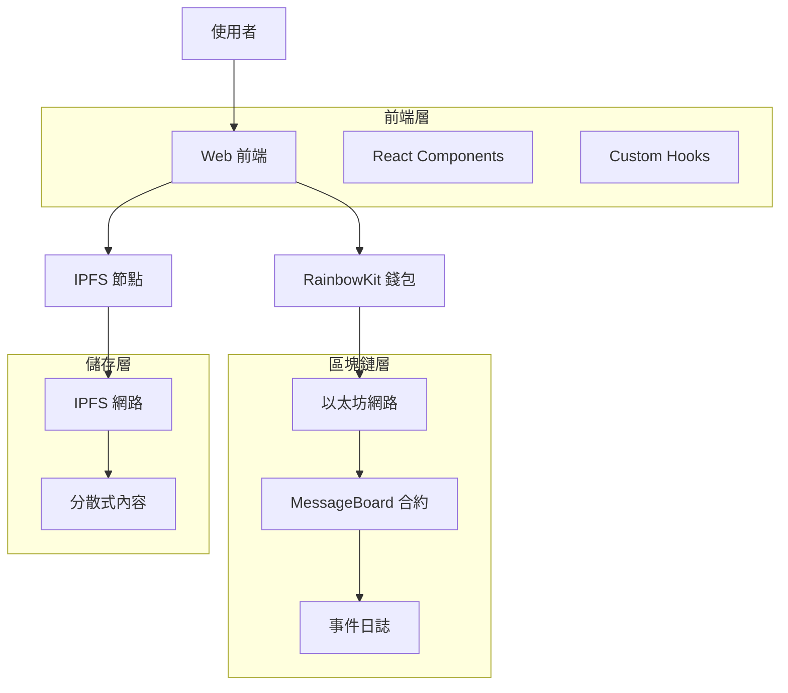

# 🌐 IPFS 去中心化留言板 | IPFS Decentralized Message Board

<div align="center">


**一個結合區塊鏈與 IPFS 技術的去中心化留言板應用**

[🚀 快速開始](#-快速開始) • [📖 功能介紹](#-功能介紹) • [🏗️ 技術架構](#️-技術架構) • [📱 使用指南](#-使用指南) • [🔧 開發指南](#-開發指南)

</div>

---

## 📋 專案概述

本專案是 **141-IPFS-course-v2** 課程的完整實作，展示如何建構一個真正的去中心化應用（DApp）。透過整合以太坊智能合約與 IPFS 分散式儲存系統，實現了一個無需中央伺服器的留言板平台。

### 🎯 專案目標

- **去中心化儲存**：使用 IPFS 儲存留言內容，確保資料永久性和抗審查性
- **區塊鏈驗證**：透過智能合約確保留言的真實性和不可篡改性
- **使用者友善**：提供直觀的 Web3 使用者介面
- **開源透明**：完全開源，可驗證的智能合約和前端代碼

### ✨ 主要特色

- 🔒 **完全去中心化**：無需中央伺服器，資料儲存在 IPFS 和區塊鏈上
- 🛡️ **抗審查性**：內容無法被單一實體刪除或修改
- 💰 **低成本**：僅在發布留言時需要少量 Gas 費用
- 🔍 **完全透明**：所有操作都可在區塊鏈上驗證
- 📱 **響應式設計**：支援桌面和行動裝置
- ⚡ **即時更新**：使用事件監聽實現即時留言更新

---

## 🏗️ 技術架構

### 核心技術棧

| 技術領域 | 使用技術 | 版本 | 用途 |
|---------|---------|------|------|
| **前端框架** | Next.js | 14.x | React 全端框架 |
| **區塊鏈開發** | Hardhat | 2.22.x | 智能合約開發環境 |
| **Web3 整合** | Wagmi + Viem | 最新 | 區塊鏈互動 |
| **錢包連接** | RainbowKit | 最新 | 多錢包支援 |
| **分散式儲存** | IPFS | - | 內容儲存 |
| **樣式系統** | Tailwind CSS | 3.x | UI 樣式 |
| **開發語言** | TypeScript | 5.8+ | 型別安全 |

### 系統架構圖



### 資料流程

1. **發布留言**：使用者撰寫留言 → 上傳至 IPFS → 獲得 CID → 呼叫智能合約儲存 CID
2. **讀取留言**：查詢智能合約獲得 CID 列表 → 從 IPFS 獲取內容 → 渲染至前端
3. **即時更新**：監聽合約事件 → 自動獲取新留言 → 更新 UI

---

## 📖 功能介紹

### 🔥 核心功能

#### 📝 留言發布
- **Markdown 支援**：支援豐富的文字格式
- **IPFS 整合**：自動上傳至 IPFS 並獲得永久連結
- **即時確認**：交易確認後立即顯示
- **錯誤處理**：完善的錯誤提示和重試機制

#### 📚 留言瀏覽
- **多種檢視模式**：全部留言、最新留言、使用者留言
- **分頁載入**：支援大量留言的高效載入
- **即時更新**：新留言自動出現，無需重新整理
- **內容渲染**：支援 Markdown 格式的美觀顯示

#### 👤 使用者功能
- **多錢包支援**：MetaMask、WalletConnect 等主流錢包
- **地址展示**：美觀的地址縮寫和頭像
- **留言統計**：顯示使用者發布的留言數量
- **操作歷史**：追蹤使用者的所有操作

### 🛠️ 管理功能

#### 🔐 合約管理
- **緊急暫停**：合約擁有者可暫停留言發布
- **擁有權轉移**：支援安全的擁有權轉移
- **狀態監控**：即時監控合約狀態

#### 📊 統計資訊
- **總留言數**：顯示平台總留言數量
- **使用者統計**：各使用者的活躍度統計
- **網路資訊**：當前網路狀態和 Gas 價格

### 🔍 進階功能

#### 🎨 使用者體驗
- **深色模式**：支援淺色/深色主題切換
- **響應式設計**：完美適配各種螢幕尺寸
- **載入狀態**：優雅的載入動畫和進度提示
- **錯誤邊界**：防止應用崩潰的錯誤處理

#### ⚡ 效能優化
- **內容快取**：智能快取 IPFS 內容
- **批次載入**：高效的批次資料載入
- **懶載入**：按需載入留言內容
- **事件訂閱**：高效的區塊鏈事件監聽

---

## 🚀 快速開始

### 📋 系統需求

在開始之前，請確保您的系統已安裝：

- **Node.js** >= 20.18.3
- **Yarn** 1.x 或 2.x+
- **Git**
- **Web3 錢包**（如 MetaMask）

### ⚡ 一鍵啟動

```bash
# 1. 複製專案
git clone <your-repo-url>
cd 142-se2-message-board

# 2. 安裝依賴
yarn install

# 3. 啟動本地區塊鏈（終端 1）
yarn chain

# 4. 部署合約（終端 2）
yarn deploy

# 5. 啟動前端（終端 3）
yarn start
```

### 🌐 訪問應用

- **前端應用**：http://localhost:3000
- **合約除錯**：http://localhost:3000/debug
- **區塊瀏覽器**：http://localhost:3000/blockexplorer

---

## 📱 使用指南

### 💰 錢包設定

1. **安裝 MetaMask**
   - 前往 [metamask.io](https://metamask.io) 安裝瀏覽器擴充功能
   - 建立新錢包或匯入現有錢包

2. **新增本地網路**
   ```
   網路名稱：Localhost 8545
   RPC URL：http://127.0.0.1:8545
   鏈 ID：31337
   貨幣符號：ETH
   ```

3. **匯入測試帳戶**
   - 使用 `yarn chain` 顯示的測試私鑰
   - 每個帳戶都有 10,000 ETH 供測試使用

### ✍️ 發布留言

1. **連接錢包**
   - 點擊右上角的「Connect Wallet」按鈕
   - 選擇您的錢包並授權連接

2. **撰寫留言**
   - 在首頁的留言輸入框中撰寫內容
   - 支援 Markdown 語法，可預覽效果

3. **發布留言**
   - 點擊「發布留言」按鈕
   - 確認交易並等待區塊確認

4. **查看結果**
   - 留言會自動出現在留言列表中
   - 可在區塊瀏覽器中查看交易詳情

### 🔍 瀏覽留言

- **全部留言**：在首頁查看所有留言
- **最新留言**：自動載入最新發布的留言
- **使用者留言**：點擊地址查看特定使用者的留言
- **留言詳情**：點擊留言卡片查看完整內容

---

## 🔧 開發指南

### 📁 專案結構

```
142-se2-message-board/
├── packages/
│   ├── hardhat/                    # 智能合約開發
│   │   ├── contracts/
│   │   │   └── MessageBoard.sol    # 主要合約
│   │   ├── deploy/                 # 部署腳本
│   │   ├── test/                   # 合約測試
│   │   └── hardhat.config.ts       # Hardhat 配置
│   └── nextjs/                     # 前端應用
│       ├── app/                    # Next.js App Router
│       ├── components/             # React 組件
│       ├── hooks/                  # 自定義 Hooks
│       ├── contracts/              # 合約 ABI 和地址
│       └── scaffold.config.ts      # 前端配置
├── package.json                    # 根目錄配置
└── README.md                      # 專案說明
```

### 🧪 智能合約開發

#### 合約架構

```solidity
contract MessageBoard {
    // 留言結構
    struct Message {
        address sender;      // 發送者
        uint256 timestamp;   // 時間戳
        string ipfsCid;      // IPFS CID
        uint256 messageId;   // 留言 ID
    }
    
    // 主要功能
    function postMessage(string calldata _ipfsCid) external;
    function getAllMessages() external view returns (Message[] memory);
    function getUserMessages(address _user) external view returns (Message[] memory);
}
```

#### 測試合約

```bash
# 編譯合約
yarn compile

# 執行測試
yarn test

# 測試覆蓋率
yarn hardhat:test --coverage

# 部署到本地
yarn deploy

# 部署到測試網
yarn deploy --network sepolia
```

### 🎨 前端開發

#### 核心 Hooks

```typescript
// 讀取合約資料
const { data: messages } = useScaffoldReadContract({
  contractName: "MessageBoard",
  functionName: "getAllMessages",
});

// 寫入合約資料
const { writeContractAsync } = useScaffoldWriteContract({
  contractName: "MessageBoard",
});

// 監聽合約事件
const { data: events } = useScaffoldEventHistory({
  contractName: "MessageBoard",
  eventName: "MessagePosted",
  watch: true,
});
```

#### IPFS 整合

```typescript
// 上傳內容至 IPFS
const uploadToIPFS = async (content: string) => {
  const response = await fetch('/api/upload-to-ipfs', {
    method: 'POST',
    body: JSON.stringify({ content }),
  });
  return response.json();
};

// 從 IPFS 獲取內容
const fetchFromIPFS = async (cid: string) => {
  const response = await fetch(`/api/get-from-ipfs?cid=${cid}`);
  return response.text();
};
```

### 🚀 部署指南

#### 本地部署

```bash
# 1. 啟動本地區塊鏈
yarn chain

# 2. 部署合約
yarn deploy

# 3. 啟動前端
yarn start
```

#### 測試網部署

1. **設定環境變數**
   ```bash
   # .env.local
   DEPLOYER_PRIVATE_KEY=your_private_key
   ALCHEMY_API_KEY=your_alchemy_key
   ```

2. **修改網路配置**
   ```typescript
   // scaffold.config.ts
   targetNetworks: [chains.sepolia]
   ```

3. **執行部署**
   ```bash
   yarn deploy --network sepolia
   ```

#### 主網部署

⚠️ **注意**：主網部署需要真實的 ETH，請確保：
- 充分測試合約功能
- 進行安全審計
- 準備足夠的 Gas 費用

```bash
# 部署到主網
yarn deploy --network mainnet

# 驗證合約
yarn verify --network mainnet
```

---

## 🧪 測試指南

### 🔬 合約測試

```bash
# 執行所有測試
yarn test

# 執行特定測試
yarn hardhat:test --grep "MessageBoard"

# 生成測試報告
yarn hardhat:test --reporter html

# 檢查測試覆蓋率
yarn hardhat:test --coverage
```

### 🌐 前端測試

```bash
# 單元測試
yarn next:test

# E2E 測試
yarn next:test:e2e

# 組件測試
yarn next:test:components
```

### 📊 效能測試

```bash
# 合約 Gas 分析
REPORT_GAS=true yarn test

# 前端效能分析
yarn next:analyze

# Bundle 大小分析
yarn next:bundle-analyzer
```

---

## 📚 API 參考

### 🔗 智能合約 API

#### 讀取函式

| 函式名稱 | 參數 | 回傳值 | 描述 |
|---------|------|--------|------|
| `getAllMessages()` | - | `Message[]` | 獲取所有留言 |
| `getMessage(uint256)` | messageId | `Message` | 獲取特定留言 |
| `getLatestMessages(uint256)` | count | `Message[]` | 獲取最新 N 則留言 |
| `getUserMessages(address)` | user | `Message[]` | 獲取使用者留言 |
| `getTotalMessages()` | - | `uint256` | 獲取留言總數 |

#### 寫入函式

| 函式名稱 | 參數 | Gas 估算 | 描述 |
|---------|------|---------|------|
| `postMessage(string)` | ipfsCid | ~50,000 | 發布新留言 |
| `setPaused(bool)` | paused | ~30,000 | 暫停/恢復合約 |
| `transferOwnership(address)` | newOwner | ~30,000 | 轉移擁有權 |

#### 事件

| 事件名稱 | 參數 | 描述 |
|---------|------|------|
| `MessagePosted` | messageId, sender, timestamp, ipfsCid | 留言發布事件 |
| `BoardStatusChanged` | isPaused | 狀態變更事件 |

### 🌐 前端 API

#### IPFS API 路由

```typescript
// POST /api/upload-to-ipfs
interface UploadRequest {
  content: string;
  metadata?: object;
}

interface UploadResponse {
  success: boolean;
  cid: string;
  error?: string;
}

// GET /api/get-from-ipfs?cid=<CID>
interface GetResponse {
  success: boolean;
  content: string;
  error?: string;
}
```

---

## 🛡️ 安全考量

### 🔒 智能合約安全

- **重入攻擊防護**：使用 OpenZeppelin 的 ReentrancyGuard
- **整數溢位保護**：Solidity 0.8+ 內建保護
- **存取控制**：使用 modifier 限制敏感函式
- **輸入驗證**：嚴格驗證所有輸入參數

### 🛡️ 前端安全

- **XSS 防護**：所有使用者輸入都經過清理
- **CSRF 防護**：使用 CSRF token
- **內容驗證**：驗證 IPFS 內容完整性
- **錯誤處理**：不洩露敏感資訊

### 🔐 最佳實踐

1. **私鑰管理**：永遠不要在代碼中硬編碼私鑰
2. **環境隔離**：區分開發、測試、生產環境
3. **定期更新**：保持依賴套件最新版本
4. **安全審計**：定期進行安全審計

---

## 🐛 疑難排解

### ❓ 常見問題

#### 合約部署失敗

**問題**：`Error: Transaction ran out of gas`

**解決方案**：
```typescript
// hardhat.config.ts
networks: {
  localhost: {
    gas: 5000000,
    gasPrice: 8000000000,
  },
}
```

#### 前端無法連接合約

**問題**：`Contract not found`

**解決方案**：
1. 確認 `yarn chain` 正在運行
2. 重新部署合約：`yarn deploy`
3. 重新啟動前端：`yarn start`

#### IPFS 上傳失敗

**問題**：`IPFS upload timeout`

**解決方案**：
1. 檢查網路連接
2. 嘗試使用不同的 IPFS 節點
3. 減小上傳內容大小

#### MetaMask 連接問題

**問題**：`Unsupported chain`

**解決方案**：
1. 在 MetaMask 中添加本地網路
2. 確認鏈 ID 為 31337
3. 重新整理頁面並重新連接

### 🔧 除錯工具

```bash
# 查看合約事件
yarn hardhat console --network localhost

# 檢查 IPFS 狀態
curl http://localhost:5001/api/v0/id

# 前端除錯模式
yarn start --debug

# 查看交易詳情
yarn hardhat run scripts/debug-transaction.ts
```

---

## 🤝 貢獻指南

我們歡迎所有形式的貢獻！無論是錯誤修復、功能增強還是文檔改進。

### 📝 如何貢獻

1. **Fork 專案**
   ```bash
   git fork https://github.com/your-username/142-se2-message-board
   ```

2. **建立分支**
   ```bash
   git checkout -b feature/your-feature-name
   ```

3. **提交變更**
   ```bash
   git commit -m "feat: add your feature description"
   ```

4. **推送分支**
   ```bash
   git push origin feature/your-feature-name
   ```

5. **建立 Pull Request**
   - 描述您的變更
   - 包含相關的測試
   - 確保所有檢查通過

### 🎯 貢獻領域

- 🐛 **錯誤修復**：修復已知問題
- ✨ **新功能**：添加有用的新功能
- 📖 **文檔改進**：改善文檔和註釋
- 🧪 **測試增強**：增加測試覆蓋率
- 🎨 **UI/UX 改進**：提升使用者體驗
- ⚡ **效能優化**：提高應用效能

### 📋 代碼規範

- 使用 TypeScript 進行開發
- 遵循 ESLint 和 Prettier 規範
- 為新功能編寫測試
- 更新相關文檔

---

## 📄 授權資訊

本專案採用 MIT 授權條款。詳情請參閱 [LICENSE](./LICENSE) 檔案。

### 🙏 致謝

- **Scaffold-ETH 2** - 提供優秀的開發框架
- **IPFS** - 提供去中心化儲存解決方案
- **Ethereum** - 提供區塊鏈基礎設施
- **所有貢獻者** - 感謝每一位貢獻者的付出

---

## 🔗 相關連結

### 📚 學習資源

- [141-IPFS-course-v2](../141-IPFS-course-v2/) - 相關課程材料
- [Scaffold-ETH 2 文檔](https://docs.scaffoldeth.io/)
- [IPFS 文檔](https://docs.ipfs.io/)
- [Solidity 文檔](https://docs.soliditylang.org/)

### 🛠️ 開發工具

- [Hardhat](https://hardhat.org/) - 智能合約開發環境
- [Next.js](https://nextjs.org/) - React 全端框架
- [Wagmi](https://wagmi.sh/) - React Hooks for Ethereum
- [RainbowKit](https://www.rainbowkit.com/) - 錢包連接庫

### 🌐 社群連結

- [GitHub Issues](https://github.com/your-username/142-se2-message-board/issues) - 問題回報
- [GitHub Discussions](https://github.com/your-username/142-se2-message-board/discussions) - 討論區
- [Discord](https://discord.gg/your-discord) - 即時討論

---

<div align="center">

**🎉 感謝使用 IPFS 去中心化留言板！**

如果這個專案對您有幫助，請給我們一個 ⭐️

[回到頂部](#-ipfs-去中心化留言板--ipfs-decentralized-message-board) • [報告問題](https://github.com/your-username/142-se2-message-board/issues) • [功能建議](https://github.com/your-username/142-se2-message-board/discussions)

---

*建構於 2024 年 • 使用 ❤️ 和 ☕ 製作*

</div>