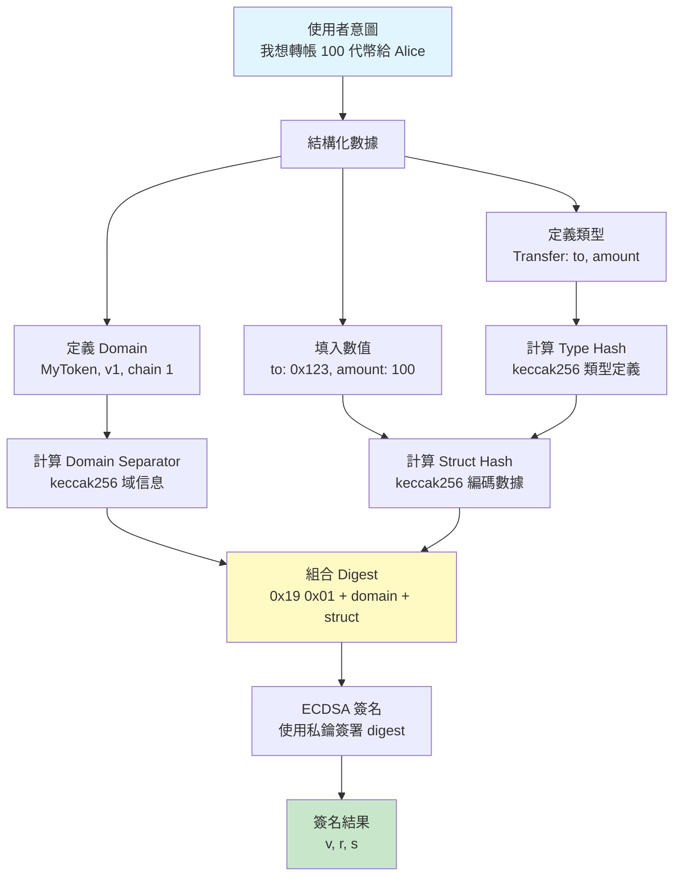
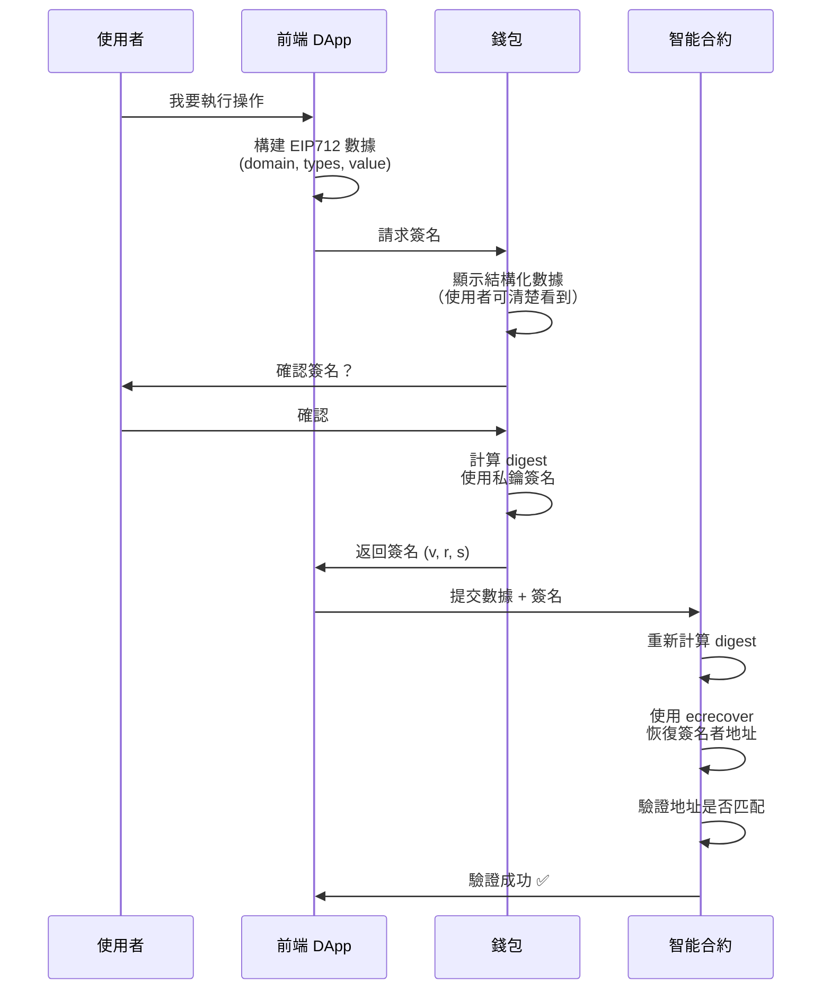

# 第一章：EIP712 基礎 - 概念、動機與心智模型

> 建立正確的 EIP712 心智圖像，為後續學習打下堅實基礎

## 🎯 本章目標

- 理解為什麼需要 EIP712
- 建立清晰的心智模型
- 掌握核心概念和類比
- 了解 EIP712 在以太坊生態中的位置

## 📖 目錄

1. [問題與動機](#問題與動機)
2. [核心心智模型](#核心心智模型)
3. [EIP712 的組成部分](#eip712-的組成部分)
4. [與 EIP191 的關係](#與-eip191-的關係)
5. [資料流視覺化](#資料流視覺化)

---

## 問題與動機

### 傳統簽名的問題

在 EIP712 之前，以太坊的簽名方式主要是對原始字節進行簽名：

```typescript
// 傳統方式：簽署原始訊息
const message = "Transfer 100 tokens to Alice";
const signature = await signer.signMessage(message);
```

**問題在於：**

#### 1. 盲簽風險 🚨

使用者看到的是人類可讀的文字，但實際簽署的是經過編碼的字節數據。惡意應用可以顯示一個訊息，但讓你簽署完全不同的內容。

```
顯示: "登入 MyDApp"
實際簽署: "轉移所有 NFT 的授權"
```

#### 2. 缺乏結構

傳統簽名無法表達數據的結構和類型：

```typescript
// 這些信息混在一起，無法明確區分
const message = "to:0x123,amount:100,deadline:1234567890";
```

#### 3. 無法防止重放攻擊

同一個簽名可以在不同的應用程式或鏈上被重複使用：

```
簽名在 DApp A: "轉帳 100 USDC"
同樣的簽名可能在 DApp B 被重放使用 ❌
```

### EIP712 的解決方案 ✅

EIP712 引入了**結構化的、有類型的簽名數據**：

```typescript
// EIP712 方式：結構化簽名
const domain = {
  name: "MyToken",
  version: "1",
  chainId: 1,
  verifyingContract: "0x..."
};

const types = {
  Transfer: [
    { name: "to", type: "address" },
    { name: "amount", type: "uint256" }
  ]
};

const value = {
  to: "0x123...",
  amount: 100
};

// 簽署時錢包會清楚顯示每個字段的類型和值
const signature = await signer.signTypedData(domain, types, value);
```

**優勢：**
- ✅ 每個字段有明確的類型和名稱
- ✅ 包含應用程式身份（domain）防止跨應用重放
- ✅ 包含鏈 ID 防止跨鏈重放
- ✅ 錢包可以清楚地展示簽名內容

---

## 核心心智模型

### 🧠 心智模型 1：有型別的 JSON 簽名

**把 EIP712 想像成「給 JSON 加上強型別後再簽名」**

```typescript
// 類似於 TypeScript 的介面定義
interface Transfer {
  to: address;      // 不是 string，是 address 類型
  amount: uint256;  // 不是 number，是 uint256 類型
  deadline: uint256;
}

// 創建一個實例
const transfer: Transfer = {
  to: "0x742d35Cc6634C0532925a3b844Bc9e7595f0bEb",
  amount: 100n,
  deadline: 1234567890n
};

// 對這個「有型別的數據」進行簽名
```

### 🧠 心智模型 2：Domain Separator 是「應用程式的身分證」

**Domain Separator 就像應用程式的獨特身份標識**

```typescript
const domain = {
  name: "Uniswap V2",           // 應用名稱
  version: "1",                 // 版本號
  chainId: 1,                   // 哪條鏈
  verifyingContract: "0x..."    // 哪個合約
};
```

類比：
- 就像你的護照包含：姓名、出生日期、國籍、護照號碼
- Domain 包含：應用名稱、版本、鏈 ID、合約地址

**作用：** 確保簽名只能在特定的應用、特定的鏈、特定的合約上使用。

### 🧠 心智模型 3：Type Hash 是「資料結構的指紋」

**Type Hash 是對數據結構定義的哈希**

```typescript
// 定義結構
const types = {
  Transfer: [
    { name: "to", type: "address" },
    { name: "amount", type: "uint256" }
  ]
};

// Type Hash = keccak256("Transfer(address to,uint256 amount)")
// 這是結構定義的「指紋」
```

類比：
- 就像建築物的藍圖哈希
- 確保雙方對數據結構的理解完全一致

### 🧠 心智模型 4：完整的類比

```
EIP712 = 結構化數據 + 強型別 + 命名空間隔離

相當於：
┌─────────────────────────────────────┐
│  應用身份證 (Domain)                 │
│  ┌───────────────────────────────┐  │
│  │ 數據結構藍圖 (Type Hash)      │  │
│  │  ┌─────────────────────────┐  │  │
│  │  │ 實際數據 (Value)        │  │  │
│  │  └─────────────────────────┘  │  │
│  └───────────────────────────────┘  │
└─────────────────────────────────────┘
        ↓ 全部一起哈希並簽名
      數位簽名 (v, r, s)
```

---

## EIP712 的組成部分

### 1. Domain Separator（域分隔符）

**目的：** 將簽名綁定到特定的應用和環境

```solidity
struct EIP712Domain {
    string  name;               // DApp 或協議名稱
    string  version;            // 版本號（如 "1"）
    uint256 chainId;            // 鏈 ID（防止跨鏈重放）
    address verifyingContract;  // 驗證合約地址
    bytes32 salt;               // 可選：額外的隨機鹽值
}
```

**計算方式：**
```
domainSeparator = keccak256(abi.encode(
    DOMAIN_TYPEHASH,
    keccak256(bytes(name)),
    keccak256(bytes(version)),
    chainId,
    verifyingContract
))
```

### 2. Type Hash（類型哈希）

**目的：** 定義數據結構的「形狀」

```typescript
// 例如 Transfer 類型
const transferTypeString = "Transfer(address to,uint256 amount)";
const transferTypeHash = keccak256(transferTypeString);
```

**關鍵規則：**
- 必須按字母順序列出字段（實際上是按定義順序）
- 格式嚴格：`TypeName(type1 name1,type2 name2)`
- 嵌套類型需要遞歸定義

### 3. Struct Hash（結構哈希）

**目的：** 對實際數據實例進行哈希

```
structHash = keccak256(abi.encode(
    typeHash,
    value1,
    value2,
    ...
))
```

### 4. 最終的 Digest（摘要）

**目的：** 將所有部分組合成最終要簽署的訊息

```
digest = keccak256(abi.encodePacked(
    "\x19\x01",           // EIP191 前綴
    domainSeparator,      // 域分隔符
    structHash            // 結構哈希
))
```

**這個 digest 就是最終簽署的 32 字節數據。**

---

## 與 EIP191 的關係

### EIP191：簽名數據標準

EIP191 定義了一個通用的簽名前綴格式：

```
0x19 <1 byte version> <version specific data> <data to sign>
```

### EIP712 是 EIP191 的特化版本

EIP712 使用 EIP191 的版本 `0x01`：

```
0x19 0x01 <domainSeparator> <structHash>
 │    │           │              │
 │    │           │              └─ 結構化數據的哈希
 │    │           └─ 域分隔符（應用身份）
 │    └─ 版本號 0x01（表示 EIP712）
 └─ EIP191 前綴
```

**為什麼需要 `0x19`？**

`0x19` 是一個特殊的前綴，因為：
- 它不是有效的 RLP 編碼開頭
- 防止簽名數據被誤認為是以太坊交易

**關係總結：**

```
EIP191 (通用簽名標準)
    │
    ├─ 0x00 版本：給數據加前綴
    ├─ 0x01 版本：結構化數據 (EIP712) ✅
    └─ 0x45 版本：個人簽名 (eth_sign)
```

---

## 資料流視覺化

### 從使用者意圖到數位簽名的完整流程



### 編碼和驗證的雙向流程



### 心智模型圖：層層包裹

```
最外層：應用身份（Domain Separator）
    │
    ├─ 應用名稱: "MyToken"
    ├─ 版本: "1"
    ├─ 鏈 ID: 1
    └─ 合約地址: 0x...
         │
    中間層：數據結構（Type Hash）
         │
         ├─ 字段名: to
         ├─ 字段類型: address
         ├─ 字段名: amount
         └─ 字段類型: uint256
              │
    最內層：實際數據（Value）
              │
              ├─ to = 0x742d35Cc...
              └─ amount = 100
                   │
                   ↓
          [全部打包哈希]
                   ↓
              最終 Digest
                   ↓
          [ECDSA 簽名]
                   ↓
              (v, r, s)
```

---

## 🔑 關鍵要點

1. **EIP712 的本質**：有型別的 JSON 簽名
   
2. **三個核心組件**：
   - Domain Separator = 應用身份證
   - Type Hash = 數據結構指紋  
   - Struct Hash = 實際數據哈希

3. **安全性來源**：
   - 結構化 → 防止盲簽
   - 類型化 → 明確數據含義
   - 域隔離 → 防止重放攻擊

4. **與 EIP191 的關係**：EIP712 是 EIP191 的 `0x01` 版本

5. **數據流**：意圖 → 結構化 → 類型化 → 哈希 → 簽名 → 驗證

---

## 💡 類比總結

| 概念 | 類比 | 作用 |
|------|------|------|
| Domain Separator | 應用程式的護照 | 確保簽名只在特定環境有效 |
| Type Hash | 建築藍圖的指紋 | 確保數據結構一致 |
| Struct Hash | 實際建築的照片 | 表示具體的數據實例 |
| Digest | 所有信息的摘要 | 最終簽署的訊息 |
| 簽名 (v,r,s) | 數位印章 | 證明數據由特定私鑰簽署 |

---

## 🎯 檢查理解

在繼續下一章之前，確保你能回答：

1. ✅ 傳統簽名有哪些主要問題？
2. ✅ Domain Separator 的作用是什麼？能防止什麼攻擊？
3. ✅ EIP712 為什麼被稱為「結構化數據簽名」？
4. ✅ `0x19 0x01` 前綴的意義是什麼？
5. ✅ 能畫出從使用者意圖到簽名的數據流嗎？

---

## 📝 動手實踐

查看本目錄下的：
- [mental-model-diagrams.md](./mental-model-diagrams.md) - 更多視覺化圖表
- [comparison-demo.ts](./comparison-demo.ts) - 對比傳統簽名 vs EIP712 簽名

---

## 下一步

[第二章：編碼流程深度解析](../02-encoding-flow/README.md) - 深入理解 EIP712 的四個編碼步驟

---

[返回主目錄](../README.md)

