# EIP712 心智模型視覺化圖表

本文檔包含多個視覺化圖表，幫助你建立對 EIP712 的直觀理解。

## 📊 圖表目錄

1. [整體架構圖](#整體架構圖)
2. [編碼流程圖](#編碼流程圖)
3. [Domain Separator 概念圖](#domain-separator-概念圖)
4. [類型系統對比](#類型系統對比)
5. [安全性保護層](#安全性保護層)

---

## 整體架構圖

### EIP712 的三層結構

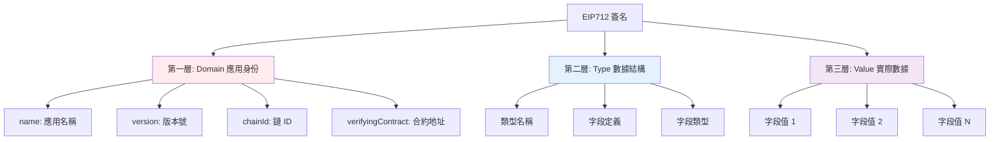

### 資料轉換流程

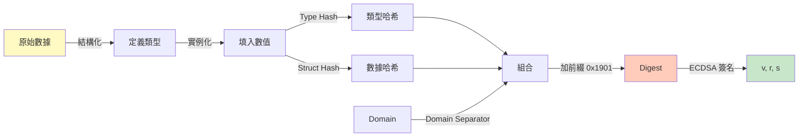

---

## 編碼流程圖

### 完整的 EIP712 編碼步驟

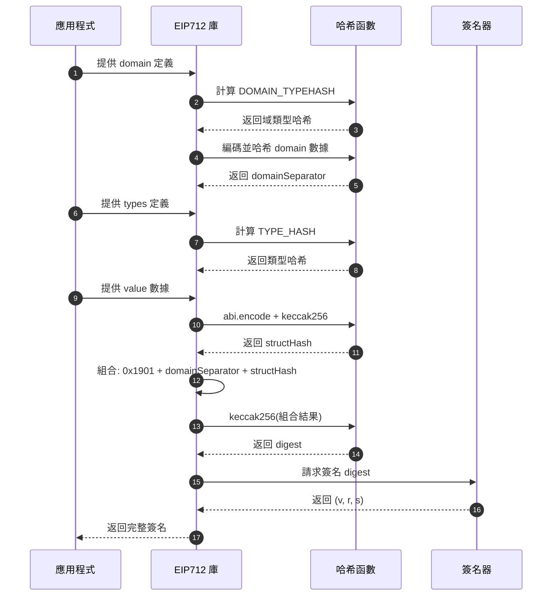

### 哈希計算的嵌套結構

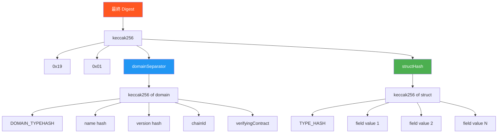

---

## Domain Separator 概念圖

### Domain 作為命名空間

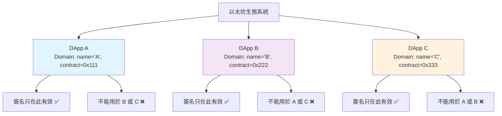

### 跨鏈隔離

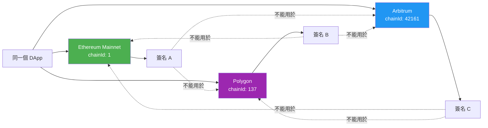

---

## 類型系統對比

### 傳統簽名 vs EIP712

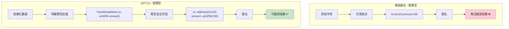

### 類型編碼示例

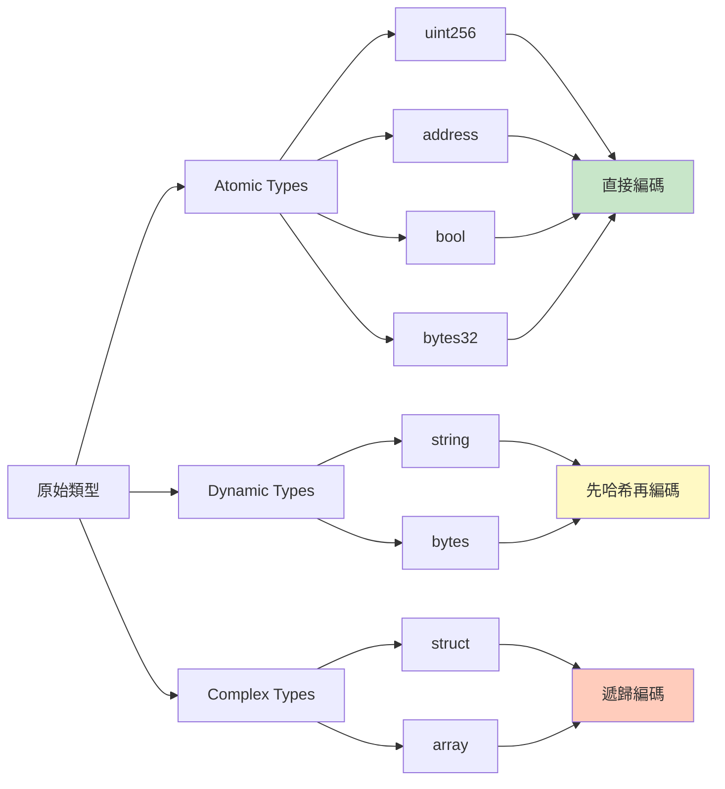

---

## 安全性保護層

### 多層防護機制

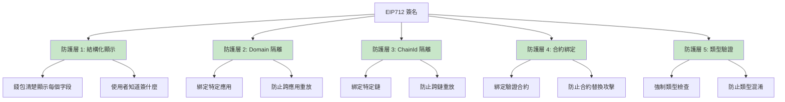

### 攻擊面對比

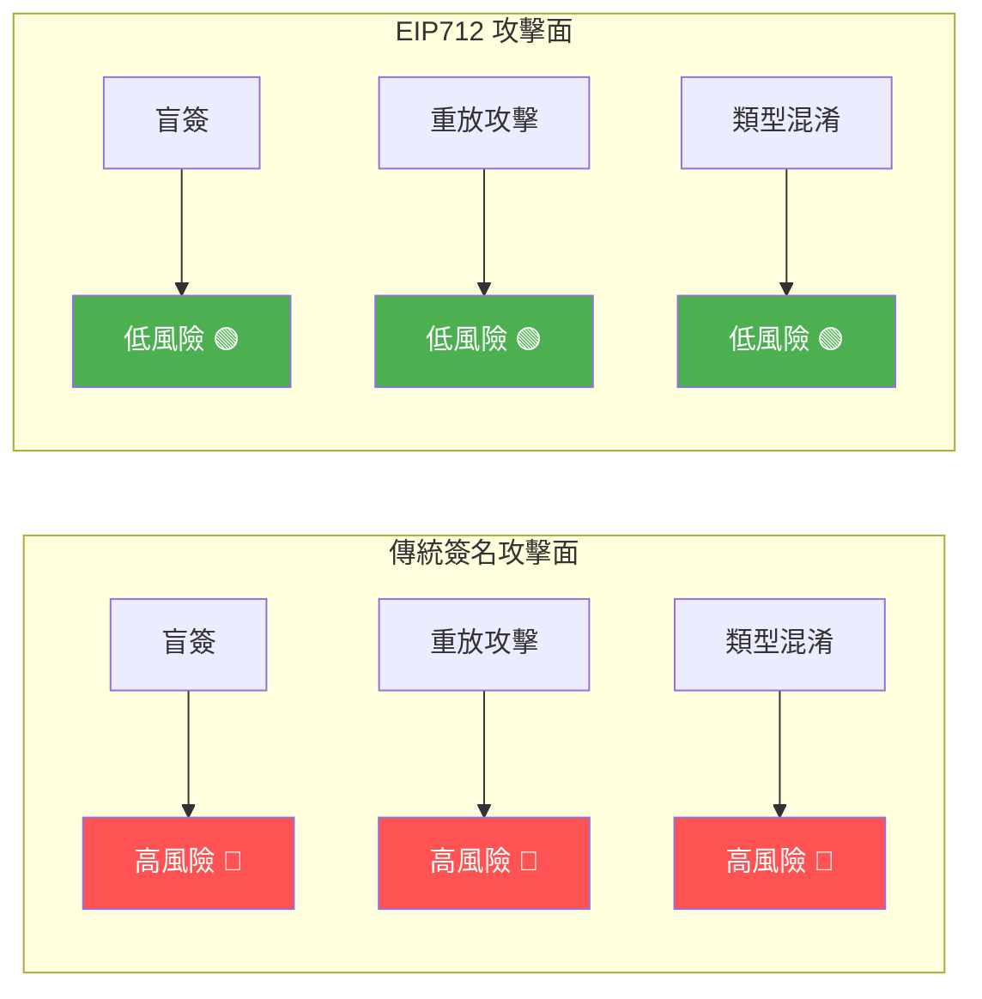

---

## 心智模型：洋蔥結構

### 層層包裹的數據

```
┌─────────────────────────────────────────────────────┐
│  最外層：EIP191 前綴 (0x19 0x01)                     │
│  ┌───────────────────────────────────────────────┐  │
│  │  第二層：Domain Separator                      │  │
│  │  ┌─────────────────────────────────────────┐  │  │
│  │  │  第三層：Type Hash                       │  │  │
│  │  │  ┌───────────────────────────────────┐  │  │  │
│  │  │  │  最內層：實際數據 Value           │  │  │  │
│  │  │  │                                   │  │  │  │
│  │  │  │  to: 0x742d35Cc...                │  │  │  │
│  │  │  │  amount: 100                      │  │  │  │
│  │  │  │  deadline: 1234567890             │  │  │  │
│  │  │  └───────────────────────────────────┘  │  │  │
│  │  │  Transfer(address,uint256,uint256)     │  │  │
│  │  └─────────────────────────────────────────┘  │  │
│  │  MyToken, v1, chainId=1, contract=0x...      │  │
│  └───────────────────────────────────────────────┘  │
│  EIP712 標識                                        │
└─────────────────────────────────────────────────────┘
                       ↓
                [全部哈希]
                       ↓
                   Digest
                       ↓
                [ECDSA 簽名]
                       ↓
                  (v, r, s)
```

---

## 數據流動畫

### 從使用者操作到簽名驗證

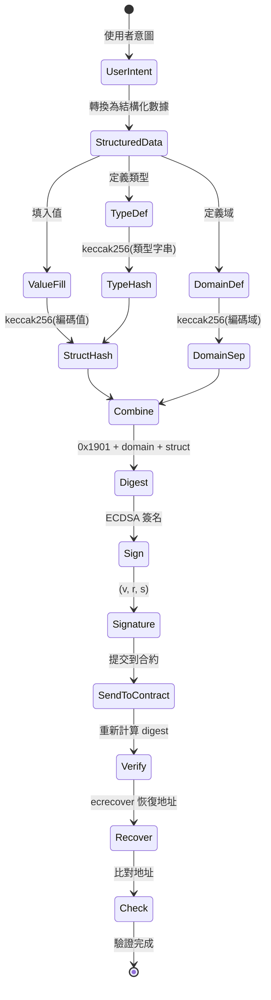

---

## 概念關係圖

### EIP712 核心概念的相互關係

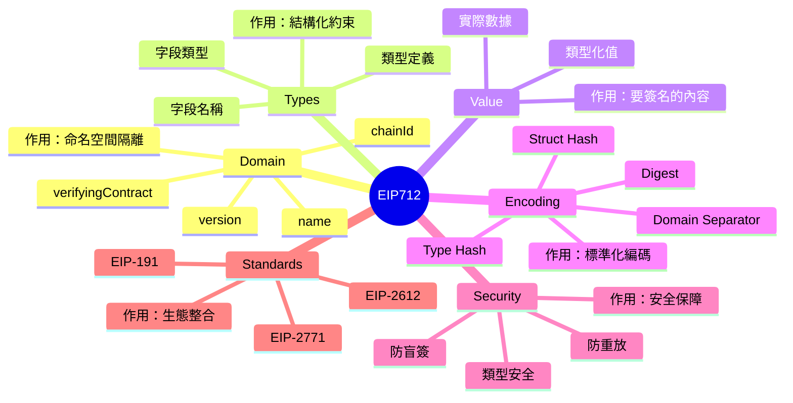

---

## 記憶輔助

### 記住 EIP712 的關鍵

使用縮寫 **D-T-V-E-S**：

```
D - Domain (域)       → 應用身份證
T - Types (類型)      → 數據藍圖
V - Value (值)        → 實際內容
E - Encoding (編碼)   → 標準化處理
S - Signature (簽名)  → 密碼學證明
```

### 編碼步驟記憶法

**「域型結，前簽驗」** (Domain-Type-Struct, Prefix-Sign-Verify)

1. **域** - 計算 Domain Separator
2. **型** - 計算 Type Hash
3. **結** - 計算 Struct Hash
4. **前** - 加 0x1901 前綴組合成 Digest
5. **簽** - ECDSA 簽名得到 (v,r,s)
6. **驗** - 合約驗證簽名

---

## 總結

這些圖表從不同角度展示 EIP712 的核心概念：

- 🏗️ **架構圖**：理解整體結構
- 🔄 **流程圖**：理解數據轉換
- 🛡️ **安全圖**：理解保護機制
- 🧠 **心智圖**：建立直觀理解

建議多次查看這些圖表，並嘗試自己畫出來，這將大大幫助理解！

---

[返回第一章主頁](./README.md) | [下一章：編碼流程](../02-encoding-flow/README.md)

