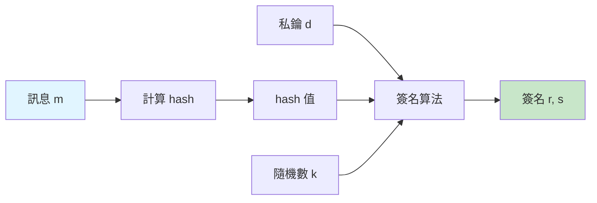
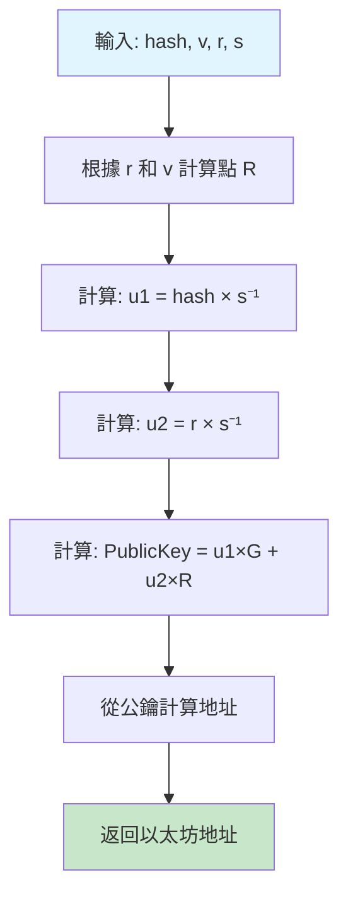

# 第三章：簽名組件解密

> 完全理解 ECDSA 簽名的 v, r, s 組件

## 🎯 本章目標

- 理解 ECDSA 簽名的工作原理
- 掌握 v, r, s 三個組件的意義
- 學會地址恢復的過程
- 了解簽名可塑性問題

## 📖 目錄

1. [ECDSA 簽名概述](#ecdsa-簽名概述)
2. [簽名組件詳解](#簽名組件詳解)
3. [地址恢復原理](#地址恢復原理)
4. [簽名可塑性問題](#簽名可塑性問題)
5. [實作範例](#實作範例)

---

## ECDSA 簽名概述

### 什麼是 ECDSA？

**ECDSA** = Elliptic Curve Digital Signature Algorithm（橢圓曲線數位簽章算法）

以太坊使用 **secp256k1** 橢圓曲線，這是與比特幣相同的曲線。

### 簽名的基本流程



```
1. 計算訊息的哈希：h = keccak256(message)
2. 選擇隨機數：k
3. 計算點：R = k × G （G 是曲線的生成點）
4. 計算 r：r = R.x（取 R 的 x 坐標）
5. 計算 s：s = k⁻¹ × (h + r × d) mod n
   其中 d 是私鑰，n 是曲線的階

簽名結果：(r, s, v)
```

### 為什麼需要三個值？

| 組件 | 含義 | 大小 |
|------|------|------|
| r | 簽名點的 x 坐標 | 32 bytes |
| s | 簽名證明 | 32 bytes |
| v | 恢復標識符 | 1 byte |

**總計：65 bytes**

---

## 簽名組件詳解

### 組件 r：簽名點的 x 坐標

#### 數學原理

```
r = (k × G).x mod n

其中：
- k 是隨機數（nonce）
- G 是橢圓曲線的生成點
- .x 表示取點的 x 坐標
- n 是曲線的階（secp256k1: 0xFFFFFFFF FFFFFFFF FFFFFFFF FFFFFFFE BAAEDCE6 AF48A03B BFD25E8C D0364141）
```

#### 特性

- `r` 是一個 256 位的整數（32 bytes）
- 範圍：1 ≤ r < n
- `r` 是公開的，不洩露私鑰信息

#### 視覺化

```
橢圓曲線上的點運算：

       Y
       │
       │    R = k × G
       │      ●
       │       
       │
───────┼───────────── X
       │          r = R 的 x 坐標
       │
```

### 組件 s：簽名證明

#### 數學原理

```
s = k⁻¹ × (h + r × d) mod n

其中：
- k 是隨機數（與計算 r 時相同）
- k⁻¹ 是 k 的模逆元
- h 是訊息哈希
- r 是前面計算的 r 值
- d 是私鑰
- n 是曲線的階
```

#### 特性

- `s` 是一個 256 位的整數（32 bytes）
- 範圍：1 ≤ s < n
- `s` 包含了私鑰信息（但不能直接推導出私鑰）
- `s` 和訊息哈希相關聯

#### 重要性

`s` 是證明簽名者知道私鑰的核心證據。通過驗證等式：

```
R = s⁻¹ × h × G + s⁻¹ × r × PublicKey
```

可以確認簽名的有效性。

### 組件 v：恢復標識符 (Recovery ID)

#### 作用

從 (r, s) 和訊息可以計算出**最多 4 個**可能的公鑰。`v` 告訴我們應該使用哪一個。

#### 取值

在以太坊中：

```
v ∈ {27, 28}  // 傳統格式
或
v ∈ {0, 1}     // EIP-155 後的格式

在 EIP-155 (replay protection) 之後:
v = chainId * 2 + 35 + yParity
```

#### 為什麼有多個可能的公鑰？

1. **橢圓曲線對稱性**：給定 x 坐標，有兩個可能的 y 坐標（正負）
2. **r 的重複性**：理論上 r 可能對應曲線上的兩個不同的點

```
      Y
      │
      │  ● P1 (x, y)
      │  
──────┼────────────── X (相同的 r 值)
      │
      │  ● P2 (x, -y)
      │
```

所以：2 (y 的選擇) × 2 (r 的選擇) = 4 種可能

但實際上，第二種 r 的情況極少發生，所以通常只有 2 種選擇：
- `v = 27`：使用 y 的正值
- `v = 28`：使用 y 的負值（更準確說是 y mod n 的另一個解）

#### yParity

在現代實現中，更常用 `yParity`：

```typescript
yParity = v - 27  // 0 or 1
```

---

## 地址恢復原理

### ecrecover 函數

以太坊提供內建的 `ecrecover` 函數來從簽名恢復地址：

```solidity
function ecrecover(
    bytes32 hash,     // 訊息哈希
    uint8 v,          // 恢復標識符
    bytes32 r,        // 簽名 r
    bytes32 s         // 簽名 s
) returns (address)   // 恢復的地址
```

### 恢復流程



### 數學公式

```
1. 計算：u1 = h × s⁻¹ mod n
2. 計算：u2 = r × s⁻¹ mod n
3. 計算：PublicKey = u1 × G + u2 × R
4. 計算：address = keccak256(PublicKey)[12:]
```

### 為什麼這樣有效？

從簽名生成公式：
```
s = k⁻¹ × (h + r × d) mod n
```

可以推導出：
```
k = s⁻¹ × (h + r × d) mod n
R = k × G = s⁻¹ × (h + r × d) × G
R = s⁻¹ × h × G + s⁻¹ × r × d × G
R = u1 × G + u2 × PublicKey

其中 PublicKey = d × G（私鑰對應的公鑰）
```

### 實際範例

```typescript
import { ethers } from "ethers";

// 訊息和簽名
const message = "Hello, EIP712!";
const messageHash = ethers.hashMessage(message);

// 假設我們有簽名
const signature = "0x...";
const sig = ethers.Signature.from(signature);

// 恢復地址
const recoveredAddress = ethers.recoverAddress(messageHash, signature);

console.log("Recovered Address:", recoveredAddress);
```

### 在 Solidity 中使用

```solidity
function verify(
    bytes32 messageHash,
    bytes memory signature,
    address expectedSigner
) public pure returns (bool) {
    // 分解簽名
    bytes32 r;
    bytes32 s;
    uint8 v;
    
    assembly {
        r := mload(add(signature, 32))
        s := mload(add(signature, 64))
        v := byte(0, mload(add(signature, 96)))
    }
    
    // 恢復地址
    address recoveredSigner = ecrecover(messageHash, v, r, s);
    
    // 比對
    return recoveredSigner == expectedSigner;
}
```

---

## 簽名可塑性問題

### 什麼是簽名可塑性？

對於一個有效的簽名 `(r, s)`，存在另一個同樣有效的簽名 `(r, s')`，其中：

```
s' = n - s
v' = 27 + 28 - v  // 反轉 v
```

這兩個簽名都能恢復出相同的地址！

### 為什麼會這樣？

這是橢圓曲線數學的特性。如果 `(r, s)` 是有效簽名，那麼 `(r, -s mod n)` 也是有效的。

### 問題示例

```typescript
// 原始簽名
const sig1 = {
  r: "0x1234...",
  s: "0x5678...",
  v: 27
};

// 可塑形變體
const n = ethers.getBigInt("0xFFFFFFFFFFFFFFFFFFFFFFFFFFFFFFFEBAAEDCE6AF48A03BBFD25E8CD0364141");
const sig2 = {
  r: sig1.r,
  s: ethers.toBeHex(n - ethers.getBigInt(sig1.s)),
  v: 28  // 反轉
};

// 兩者都能恢復出相同的地址！
```

### 安全隱患

1. **交易重放**：攻擊者可以創建不同的交易哈希
2. **合約漏洞**：如果合約用簽名作為唯一 ID，可能被繞過

### EIP-2: 解決方案

EIP-2 規定 `s` 必須在低半部分：

```solidity
// secp256k1 曲線的階的一半
bytes32 constant HALF_N = 0x7FFFFFFFFFFFFFFFFFFFFFFFFFFFFFFF5D576E7357A4501DDFE92F46681B20A0;

require(uint256(s) <= uint256(HALF_N), "Invalid signature 's' value");
```

### OpenZeppelin 的實現

```solidity
function _isValidSignature(bytes32 hash, bytes memory signature) internal pure returns (bool) {
    bytes32 s;
    assembly {
        s := mload(add(signature, 0x40))
    }
    
    // EIP-2 檢查
    if (uint256(s) > 0x7FFFFFFFFFFFFFFFFFFFFFFFFFFFFFFF5D576E7357A4501DDFE92F46681B20A0) {
        return false;
    }
    
    // 其他驗證...
}
```

### 現代庫的處理

```typescript
// ethers.js v6 自動規範化簽名
const sig = ethers.Signature.from(signature);
// sig.s 自動在低半部分
```

---

## 實作範例

### 完整的簽名和恢復流程

```typescript
import { ethers } from "ethers";

async function signatureDemo() {
  // 創建錢包
  const privateKey = "0xac0974bec39a17e36ba4a6b4d238ff944bacb478cbed5efcae784d7bf4f2ff80";
  const wallet = new ethers.Wallet(privateKey);
  
  console.log("簽名者地址:", wallet.address);
  
  // 要簽名的訊息
  const message = "Hello, EIP712!";
  console.log("訊息:", message);
  
  // 計算訊息哈希（ethers 會自動加 "\x19Ethereum Signed Message:\n" 前綴）
  const messageHash = ethers.hashMessage(message);
  console.log("訊息哈希:", messageHash);
  
  // 簽名
  const signature = await wallet.signMessage(message);
  console.log("完整簽名:", signature);
  console.log("簽名長度:", (signature.length - 2) / 2, "bytes");
  
  // 分解簽名
  const sig = ethers.Signature.from(signature);
  console.log("\n簽名組件:");
  console.log("  r:", sig.r);
  console.log("  s:", sig.s);
  console.log("  v:", sig.v);
  console.log("  yParity:", sig.yParity);
  
  // 恢復地址
  const recoveredAddress = ethers.recoverAddress(messageHash, signature);
  console.log("\n恢復的地址:", recoveredAddress);
  console.log("匹配:", recoveredAddress === wallet.address ? "✅" : "❌");
  
  // 手動使用 v, r, s 恢復
  const recoveredAddress2 = ethers.recoverAddress(
    messageHash,
    { r: sig.r, s: sig.s, v: sig.v }
  );
  console.log("手動恢復的地址:", recoveredAddress2);
  console.log("匹配:", recoveredAddress2 === wallet.address ? "✅" : "❌");
}
```

### EIP712 簽名的組件

```typescript
import { ethers } from "ethers";

async function eip712SignatureDemo() {
  const wallet = new ethers.Wallet("0xac0974bec39a17e36ba4a6b4d238ff944bacb478cbed5efcae784d7bf4f2ff80");
  
  const domain = {
    name: "MyToken",
    version: "1",
    chainId: 1,
    verifyingContract: "0x1111111111111111111111111111111111111111"
  };
  
  const types = {
    Transfer: [
      { name: "to", type: "address" },
      { name: "amount", type: "uint256" }
    ]
  };
  
  const value = {
    to: "0x742d35Cc6634C0532925a3b844Bc9e7595f0bEb",
    amount: 100n
  };
  
  // 簽名
  const signature = await wallet.signTypedData(domain, types, value);
  const sig = ethers.Signature.from(signature);
  
  console.log("EIP712 簽名:");
  console.log("  r:", sig.r);
  console.log("  s:", sig.s);
  console.log("  v:", sig.v);
  
  // 驗證
  const recoveredAddress = ethers.verifyTypedData(domain, types, value, signature);
  console.log("\n恢復的地址:", recoveredAddress);
  console.log("匹配:", recoveredAddress === wallet.address ? "✅" : "❌");
}
```

---

## 🔑 關鍵要點

### 簽名組件總結

```
r (32 bytes)
├─ 簽名點的 x 坐標
├─ 來自隨機數 k 的點運算
└─ 公開，不洩露私鑰

s (32 bytes)
├─ 簽名證明
├─ 綁定私鑰、訊息和 r
└─ 核心的證明組件

v (1 byte)
├─ 恢復標識符
├─ 取值：27 或 28（傳統）
├─ 取值：0 或 1（yParity）
└─ 用於從 4 種可能中選擇正確的公鑰
```

### 記憶口訣

**R**andom point (r - 隨機點)
**S**ignature proof (s - 簽名證明)  
**V**ersion/recovery (v - 恢復版本)

### 常見錯誤

❌ **錯誤 1**：忘記檢查 s 值（簽名可塑性）
```solidity
// 應該檢查
require(uint256(s) <= HALF_N, "Invalid s");
```

❌ **錯誤 2**：v 值使用錯誤
```solidity
// 傳統 v: 27/28
// EIP-155 後: chainId * 2 + 35 + yParity
```

❌ **錯誤 3**：直接使用簽名作為唯一標識
```solidity
// 不安全：簽名可以被修改
mapping(bytes => bool) used;

// 更好：使用訊息哈希或其他唯一 ID
mapping(bytes32 => bool) used;
```

---

## 📝 動手實踐

查看本目錄下的腳本：

1. [signature-recovery.ts](./signature-recovery.ts) - 簽名恢復演示
2. [signature-anatomy.md](./signature-anatomy.md) - 簽名解剖圖
3. [malleability.md](./malleability.md) - 可塑性詳解

---

## 下一步

[第四章：Hello World 範例](../04-hello-world/README.md) - 實作第一個 EIP712 簽名

---

[返回主目錄](../README.md)

