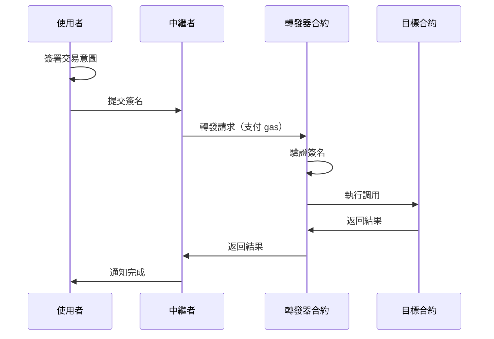

# 第五章：實戰應用範例

> 學習真實世界的 EIP712 應用場景

## 🎯 本章目標

- 理解 EIP-2612 (ERC20 Permit) 的實現
- 掌握元交易（Meta-transaction）的原理
- 學習處理複雜類型和嵌套結構
- 了解 gasless 交易的實現方式

## 📖 本章內容

本章包含三個真實世界的應用範例：

1. **[Token Permit](#1-token-permit-eip-2612)** - ERC20 的 gasless 授權
2. **[Meta Transaction](#2-meta-transaction-erc-2771)** - 無 gas 交易轉發
3. **[複雜類型](#3-複雜類型和嵌套結構)** - 處理嵌套和陣列

---

## 1. Token Permit (EIP-2612)

### 什麼是 Permit？

傳統的 ERC20 授權流程需要兩筆交易：
```
1. approve() - 授權給 spender
2. transferFrom() - spender 轉移代幣
```

使用 Permit，只需一筆交易：
```
1. 鏈下簽名授權
2. transferFrom() - 同時驗證簽名和轉移代幣
```

### Permit 的優勢

- ✅ **節省 gas**：減少一筆鏈上交易
- ✅ **更好的 UX**：使用者不需要先授權
- ✅ **gasless 授權**：使用者甚至不需要持有 ETH

### 應用場景

- DEX 交易（如 Uniswap）
- 代幣質押
- 任何需要授權的場景

### 實現範例

查看 [token-permit/PermitToken.sol](./token-permit/PermitToken.sol)

---

## 2. Meta Transaction (ERC-2771)

### 什麼是元交易？

元交易允許使用者：
- 簽署交易意圖（不是真實交易）
- 由中繼者（relayer）支付 gas 費用
- 真正實現 gasless 體驗

### 元交易的流程



### 應用場景

- 鏈遊（玩家無需持有 gas）
- DApp onboarding（新使用者友好）
- 批量操作（一次簽名，多次執行）

### 實現範例

查看 [meta-transaction/Forwarder.sol](./meta-transaction/Forwarder.sol)

---

## 3. 複雜類型和嵌套結構

### 為什麼需要複雜類型？

真實世界的應用通常需要複雜的數據結構：
- 訂單（包含多個商品）
- 提案（包含多個操作）
- NFT 屬性（嵌套結構）

### 類型編碼規則

#### 基本類型
```solidity
uint256, address, bool, bytes32 等
→ 直接編碼
```

#### 動態類型
```solidity
string, bytes
→ 先哈希：keccak256(value)
```

#### 陣列類型
```solidity
uint256[], address[]
→ 先編碼每個元素，再哈希整體
```

#### 結構類型
```solidity
struct Person { string name; address wallet; }
→ 遞歸計算 struct hash
```

### 實現範例

查看 [multi-type/ComplexTypes.sol](./multi-type/ComplexTypes.sol)

---

## 📁 專案結構

```
05-practical-examples/
├── README.md                          # 本文檔
├── token-permit/
│   ├── PermitToken.sol                # ERC20 + Permit 實現
│   ├── permit-demo.ts                 # Gasless 轉帳演示
│   └── README.md                      # Permit 詳細說明
├── meta-transaction/
│   ├── Forwarder.sol                  # ERC-2771 轉發器
│   ├── SimpleCounter.sol              # 支持元交易的範例合約
│   ├── meta-tx-demo.ts                # 元交易演示
│   └── README.md                      # 元交易詳細說明
└── multi-type/
    ├── ComplexTypes.sol               # 複雜類型處理
    ├── nested-demo.ts                 # 嵌套結構演示
    └── README.md                      # 類型編碼詳解
```

---

## 🔑 關鍵概念對比

### Permit vs Meta-transaction

| 特性 | Permit | Meta-transaction |
|------|--------|------------------|
| 用途 | 代幣授權 | 任意函數調用 |
| 標準 | EIP-2612 | ERC-2771 |
| 實現難度 | 簡單 | 中等 |
| 適用範圍 | ERC20 | 任意合約 |
| Gas 節省 | 一筆交易 | 使用者完全無 gas |

### 使用場景選擇

```
需要代幣授權？
    ├─ 是 → 使用 Permit
    └─ 否 → 需要 gasless？
            ├─ 是 → 使用 Meta-transaction
            └─ 否 → 普通交易即可
```

---

## 💡 最佳實踐

### 1. Permit 實現

✅ **推薦做法**：
```solidity
// 使用 OpenZeppelin 的 ERC20Permit
import "@openzeppelin/contracts/token/ERC20/extensions/ERC20Permit.sol";

contract MyToken is ERC20Permit {
    constructor() ERC20("MyToken", "MTK") ERC20Permit("MyToken") {}
}
```

❌ **避免**：
- 自己從零實現（容易出錯）
- 忘記檢查 deadline
- 忘記使用 nonce 防止重放

### 2. Meta-transaction 實現

✅ **推薦做法**：
```solidity
// 檢查 nonce
require(nonces[from] == nonce, "Invalid nonce");
nonces[from]++;

// 檢查 deadline
require(block.timestamp <= deadline, "Signature expired");

// 驗證簽名
require(verify(from, data, signature), "Invalid signature");
```

❌ **避免**：
- 不檢查 nonce（重放攻擊）
- 不設置 deadline（簽名永久有效）
- 信任中繼者提供的 from 地址

### 3. 複雜類型處理

✅ **推薦做法**：
```solidity
// 清楚地文檔化類型定義
/// @notice Order 結構的類型字串
/// "Order(address buyer,Item[] items)Item(string name,uint256 price)"
```

❌ **避免**：
- 類型字串格式錯誤（多餘空格）
- 忘記處理嵌套類型
- string/bytes 直接編碼（應該先哈希）

---

## 🚀 快速開始

### 1. Permit 演示

```bash
# 部署 PermitToken
npx hardhat run scripts/deploy-permit-token.ts --network localhost

# 運行 permit 演示
npx ts-node 05-practical-examples/token-permit/permit-demo.ts
```

### 2. Meta-transaction 演示

```bash
# 部署 Forwarder 和 Counter
npx hardhat run scripts/deploy-forwarder.ts --network localhost

# 運行元交易演示
npx ts-node 05-practical-examples/meta-transaction/meta-tx-demo.ts
```

### 3. 複雜類型演示

```bash
# 運行嵌套結構演示
npx ts-node 05-practical-examples/multi-type/nested-demo.ts
```

---

## 📚 深入學習

### Permit 相關資源

- [EIP-2612 規範](https://eips.ethereum.org/EIPS/eip-2612)
- [OpenZeppelin ERC20Permit](https://docs.openzeppelin.com/contracts/4.x/api/token/erc20#ERC20Permit)
- [Uniswap Permit2](https://github.com/Uniswap/permit2)

### Meta-transaction 相關資源

- [ERC-2771 規範](https://eips.ethereum.org/EIPS/eip-2771)
- [OpenGSN (Gas Station Network)](https://opengsn.org/)
- [Biconomy](https://www.biconomy.io/)

### 實際專案參考

- **Uniswap V2/V3**：使用 Permit 進行無 gas 授權
- **Gnosis Safe**：使用 EIP712 簽名多簽交易
- **OpenSea Seaport**：複雜的 NFT 訂單簽名
- **1inch**：Permit 和元交易結合

---

## 🎓 練習題

### 初級

1. 實現一個支持 Permit 的 ERC20 代幣
2. 使用 Permit 進行一次 gasless 轉帳
3. 理解 nonce 的作用並驗證重放保護

### 中級

4. 實現一個簡單的元交易轉發器
5. 添加 deadline 檢查和 gas 限制
6. 實現批量元交易執行

### 高級

7. 實現 Uniswap 風格的 Permit2
8. 構建一個完整的 gasless DApp
9. 優化 gas 消耗並添加錯誤處理

---

## ⚠️ 常見陷阱

### 1. Nonce 管理錯誤

```solidity
// ❌ 錯誤：沒有正確管理 nonce
function execute(uint256 nonce, bytes signature) {
    // 忘記檢查和增加 nonce
}

// ✅ 正確
function execute(uint256 nonce, bytes signature) {
    require(nonces[msg.sender] == nonce, "Invalid nonce");
    nonces[msg.sender]++;
    // ...
}
```

### 2. 簽名可塑性

```solidity
// ✅ 添加 EIP-2 檢查
if (uint256(s) > 0x7FFFFFFFFFFFFFFFFFFFFFFFFFFFFFFF5D576E7357A4501DDFE92F46681B20A0) {
    revert("Invalid signature 's' value");
}
```

### 3. Deadline 遺漏

```solidity
// ❌ 簽名永不過期
function permit(...) {
    // 沒有檢查 deadline
}

// ✅ 正確
function permit(..., uint256 deadline) {
    require(block.timestamp <= deadline, "Permit expired");
}
```

---

## 下一步

[第六章：安全性與最佳實踐](../06-security-best-practices/README.md) - 掌握 EIP712 開發的安全要點

---

[返回主目錄](../README.md)

