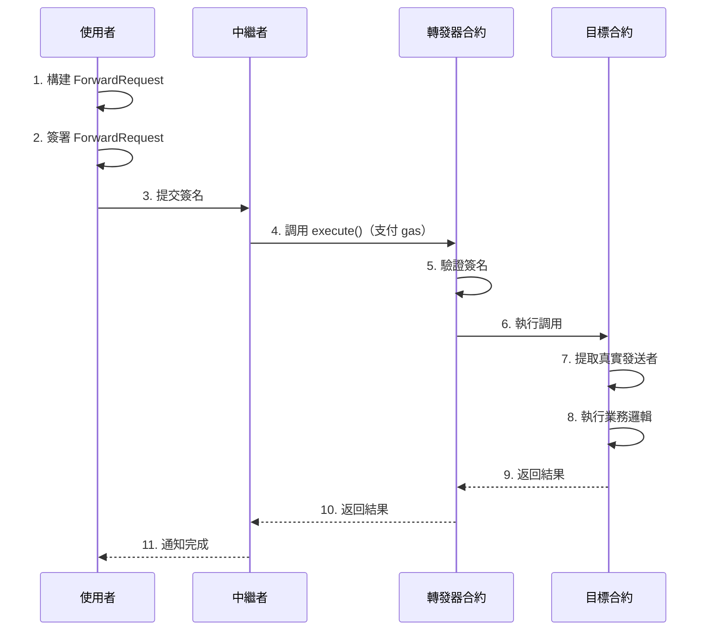

# Meta Transaction (ERC-2771)

> 實現任意函數的 gasless 調用

## 📖 什麼是元交易？

元交易（Meta Transaction）允許使用者簽署交易意圖，由第三方（中繼者）代為提交並支付 gas 費用，實現真正的 gasless 體驗。

### 傳統交易流程

```
使用者 → 簽署交易 → 廣播到網絡 → 支付 gas → 執行
```

**要求：使用者必須持有 ETH**

### 元交易流程

```
使用者 → 簽署意圖 → 傳給中繼者 → 中繼者支付 gas → 執行
```

**要求：使用者不需要持有 ETH**

## 🎭 角色說明

### 1. 使用者（User）
- 想要執行某個操作
- 但沒有 gas 代幣
- 只需離線簽署交易意圖

### 2. 中繼者（Relayer）
- 接收使用者的簽名
- 代為提交到區塊鏈
- 支付所有 gas 費用
- 可以收取服務費

### 3. 轉發器合約（Forwarder）
- 驗證使用者簽名
- 執行實際的交易
- 確保安全性

### 4. 目標合約（Target Contract）
- 實際執行業務邏輯
- 從 calldata 提取真實發送者
- 信任特定的轉發器

## 🔄 工作流程



## 🎯 核心優勢

### 1. 完全 Gasless
- 使用者不需要持有任何 ETH
- 所有 gas 由中繼者支付
- 真正的 Web2 體驗

### 2. 通用性強
- 可用於任何函數調用
- 不限於特定代幣或合約
- 靈活的應用場景

### 3. 降低門檻
- 新用戶友好
- 提高 DApp 採用率
- 更好的用戶體驗

### 4. 商業模式
- 中繼者可以收費
- 訂閱制服務
- 廣告贊助等

## 🔑 ForwardRequest 結構

```solidity
struct ForwardRequest {
    address from;      // 原始發送者
    address to;        // 目標合約
    uint256 value;     // 發送的 ETH 數量
    uint256 gas;       // Gas 限制
    uint256 nonce;     // 防重放 nonce
    uint256 deadline;  // 過期時間
    bytes data;        // 調用數據
}
```

### 類型字串

```
ForwardRequest(address from,address to,uint256 value,uint256 gas,uint256 nonce,uint256 deadline,bytes data)
```

## 💻 實作說明

### 轉發器合約

查看 [Forwarder.sol](./Forwarder.sol)

關鍵要點：

1. **繼承 EIP712**
```solidity
contract Forwarder is EIP712 {
    constructor() EIP712("Forwarder", "1") {}
}
```

2. **驗證簽名**
```solidity
function verify(ForwardRequest calldata req, bytes calldata signature)
    public view returns (bool)
{
    address signer = _hashTypedDataV4(_hashForwardRequest(req))
        .recover(signature);
    return signer == req.from;
}
```

3. **執行轉發**
```solidity
function execute(ForwardRequest calldata req, bytes calldata signature)
    public payable returns (bool success, bytes memory returnData)
{
    require(nonces[req.from] == req.nonce, "Invalid nonce");
    require(block.timestamp <= req.deadline, "Expired");
    require(verify(req, signature), "Invalid signature");
    
    nonces[req.from]++;
    
    // 附加 from 地址到 calldata 末尾
    bytes memory data = abi.encodePacked(req.data, req.from);
    (success, returnData) = req.to.call{gas: req.gas, value: req.value}(data);
}
```

### 目標合約

查看 [SimpleCounter.sol](./SimpleCounter.sol)

關鍵要點：

1. **提取真實發送者**
```solidity
function _msgSender() internal view returns (address sender) {
    if (msg.sender == trustedForwarder && msg.data.length >= 20) {
        // 從 calldata 末尾提取 20 字節的地址
        assembly {
            sender := shr(96, calldataload(sub(calldatasize(), 20)))
        }
    } else {
        sender = msg.sender;
    }
}
```

2. **使用 _msgSender**
```solidity
function increment(uint256 amount) external {
    address sender = _msgSender();  // 而不是 msg.sender
    userCounts[sender] += amount;
}
```

### 前端實現

查看 [meta-tx-demo.ts](./meta-tx-demo.ts)

關鍵步驟：

1. **編碼函數調用**
```typescript
const data = counter.interface.encodeFunctionData("increment", [5]);
```

2. **構建 ForwardRequest**
```typescript
const request = {
  from: user.address,
  to: await counter.getAddress(),
  value: 0n,
  gas: 100000n,
  nonce: await forwarder.getNonce(user.address),
  deadline: Math.floor(Date.now() / 1000) + 3600,
  data: data
};
```

3. **簽名**
```typescript
const signature = await user.signTypedData(domain, types, request);
```

4. **提交給中繼者**
```typescript
// 實際應用中，這裡會調用中繼者的 API
await relayerAPI.submitMetaTx(request, signature);
```

## 🚀 快速開始

### 1. 安裝依賴

```bash
npm install ethers @openzeppelin/contracts
```

### 2. 部署合約

```bash
# 啟動本地節點
npx hardhat node

# 部署（另一個終端）
npx hardhat run scripts/deploy-forwarder.ts --network localhost
```

### 3. 運行演示

```bash
npx ts-node 05-practical-examples/meta-transaction/meta-tx-demo.ts
```

## 📝 使用範例

### 基本元交易流程

```typescript
import { ethers } from "ethers";

// 1. 編碼函數調用
const data = counter.interface.encodeFunctionData("increment", [5]);

// 2. 獲取 nonce
const nonce = await forwarder.getNonce(user.address);

// 3. 構建 ForwardRequest
const request = {
  from: user.address,
  to: counterAddress,
  value: 0n,
  gas: 100000n,
  nonce: nonce,
  deadline: Math.floor(Date.now() / 1000) + 3600,
  data: data
};

// 4. 構建 domain
const domain = {
  name: "Forwarder",
  version: "1",
  chainId: 1,
  verifyingContract: forwarderAddress
};

// 5. 定義類型
const types = {
  ForwardRequest: [
    { name: "from", type: "address" },
    { name: "to", type: "address" },
    { name: "value", type: "uint256" },
    { name: "gas", type: "uint256" },
    { name: "nonce", type: "uint256" },
    { name: "deadline", type: "uint256" },
    { name: "data", type: "bytes" }
  ]
};

// 6. 簽名
const signature = await user.signTypedData(domain, types, request);

// 7. 中繼者執行
await forwarder.connect(relayer).execute(request, signature);
```

### 批量執行

```typescript
// 構建多個請求
const requests = [request1, request2, request3];
const signatures = [sig1, sig2, sig3];

// 批量執行
await forwarder.executeBatch(requests, signatures);
```

## 🔒 安全考量

### 1. Nonce 管理

```solidity
require(nonces[req.from] == req.nonce, "Invalid nonce");
nonces[req.from]++;
```

**防止：**
- ✅ 重放攻擊
- ✅ 簽名重複使用

### 2. Deadline 檢查

```solidity
require(block.timestamp <= req.deadline, "Request expired");
```

**防止：**
- ✅ 過期簽名使用
- ✅ 無限期有效的簽名

### 3. Gas 限制

```solidity
(success, returnData) = req.to.call{gas: req.gas}(data);
```

**防止：**
- ✅ 中繼者 gas 損失
- ✅ DoS 攻擊

### 4. 可信轉發器

```solidity
address public trustedForwarder;

modifier onlyForwarder() {
    require(msg.sender == trustedForwarder, "Untrusted forwarder");
    _;
}
```

**防止：**
- ✅ 惡意轉發器
- ✅ 偽造發送者

### 5. 簽名驗證

```solidity
address signer = _hashTypedDataV4(hash).recover(signature);
require(signer == req.from, "Invalid signature");
```

**防止：**
- ✅ 偽造簽名
- ✅ 簽名可塑性

## 🌍 實際應用案例

### 1. 區塊鏈遊戲

**案例：**
- Gods Unchained
- Axie Infinity（部分功能）

**優勢：**
- 玩家無需持有 gas
- 遊戲公司代為支付
- 降低進入門檻

### 2. DApp Onboarding

**場景：**
- 新用戶註冊
- 首次操作

**優勢：**
- 無需先購買 ETH
- 提高轉換率
- 更好的用戶體驗

### 3. NFT Minting

**場景：**
- 用戶用信用卡購買
- 後端代為鑄造

**優勢：**
- Web2 體驗
- 用戶無感知區塊鏈
- 提高銷量

### 4. DAO 治理

**場景：**
- 投票
- 提案

**優勢：**
- 投票無需 gas
- 提高參與率
- 更公平的治理

## ⚠️ 常見陷阱

### 1. ❌ 直接使用 msg.sender

```solidity
// 錯誤：會記錄到 Forwarder
function increment() external {
    counts[msg.sender]++;
}

// ✅ 正確：使用 _msgSender()
function increment() external {
    counts[_msgSender()]++;
}
```

### 2. ❌ 不檢查 nonce

```solidity
// 錯誤：沒有防重放保護
function execute(ForwardRequest req, bytes signature) {
    // 沒有檢查 nonce
}

// ✅ 正確
function execute(ForwardRequest req, bytes signature) {
    require(nonces[req.from] == req.nonce);
    nonces[req.from]++;
}
```

### 3. ❌ 不限制 gas

```solidity
// 錯誤：可能消耗過多 gas
req.to.call(data);

// ✅ 正確：限制 gas
req.to.call{gas: req.gas}(data);
```

### 4. ❌ 信任任意轉發器

```solidity
// 錯誤：任何人都可以當轉發器
function _msgSender() internal view returns (address) {
    return address(bytes20(msg.data[msg.data.length-20:]));
}

// ✅ 正確：只信任特定轉發器
function _msgSender() internal view returns (address) {
    if (msg.sender == trustedForwarder) {
        return address(bytes20(msg.data[msg.data.length-20:]));
    }
    return msg.sender;
}
```

## 🔧 中繼者實現

### 簡單的中繼者服務

```typescript
// Express API 端點
app.post("/api/relay", async (req, res) => {
  const { request, signature } = req.body;
  
  // 1. 驗證簽名
  const isValid = await forwarder.verify(request, signature);
  if (!isValid) {
    return res.status(400).json({ error: "Invalid signature" });
  }
  
  // 2. 檢查 gas 限制
  if (request.gas > MAX_GAS) {
    return res.status(400).json({ error: "Gas too high" });
  }
  
  // 3. 執行轉發
  try {
    const tx = await forwarder.execute(request, signature);
    const receipt = await tx.wait();
    res.json({ txHash: receipt.hash });
  } catch (error) {
    res.status(500).json({ error: error.message });
  }
});
```

### 商業模式

1. **訂閱制**
   - 月費方式
   - 包含一定數量的交易

2. **按次收費**
   - 每筆交易收費
   - 可用其他代幣支付

3. **廣告贊助**
   - 廣告商支付 gas
   - 免費提供給用戶

## 🚀 現有方案

### 1. OpenGSN (Gas Station Network)

- 開源的去中心化中繼網絡
- 完整的基礎設施
- https://opengsn.org/

### 2. Biconomy

- 商業化 gasless 解決方案
- 簡單易用的 SDK
- https://www.biconomy.io/

### 3. Gelato Network

- 自動化執行網絡
- 支援元交易
- https://www.gelato.network/

### 4. Defender Relayer (OpenZeppelin)

- 企業級中繼服務
- 與 Defender 平台整合
- https://www.openzeppelin.com/defender

## 📚 延伸閱讀

### 規範文檔
- [ERC-2771: Secure Protocol for Native Meta Transactions](https://eips.ethereum.org/EIPS/eip-2771)
- [EIP-712: Typed Structured Data](https://eips.ethereum.org/EIPS/eip-712)

### 實作參考
- [OpenZeppelin ERC2771Context](https://docs.openzeppelin.com/contracts/4.x/api/metatx)
- [Biconomy Documentation](https://docs.biconomy.io/)
- [OpenGSN Documentation](https://docs.opengsn.org/)

### 進階主題
- [Account Abstraction (ERC-4337)](https://eips.ethereum.org/EIPS/eip-4337)
- [批量元交易優化](https://github.com/Uniswap/permit2)

## 🎓 練習題

### 初級

1. 部署 Forwarder 和 SimpleCounter
2. 實現一筆元交易
3. 驗證 nonce 管理

### 中級

4. 實現批量元交易
5. 添加 gas 限制和檢查
6. 構建簡單的中繼者 API

### 高級

7. 實現收費機制
8. 優化 gas 消耗
9. 添加多簽支援

---

[返回第五章目錄](../README.md)

