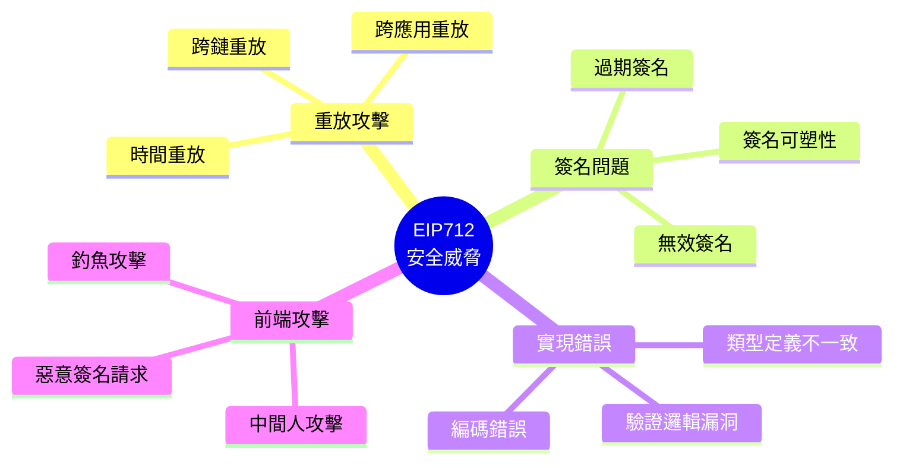

# 第六章：安全性與最佳實踐

> 掌握 EIP712 開發的安全要點，避免常見陷阱

## 🎯 本章目標

- 理解 EIP712 的主要安全威脅
- 掌握防護重放攻擊的方法
- 學習前端和合約端的安全檢查
- 了解調試和問題排查技巧

## 📖 本章內容

1. [安全威脅概覽](#安全威脅概覽)
2. [重放攻擊防護](#重放攻擊防護)
3. [前端安全](#前端安全)
4. [合約端安全](#合約端安全)
5. [常見錯誤](#常見錯誤)
6. [調試指南](#調試指南)

---

## 安全威脅概覽

### 主要威脅類型



### 威脅等級評估

| 威脅類型 | 嚴重程度 | 發生頻率 | 防護難度 |
|---------|---------|---------|---------|
| 跨應用重放 | 🔴 高 | 🟡 中 | 🟢 低 |
| 跨鏈重放 | 🔴 高 | 🟡 中 | 🟢 低 |
| 簽名可塑性 | 🟡 中 | 🟡 中 | 🟢 低 |
| 過期簽名 | 🟡 中 | 🔴 高 | 🟢 低 |
| 釣魚攻擊 | 🔴 高 | 🔴 高 | 🔴 高 |
| 實現錯誤 | 🟡 中 | 🟡 中 | 🟡 中 |

---

## 重放攻擊防護

### 1. 跨應用重放攻擊

#### 問題

同一個簽名可能被用於不同的應用。

#### 防護：使用 Domain Separator

```solidity
// ✅ 正確：Domain Separator 包含應用標識
bytes32 public immutable DOMAIN_SEPARATOR;

constructor() {
    DOMAIN_SEPARATOR = keccak256(
        abi.encode(
            DOMAIN_TYPEHASH,
            keccak256(bytes("MyApp")),        // 應用名稱
            keccak256(bytes("1")),            // 版本
            block.chainid,
            address(this)                      // 合約地址
        )
    );
}
```

**原理**：不同應用的 Domain Separator 不同，導致 digest 不同，簽名無法重放。

### 2. 跨鏈重放攻擊

#### 問題

同一個簽名可能在不同鏈上被重放。

#### 防護：包含 chainId

```solidity
// ✅ 正確：Domain Separator 包含 chainId
DOMAIN_SEPARATOR = keccak256(
    abi.encode(
        DOMAIN_TYPEHASH,
        keccak256(bytes(name)),
        keccak256(bytes(version)),
        block.chainid,           // ⭐ 關鍵：鏈 ID
        address(this)
    )
);
```

**實例**：
```
以太坊主網 (chainId: 1) 的簽名
❌ 無法在 Polygon (chainId: 137) 上使用
✅ Domain Separator 不同
```

### 3. 時間重放攻擊

#### 問題

簽名永久有效，可以被無限次重放。

#### 防護方案 A：使用 deadline

```solidity
// ✅ 正確：檢查截止時間
function permit(
    address owner,
    address spender,
    uint256 value,
    uint256 deadline,    // ⭐ 截止時間
    uint8 v,
    bytes32 r,
    bytes32 s
) public {
    require(block.timestamp <= deadline, "Expired");
    // ...
}
```

**建議**：
- 短期操作：deadline = now + 5 minutes
- 長期授權：deadline = now + 1 day
- 緊急操作：deadline = now + 1 minute

#### 防護方案 B：使用 nonce

```solidity
// ✅ 正確：使用遞增的 nonce
mapping(address => uint256) public nonces;

function execute(
    address from,
    uint256 nonce,    // ⭐ 必須等於當前 nonce
    bytes signature
) public {
    require(nonces[from] == nonce, "Invalid nonce");
    nonces[from]++;   // ⭐ 用後即焚
    // ...
}
```

**nonce 的類型**：

```solidity
// 類型 1: 順序 nonce（必須按順序使用）
nonces[user]++;

// 類型 2: 隨機 nonce（可以並行使用）
mapping(address => mapping(uint256 => bool)) public usedNonces;
require(!usedNonces[user][nonce], "Nonce used");
usedNonces[user][nonce] = true;
```

#### 防護方案 C：deadline + nonce 組合

```solidity
// ✅ 最佳：兩者結合
function permitWithDeadline(
    address owner,
    address spender,
    uint256 value,
    uint256 nonce,
    uint256 deadline,
    bytes signature
) public {
    require(block.timestamp <= deadline, "Expired");
    require(nonces[owner] == nonce, "Invalid nonce");
    nonces[owner]++;
    // ...
}
```

---

## 前端安全

### 1. 清楚展示簽名內容

#### 問題：釣魚攻擊

惡意網站可能顯示一個內容，但讓使用者簽署完全不同的內容。

#### 解決方案

```typescript
// ❌ 錯誤：不清楚展示
const signature = await signer.signTypedData(domain, types, value);

// ✅ 正確：明確告知使用者
console.log("你將要簽署以下內容：");
console.log("Domain:", JSON.stringify(domain, null, 2));
console.log("數據:", JSON.stringify(value, null, 2));
console.log("\n請仔細檢查後再確認簽名！");

const signature = await signer.signTypedData(domain, types, value);
```

#### 最佳實踐：UI 展示

```tsx
// React 範例
function SignatureRequest({ domain, types, value, onSign }) {
  return (
    <div className="signature-request">
      <h3>⚠️ 簽名請求</h3>
      
      <div className="domain-info">
        <h4>應用信息</h4>
        <p>名稱: {domain.name}</p>
        <p>版本: {domain.version}</p>
        <p>鏈: {domain.chainId}</p>
        <p>合約: {domain.verifyingContract}</p>
      </div>
      
      <div className="data-preview">
        <h4>你將簽署的數據</h4>
        <pre>{JSON.stringify(value, null, 2)}</pre>
      </div>
      
      <button onClick={onSign}>
        我已確認，簽署
      </button>
    </div>
  );
}
```

### 2. 驗證 Domain

```typescript
// ✅ 正確：驗證 domain 是否正確
const expectedDomain = {
  name: "MyApp",
  version: "1",
  chainId: 1,
  verifyingContract: "0x..."  // 已知的合約地址
};

// 檢查是否匹配
if (domain.verifyingContract !== expectedDomain.verifyingContract) {
  throw new Error("⚠️ 警告：合約地址不匹配！");
}

if (domain.chainId !== expectedDomain.chainId) {
  throw new Error("⚠️ 警告：鏈 ID 不匹配！");
}
```

### 3. 檢查網路

```typescript
// ✅ 正確：確保在正確的網路上
const provider = new ethers.BrowserProvider(window.ethereum);
const network = await provider.getNetwork();

if (network.chainId !== domain.chainId) {
  alert(`請切換到 chainId ${domain.chainId}`);
  throw new Error("Wrong network");
}
```

### 4. 使用 HTTPS

```
❌ http://myapp.com  - 容易被中間人攻擊
✅ https://myapp.com - 加密連接
```

---

## 合約端安全

### 1. 簽名驗證清單

```solidity
function verifySignature(
    address signer,
    bytes32 digest,
    bytes memory signature
) internal pure returns (bool) {
    // ✅ 檢查 1: 簽名長度
    require(signature.length == 65, "Invalid signature length");
    
    // 分解簽名
    bytes32 r;
    bytes32 s;
    uint8 v;
    assembly {
        r := mload(add(signature, 32))
        s := mload(add(signature, 64))
        v := byte(0, mload(add(signature, 96)))
    }
    
    // ✅ 檢查 2: v 值範圍
    require(v == 27 || v == 28, "Invalid v value");
    
    // ✅ 檢查 3: s 值範圍（防止可塑性）
    require(
        uint256(s) <= 0x7FFFFFFFFFFFFFFFFFFFFFFFFFFFFFFF5D576E7357A4501DDFE92F46681B20A0,
        "Invalid s value"
    );
    
    // ✅ 檢查 4: ecrecover 結果
    address recovered = ecrecover(digest, v, r, s);
    require(recovered != address(0), "Invalid signature");
    require(recovered == signer, "Signer mismatch");
    
    return true;
}
```

### 2. Nonce 管理

```solidity
// ✅ 正確：嚴格的 nonce 管理
mapping(address => uint256) public nonces;

function useNonce(address user, uint256 nonce) internal {
    require(nonces[user] == nonce, "Invalid nonce");
    nonces[user]++;  // 原子操作
}

// ❌ 錯誤：可能的競態條件
function badNonceManagement(address user, uint256 nonce) internal {
    require(nonces[user] == nonce, "Invalid nonce");
    // 如果這裡被重入，nonce 檢查會失效
    nonces[user] = nonce + 1;
}
```

### 3. Deadline 檢查

```solidity
// ✅ 正確
function permit(
    ...
    uint256 deadline
) public {
    require(block.timestamp <= deadline, "Expired");
    // ...
}

// ❌ 錯誤：使用 block.number
function badDeadline(
    ...
    uint256 blockDeadline
) public {
    require(block.number <= blockDeadline, "Expired");
    // 區塊時間不固定，不適合做時間限制
}
```

### 4. 零地址檢查

```solidity
// ✅ 正確
address recovered = ecrecover(digest, v, r, s);
require(recovered != address(0), "Invalid signature");
require(recovered == expectedSigner, "Wrong signer");

// ❌ 錯誤：ecrecover 失敗返回 0，可能被繞過
address recovered = ecrecover(digest, v, r, s);
require(recovered == expectedSigner, "Wrong signer");
// 如果 expectedSigner 也是 address(0)？
```

---

## 常見錯誤

### 1. 類型定義不一致

```solidity
// 合約端
bytes32 constant TYPE_HASH = keccak256(
    "Transfer(address to,uint256 amount)"
);

// 前端（錯誤）
const types = {
    Transfer: [
        { name: "recipient", type: "address" },  // ❌ 字段名不同
        { name: "amount", type: "uint256" }
    ]
};

// 前端（正確）
const types = {
    Transfer: [
        { name: "to", type: "address" },  // ✅ 必須一致
        { name: "amount", type: "uint256" }
    ]
};
```

### 2. String/Bytes 編碼錯誤

```solidity
// ❌ 錯誤
bytes32 structHash = keccak256(
    abi.encode(
        TYPE_HASH,
        message.content,  // string 直接編碼
        message.sender
    )
);

// ✅ 正確
bytes32 structHash = keccak256(
    abi.encode(
        TYPE_HASH,
        keccak256(bytes(message.content)),  // 先哈希
        message.sender
    )
);
```

### 3. Domain Separator 快取問題

```solidity
// ❌ 錯誤：硬分叉後 chainId 改變
bytes32 public constant DOMAIN_SEPARATOR = 0x...;

// ✅ 正確：動態計算或重新計算
bytes32 public immutable DOMAIN_SEPARATOR;

constructor() {
    DOMAIN_SEPARATOR = _computeDomainSeparator();
}

function _computeDomainSeparator() internal view returns (bytes32) {
    return keccak256(
        abi.encode(
            DOMAIN_TYPEHASH,
            keccak256(bytes(name)),
            keccak256(bytes(version)),
            block.chainid,  // 動態獲取
            address(this)
        )
    );
}
```

### 4. 忘記檢查合約地址

```typescript
// ❌ 錯誤：不檢查合約地址
const domain = {
  name: "MyToken",
  version: "1",
  chainId: 1
  // 缺少 verifyingContract
};

// ✅ 正確
const domain = {
  name: "MyToken",
  version: "1",
  chainId: 1,
  verifyingContract: "0x..."  // 必須包含
};
```

---

## 調試指南

### 1. 對比 Digest

最常見的錯誤是前端和合約計算的 digest 不一致。

```typescript
// 前端
const digest = ethers.TypedDataEncoder.hash(domain, types, value);
console.log("前端 digest:", digest);

// 合約
const contractDigest = await contract.getDigest(value);
console.log("合約 digest:", contractDigest);

// 對比
if (digest !== contractDigest) {
  console.error("❌ Digest 不一致！檢查：");
  console.error("1. Domain 定義是否一致？");
  console.error("2. Types 定義是否一致？");
  console.error("3. Value 編碼是否正確？");
}
```

### 2. 逐步驗證

```typescript
// 步驟 1: 驗證 Domain Separator
const frontendDomain = computeDomainSeparator(domain);
const contractDomain = await contract.DOMAIN_SEPARATOR();
console.log("Domain 一致？", frontendDomain === contractDomain);

// 步驟 2: 驗證 Type Hash
const frontendTypeHash = computeTypeHash(types);
const contractTypeHash = await contract.TYPE_HASH();
console.log("Type Hash 一致？", frontendTypeHash === contractTypeHash);

// 步驟 3: 驗證 Struct Hash
const frontendStructHash = computeStructHash(types, value);
const contractStructHash = await contract.getStructHash(value);
console.log("Struct Hash 一致？", frontendStructHash === contractStructHash);
```

### 3. 使用調試工具

```bash
# 使用 Hardhat console
npx hardhat console --network localhost

# 手動驗證
const contract = await ethers.getContractAt("MyContract", "0x...");
const digest = await contract.getDigest(...);
console.log("Digest:", digest);
```

### 4. 常見錯誤檢查清單

```
□ chainId 是否正確？
□ 合約地址是否正確？
□ 類型定義是否完全一致？
□ String 是否先哈希？
□ Nonce 是否正確？
□ Deadline 是否有效？
□ 簽名格式是否正確？
□ v 值是否正確（27/28）？
```

---

## 安全檢查清單

### 開發階段

- [ ] 使用標準的 EIP712 庫（OpenZeppelin 等）
- [ ] 包含完整的 Domain Separator（name, version, chainId, contract）
- [ ] 實現 nonce 機制防止重放
- [ ] 實現 deadline 機制防止過期簽名
- [ ] 檢查 s 值範圍（EIP-2）
- [ ] 檢查 ecrecover 返回值不為零
- [ ] 添加事件記錄
- [ ] 編寫完整測試

### 部署前

- [ ] 審計合約代碼
- [ ] 測試所有邊界條件
- [ ] 測試重放攻擊防護
- [ ] 測試過期簽名處理
- [ ] 測試無效簽名處理
- [ ] 檢查 gas 消耗
- [ ] 準備應急暫停機制

### 運行時

- [ ] 監控異常交易
- [ ] 記錄失敗的驗證
- [ ] 定期審查 nonce 使用
- [ ] 監控合約餘額變化
- [ ] 保持前端和合約版本同步

---

## 參考資源

### 安全指南

- [OpenZeppelin 安全最佳實踐](https://docs.openzeppelin.com/contracts/4.x/api/utils#cryptography)
- [Consensys 智能合約最佳實踐](https://consensys.github.io/smart-contract-best-practices/)
- [Trail of Bits 安全檢查清單](https://github.com/crytic/building-secure-contracts)

### 工具

- **Slither**: 靜態分析工具
- **Mythril**: 安全掃描工具
- **Tenderly**: 交易模擬和調試

---

## 下一步

[第七章：互動式練習](../07-exercises/README.md) - 通過練習鞏固所學知識

---

[返回主目錄](../README.md)

